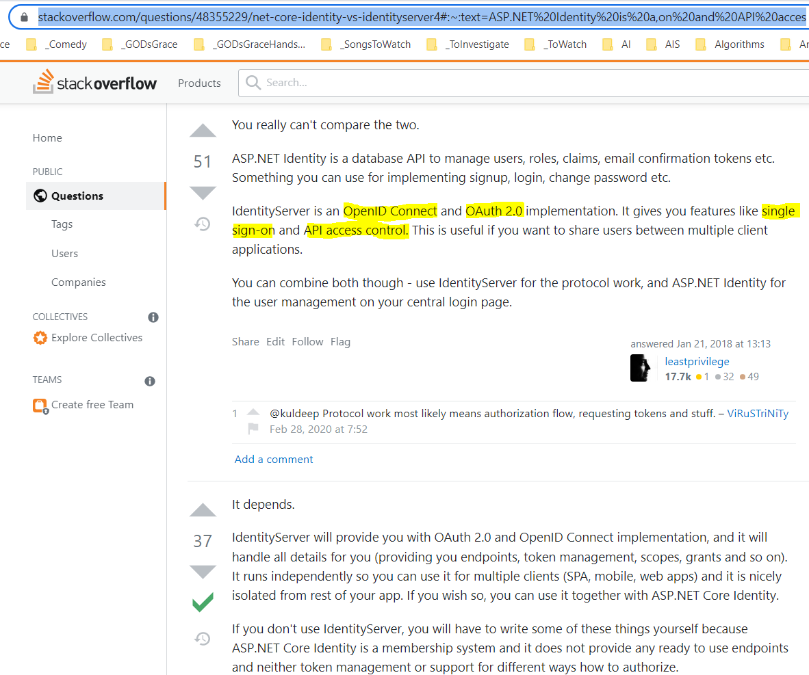

# Building Cloud Native .NET Apps on Azure with Authentication

## Date Time: 20-Jun-2022 at 09:00 PM IST

## Event URL: [https://www.youtube.com/watch?v=-4J3qWFozSs&list=PLdo4fOcmZ0oV2fcY7wsQHx4RNWXEDKgm4&index=58](https://www.youtube.com/watch?v=-4J3qWFozSs&list=PLdo4fOcmZ0oV2fcY7wsQHx4RNWXEDKgm4&index=58)

---

## Pre-Requisites

> 1. .NET 6
> 1. Azure CLI

### Software/Tools

> 1. OS: win32 x64
> 1. Node: **v14.17.5**
> 1. Visual Studio Code
> 1. Visual Studio 2022

### Prior Knowledge

> 1. C#, Node JS
> 1. Azure Storage
> 1. Azure Functions
> 1. .NET Razor/Blazor WASM

### Assumptions

> 1. NIL

## Technology Stack

> 1. Azure Functions

## Information

## 

## What are we doing today?

> 1. Authentication (101 / Under the hood) - ASP.Net Core Identity
> 1. Azure Functions - Authentication using AAD
> 1. APIM - Authentication using AAD
> 1. ASP.Net Identity using IdentityServer 6
> 1. .NET 6 Web API - Authentication using Auth0
> 1. SUMMARY / RECAP / Q&A

---

---

## 1. Authentication (101 / Under the hood) - ASP.Net Core Identity
> 1. Discussion and Demo

## 2. Azure Functions - Authentication using AAD
> 1. Discussion and Demo

## 3. APIM - Authentication using AAD
> 1. Discussion and Demo

## 4. ASP.Net Identity using IdentityServer 6
> 1. Discussion and Demo

Reference: 
[https://stackoverflow.com/questions/48355229/net-core-identity-vs-identityserver4#:~:text=ASP.NET%20Identity%20is%20a,on%20and%20API%20access%20control.](https://stackoverflow.com/questions/48355229/net-core-identity-vs-identityserver4#:~:text=ASP.NET%20Identity%20is%20a,on%20and%20API%20access%20control.)

## 5. .NET 6 Web API - Authentication using Auth0
> 1. Discussion

---

## SUMMARY / RECAP / Q&A

---

> 1. SUMMARY / RECAP / Q&A
> 2. Any open queries, I will get back through meetup chat/twitter.

---
