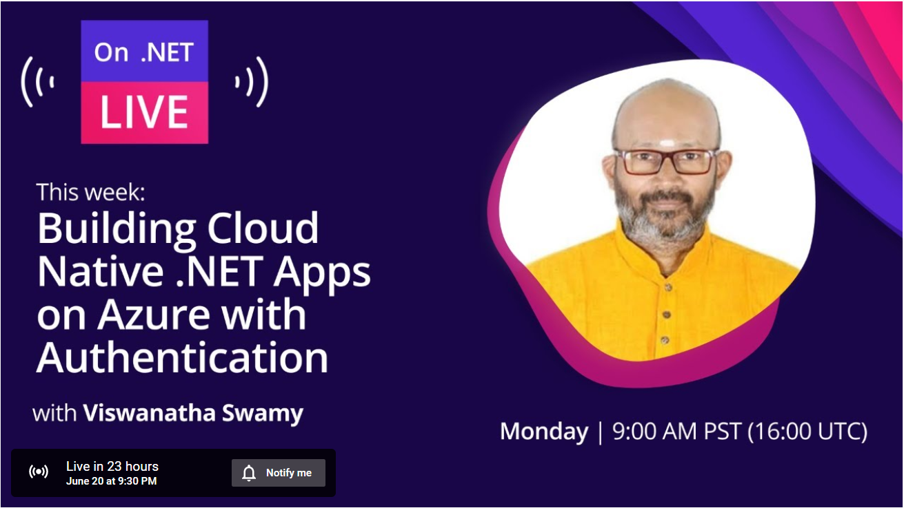
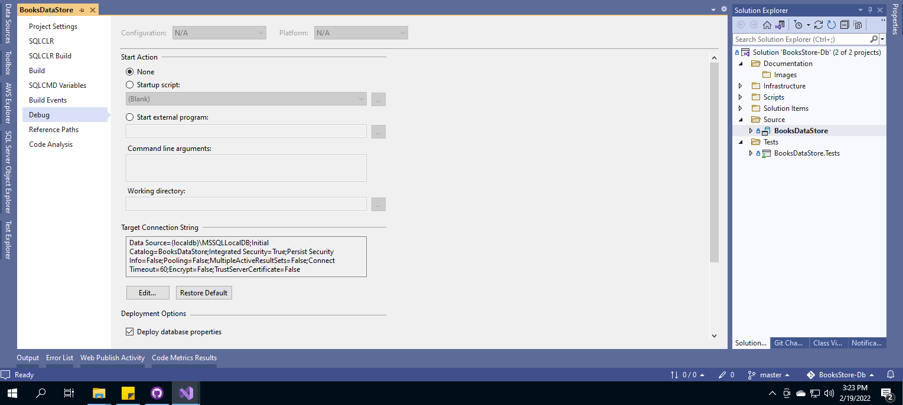
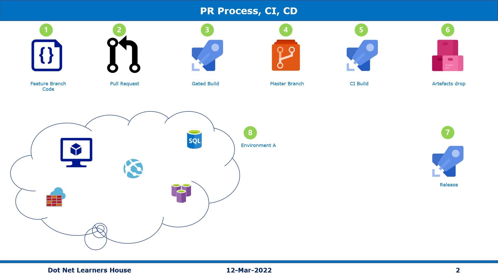
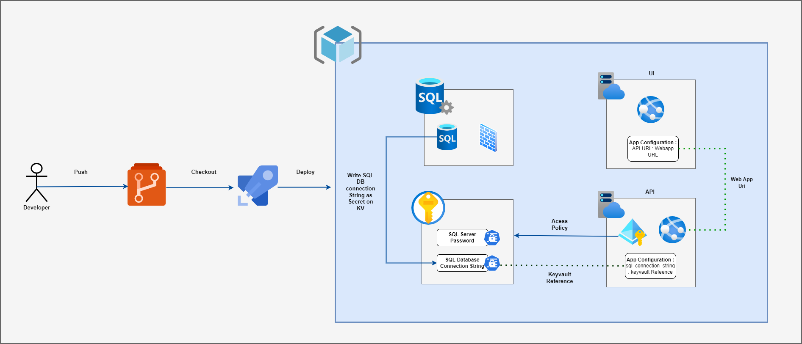

# Building Cloud Native .NET Apps on Azure with Authentication

## Date Time: 20-Jun-2022 at 09:00 PM IST

## Event URL: [https://www.youtube.com/watch?v=-4J3qWFozSs&list=PLdo4fOcmZ0oV2fcY7wsQHx4RNWXEDKgm4&index=58](https://www.youtube.com/watch?v=-4J3qWFozSs&list=PLdo4fOcmZ0oV2fcY7wsQHx4RNWXEDKgm4&index=58)

---

## Pre-Requisites

> 1. .NET 6
> 1. Azure CLI

### Software/Tools

> 1. OS: win32 x64
> 1. Node: **v14.17.5**
> 1. Visual Studio Code
> 1. Visual Studio 2022

### Prior Knowledge

> 1. C#, Node JS
> 1. Azure Storage
> 1. Azure Functions
> 1. .NET Razor/Blazor WASM

### Assumptions

> 1. NIL

## Technology Stack

> 1. Azure Functions

## Information

## 

## What are we doing today?

> 1. Authentication (101 / Under the hood) - ASP.Net Core Identity
> 1. SUMMARY / RECAP / Q&A

---

---

## 1. Azure DevOps Boards (25 Minutes)

> 1. Discussion and Demo
> 1. Epic, Features, User Story, Tasks, Bugs
> 1. Sprints, Capacity Planning
> 1. Boards, Backlog
> 1. Burndown, Sprint Refinement, Sprint Retro, Daily SCRUM
> 1. Story Pointing, T-Shirt Sizing, Poker Planning

## 2. Manual Deployments (10 Minutes)

> 1. Discussion and Demo
> 1. Create SQL Server, and Database manually in Azure Portal
> 1. Deploy it using VS 2022

## 3. PR Process (15 Minutes)

> 1. Discussion and Demo
> 1. Try checking into `main` branch
> 1. Create a feature branch and raise a PR
> 1. Code Review, Comments, Approvals
> 1. Gated Builds, Continuous Integration, and Artifacts (During Build Pipelines)

### Architecture

## 4. Infrastructure as a Code (55 Minutes)

> 1. Discussion and Demo
> 1. Create a Web App in Azure Portal
> 1. Create a Web App in using .PS1, and Azure CLI
> 1. Deploy SQL Server, Database using ARM + .PS1
> 1. Deplopy App Service, Web App using ARM + .sh
> 1. Infrastructure as Code, and walk through all the assets inside the repository
> 1. Replace tokens in Build Pipeline
> 1. What and Why of Service connections
> 1. Using Managed identities for Web App
> 1. Using managed identity permissions to read keyvault secrets
> 1. referencing managed identities in ARM template

## 5. Build Pipeline  (30 Minutes)

> 1. Discussion
> 1. Classic Pipeline
> 1. YML Pipleline (Conditions, Triggers, Steps)
> 1. Gated Builds, Continuous Integration, and Artifacts (During Build Pipelines)

## 

## 6. Release Pipeline (30 Minutes)

> 1. Discussion and Demo
> 1. Picking up the Artifacts from the Build Pipeline
> 1. Creating the Variable Groups to access the Key Valut Secrets
> 1. CD Pipeline
> 1. Approval for Release

## 

---

## SUMMARY / RECAP / Q&A

---

> 1. SUMMARY / RECAP / Q&A
> 2. Any open queries, I will get back through meetup chat/twitter.

---
