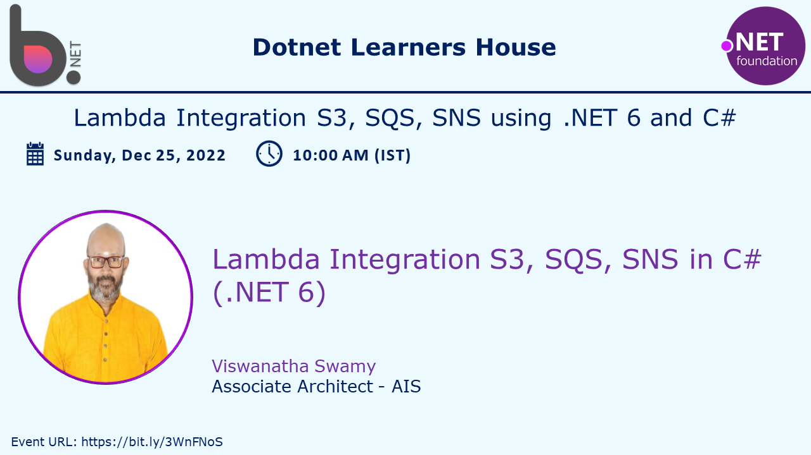
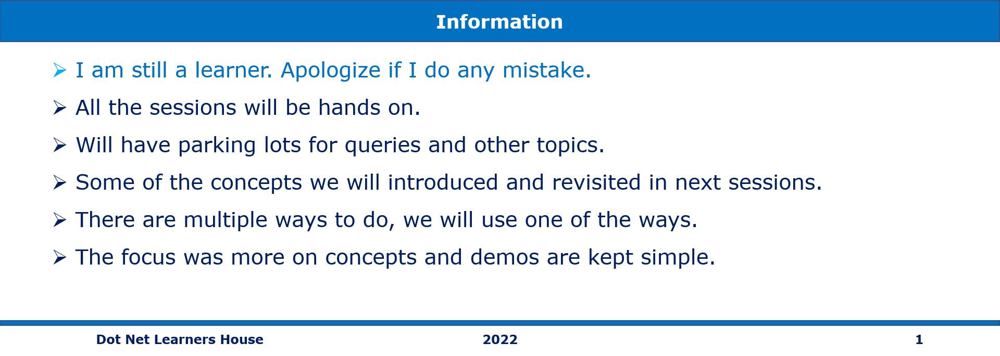
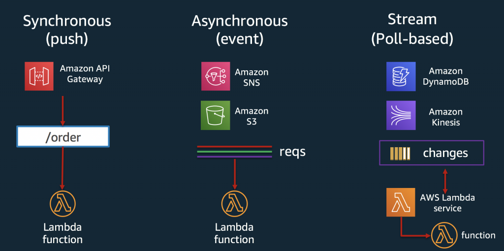

# Lambda Triggers, Integration with S3, SQS, and SNS in C# (.NET 6)

## Date Time: 25-Dec-2022 at 10:00 AM IST

## Event URL: [https://www.meetup.com/dot-net-learners-house-hyderabad/events/288854207](https://www.meetup.com/dot-net-learners-house-hyderabad/events/288854207)

## Youtube URL: [https://www.youtube.com/watch?v=0Qs9vPqNMoE](https://www.youtube.com/watch?v=0Qs9vPqNMoE)

---

## Information

## What are we doing today?

> 1. Lambda Triggers
> 1. Quick Recap of AWS Lambda and API Integration
> 1. Lambda Integration with S3
> 1. Lambda Integration with SNS
> 1. Lambda Integration with SQS
> 1. SUMMARY / RECAP / Q&A

---

## Lambda Triggers

> 1. Demo and Discussion

Reference: [https://aws.amazon.com/blogs/architecture/understanding-the-different-ways-to-invoke-lambda-functions/](https://aws.amazon.com/blogs/architecture/understanding-the-different-ways-to-invoke-lambda-functions/)

## Quick Recap of AWS Lambda and API Integration

> 1. Demo and Discussion

## Lambda Integration with S3

> 1. Demo and Discussion

## Lambda Integration with SNS

> 1. Demo and Discussion

## Lambda Integration with SQS

> 1. Demo and Discussion

---

## SUMMARY / RECAP / Q&A

---

> 1. SUMMARY / RECAP / Q&A
> 2. Any open queries, I will get back through meetup chat/twitter.

---

## What is Next?

### C# (.NET 6) on AWS - Getting Started With ECR and ECS
