# .NET 6 Web API with DynamoDB, and Deploying .NET 6 Blazor WASM to Windows EC2

## Date Time: 15-Jan-2022 at 09:00 AM IST

## Event URL: [https://www.meetup.com/dot-net-learners-house-hyderabad/events/282817403](https://www.meetup.com/dot-net-learners-house-hyderabad/events/282817403)

## Youtube URL: [https://www.youtube.com/watch?v=RWxWEobeR0M](https://www.youtube.com/watch?v=RWxWEobeR0M)

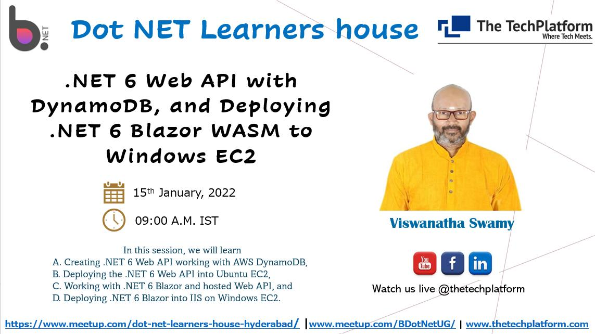

---

## Application Architecture Diagram

> 1. To Be Done

---

## Information

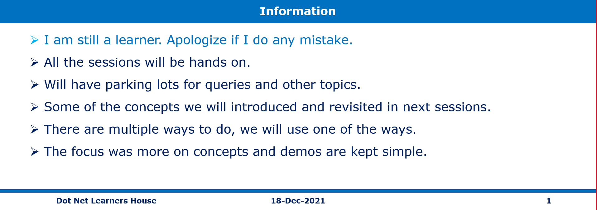

## What are we doing today?

> 1. Modify the .NET 6 Web API to work with DynamoDB
> 1. Deploying .NET 6 Blazor WASM App into Amazon EC2 (IIS in Windows)
> 1. Deploying .NET 6 updated Web API into Amazon EC2 (Ubuntu) **Stretch Goal**
> 1. SUMMARY / RECAP / Q&A


---

## 1. Modify the .NET 6 Web API to work with DynamoDB

Note:
```
dotnet run --project ./api/Products.Api/Products.Api.csproj 
dotnet run --project ./web/Products.Web/Products.Web.csproj 
```

> 1. Discussion and Demo

Install these Pre-Requisites on EC2 Ubuntu:

> 1. `sudo apt install net-tools`
> 1. `sudo apt install unzip`
> 1. `aws cli` https://docs.aws.amazon.com/cli/latest/userguide/getting-started-install.html

```
curl "https://awscli.amazonaws.com/awscli-exe-linux-x86_64.zip" -o "awscliv2.zip"
unzip awscliv2.zip
sudo ./aws/install
```

### Trust the dev-certs locally

```
dotnet dev-certs https
sudo -E dotnet dev-certs https -ep /usr/local/share/ca-certificates/aspnet/https.crt --format PEM
sudo update-ca-certificates
```

Reference:
[https://docs.microsoft.com/en-us/aspnet/core/security/enforcing-ssl?view=aspnetcore-6.0&tabs=visual-studio](https://docs.microsoft.com/en-us/aspnet/core/security/enforcing-ssl?view=aspnetcore-6.0&tabs=visual-studio)

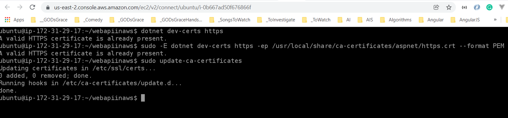

#### Verify existing Web API locally using https

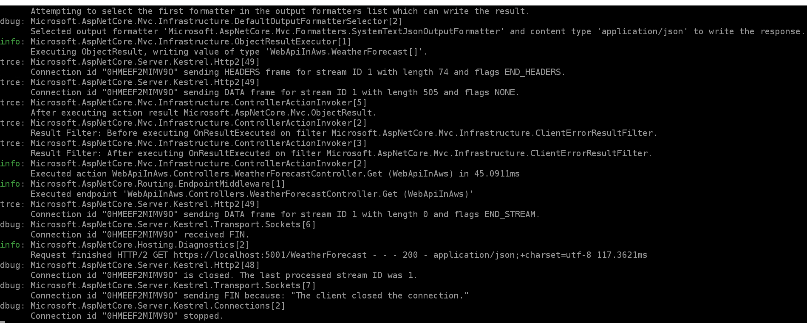

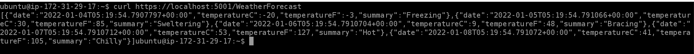

### .NET 6 Web API to work with DynamoDB inside VS 2022

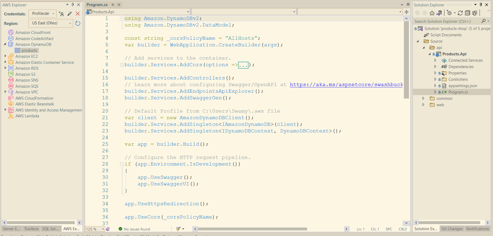

### Verifying .NET 6 Web API to work with DynamoDB Locally

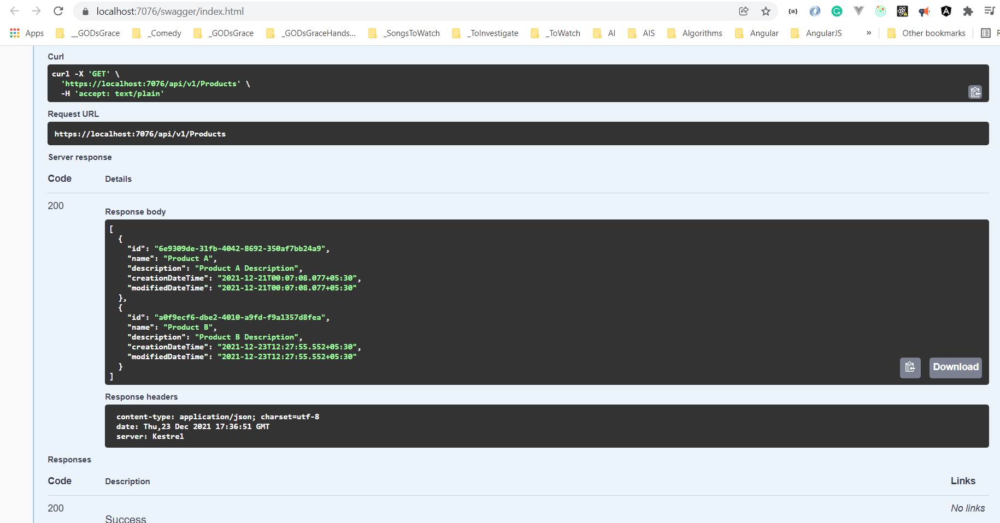

## 2. Deploying .NET 6 updated Web API into Amazon EC2 (Ubuntu)

> 1. Discussion and Demo


### Deploy the latest version of the Web API to the EC2 Ubuntu instance

#### Configure Credentials using `aws configure`

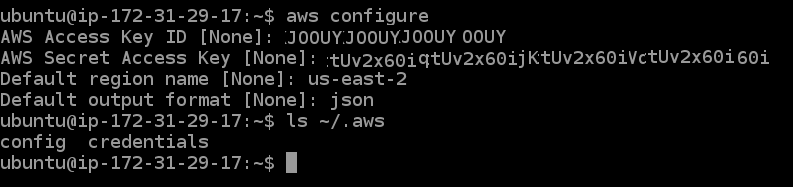

#### Verify the Web API is working on EC2 Ubuntu instance
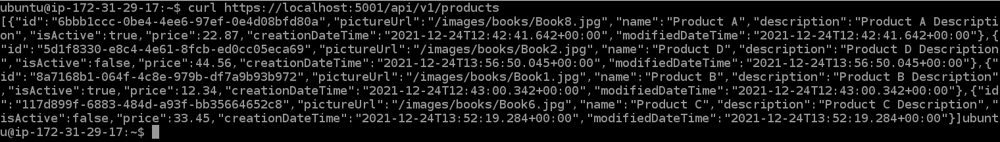

#### Create a service file for our Web API

```
sudo nano /etc/systemd/system/webapiinaws.service
```

**Note:**

> 1. The service file is created in the `/etc/systemd/system` folder
> 1. Update the webapiinaws.service file with the content given below
> 1. Update the permissions of the service file to `0744`

```
[Unit]
Description=.NET 6 Web API on Ubuntu

[Service]
WorkingDirectory=/home/ubuntu/webapiinaws
ExecStart=/usr/bin/dotnet /home/ubuntu/webapiinaws/Products.Api.dll
Restart=always
KillSignal=SIGINT
# Restart service after 10 seconds if dotnet service crashes
RestartSec=10
SyslogIdentifier=products-webapi
Environment=ASPNETCORE_ENVIRONMENT=Production
Environment=DOTNET_PRINT_TELEMETRY_MESSAGE=false

[Install]
WantedBy=multi-user.target
```

### Create the aws files

> 1. `credentials` file
> 1. `config` file

```
[default]
aws_access_key_id=Your_AWS_Access_Key_Id
aws_secret_access_key=Your_AWS_Secret_Access_Key
toolkit_artifact_guid=b87e1bae-59bd-41fa-8ca5-75169336f173
```

```
[default]
region = us-east-2
output = json
```

### Deploy the latest changes to the EC2 instance

> 1. Demo and Discussion

### Update the Nginx files

> 1. /etc/nginx/sites-available/default

```
server {
    listen 80;

    location / {
        proxy_pass http://localhost:5000;
        proxy_http_version 1.1;
        proxy_set_header Upgrade $http_upgrade;
        proxy_set_header Connection keep-alive;
        proxy_set_header Host $host;
        proxy_cache_bypass $http_upgrade;
        proxy_set_header X-Forwarded-For $proxy_add_x_forwarded_for;
        proxy_set_header X-Forwarded-Proto $scheme;
    }
}

```

```
server {
    listen 443 ssl;
    listen [::]:443 ssl;

    include snippets/self-signed.conf;


    location / {
        proxy_pass https://localhost:5001;
        proxy_http_version 1.1;
        proxy_set_header Upgrade $http_upgrade;
        proxy_set_header Connection keep-alive;
        proxy_set_header Host $host;
        proxy_cache_bypass $http_upgrade;
        proxy_cache_bypass $http_upgrade;
        proxy_set_header X-Forwarded-Proto $scheme;
    }
}
```

```
sudo service nginx start
sudo service nginx restart
sudo systemctl status nginx.service
sudo journalctl -xe
```

### Verifying .NET 6 Web API to work with DynamoDB Hosted in Amazon EC2

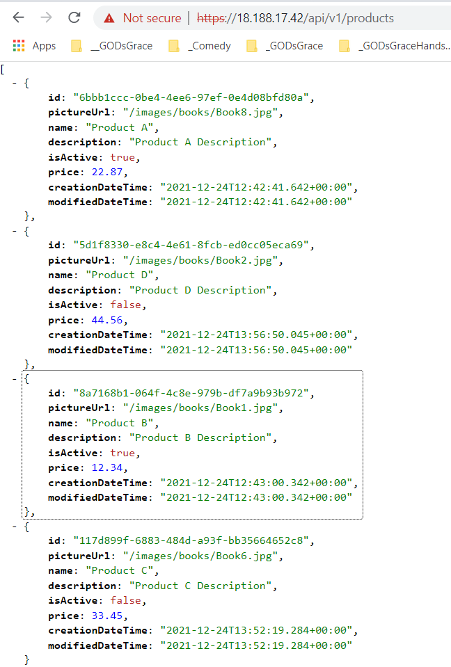

## 3. Deploying .NET 6 Blazor WASM App into Amazon EC2 (IIS in Windows)

> 1. Discussion and Demo

### Publishing .NET 6 Blazor WASM App into Amazon EC2 (IIS in Windows)

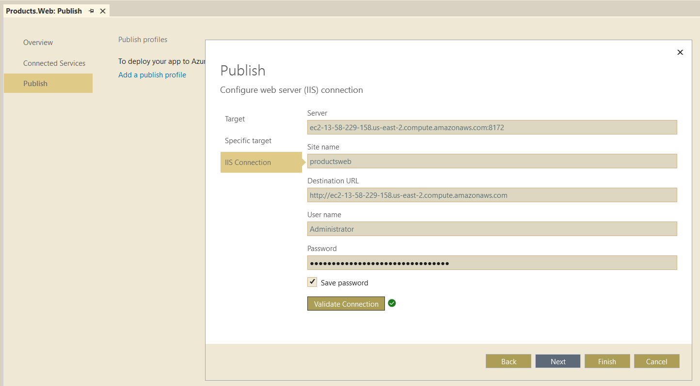

### Verify .NET 6 Blazor WASM Local with Web Api hosted in Amazon EC2 (Nginx in Ubuntu 20.04)

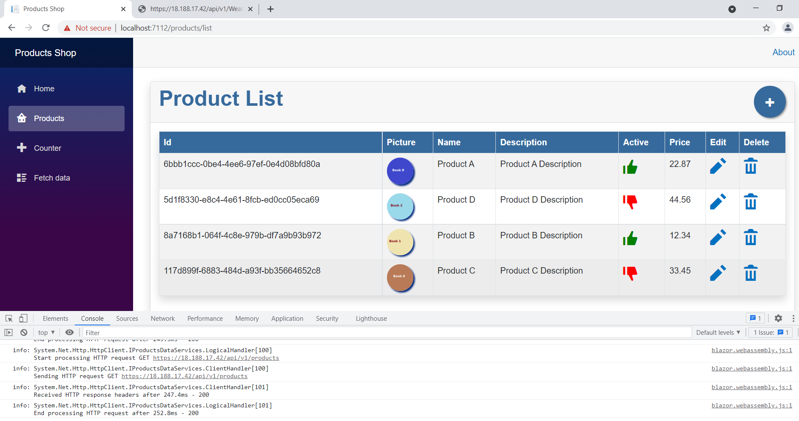

### Verify .NET 6 Blazor WASM hosted in Amazon EC2 (IIS in Windows) Web Api hosted in Amazon EC2 (Nginx in Ubuntu 20.04)

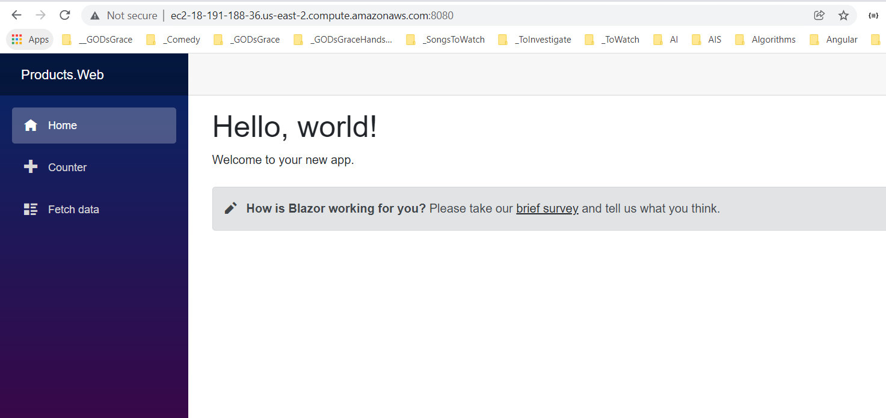

### Products Page

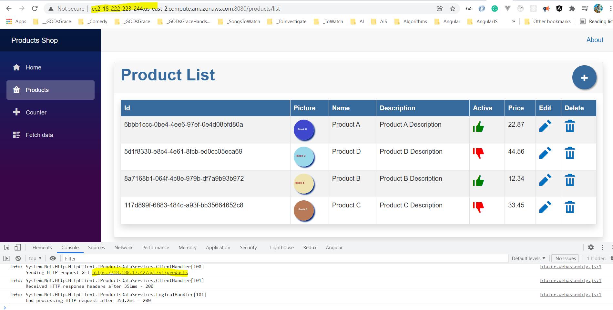

---

## 4. SUMMARY / RECAP / Q&A

---

> 1. SUMMARY / RECAP / Q&A
> 2. Any open queries, I will get back through meetup chat/twitter.

---

## What is Next?

**URL:** [https://www.meetup.com/dot-net-learners-house-hyderabad/events/ToBeDone](https://www.meetup.com/dot-net-learners-house-hyderabad/events/ToBeDone)

**Date:** `12-Feb-2022` at `09:00 AM IST`

> 1. Introduction with Amazon S3 Bucket
> 1. Working with S3 using .NET
> 1. Deploying static websites on Amazon S3
> 1. VPC, Subnets
> 1. Availability Zones (AZs)
> 1. Regions
> 1. Edge Locations
> 1. Regional Edge Caches
> 1. Reboot the machine to show data loss
