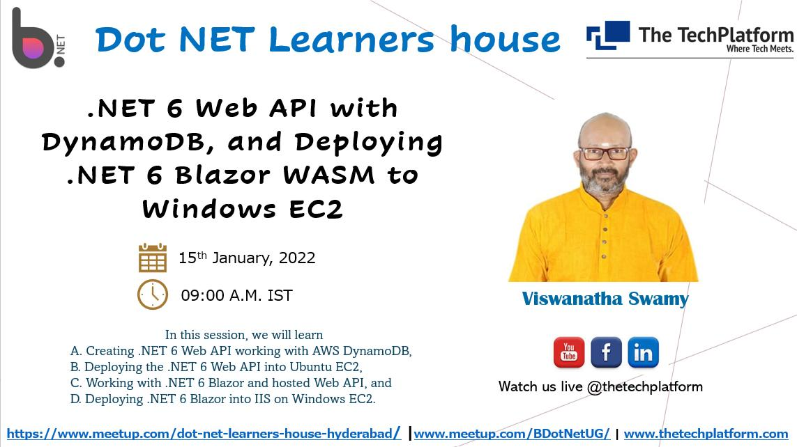
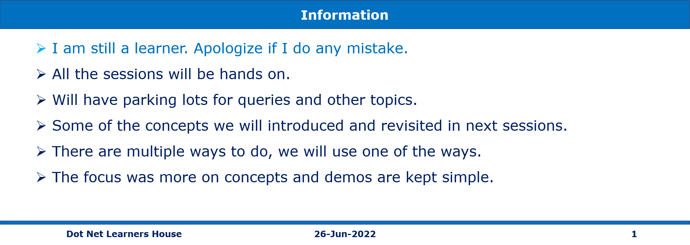

# S3 Buckets, Deploying .NET 6 Apps to Windows/Linux EC2, and Beanstalk

## Date Time: 28-May-2022 at 09:00 AM IST

## Event URL: [https://www.meetup.com/dot-net-learners-house-hyderabad/events/285669327](https://www.meetup.com/dot-net-learners-house-hyderabad/events/285669327)

## Youtube URL: [https://www.youtube.com/watch?v=aeNbN7sIUcc](https://www.youtube.com/watch?v=aeNbN7sIUcc)

---

## Application Architecture Diagram

> 1. To Be Done

---

## Information

## What are we doing today?

> 1. What is S3 Buckets and Objects?
> 1. How to create S3 Buckets, and Objects.
> 1. Accessing Objects in S3 Buckets.
> 1. How to delete Objects in S3 Buckets, and S3 Buckets.
> 1. How to deploy .NET Apps into EC2 (Windows/Linux).
> 1. How to deploy .NET Apps into Beanstalk.
> 1. SUMMARY / RECAP / Q&A

---

## 1. Modify the .NET 6 Web API to work with DynamoDB

---

## 4. SUMMARY / RECAP / Q&A

---

> 1. SUMMARY / RECAP / Q&A
> 2. Any open queries, I will get back through meetup chat/twitter.

---

## What is Next?

**URL:** [https://www.meetup.com/dot-net-learners-house-hyderabad/events/ToBeDone](https://www.meetup.com/dot-net-learners-house-hyderabad/events/ToBeDone)

**Date:** `25-Jun-2022` at `09:00 AM IST`

> 1. Reboot the machine to show data loss
> 1. VPC, Subnets
> 1. Availability Zones (AZs)
> 1. Regions
> 1. Edge Locations
> 1. Regional Edge Caches
> 1. Working with S3 using .NET (`Console Application`)
> 1. Deploying static websites on Amazon S3
> 1. Deploying .NET 6 + Mongo Db Web API into Amazon EC2 using Beanstalk
