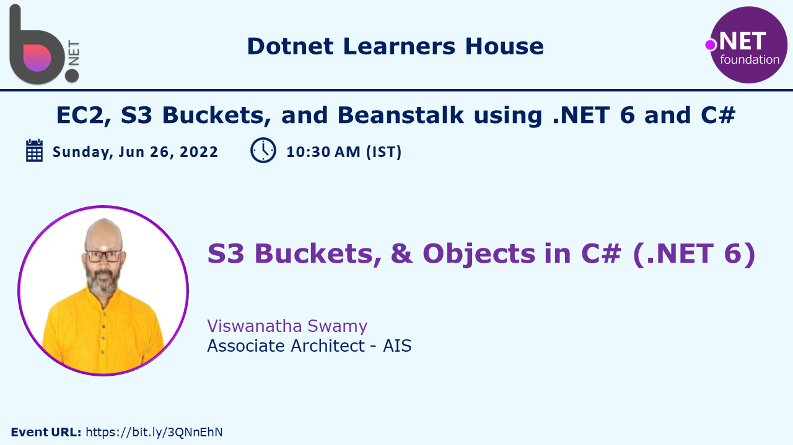

# S3 Buckets, Deploying .NET 6 Apps to Windows/Linux EC2, and Beanstalk

## Date Time: 26-Jun-2022 at 10:00 AM IST

## Event URL: [https://www.meetup.com/dot-net-learners-house-hyderabad/events/286232863](https://www.meetup.com/dot-net-learners-house-hyderabad/events/286232863)

## Youtube URL: [https://www.youtube.com/watch?v=yu8o1ray_cU](https://www.youtube.com/watch?v=yu8o1ray_cU)



---

## Information


## What are we doing today?

> 1. What are S3 Buckets and Objects?
> 1. How to create S3 Buckets and Objects in AWS Console
> 1. How to delete Objects in S3 Buckets, and S3 Buckets in AWS Console
> 1. Accessing Objects in S3 Buckets
> 1. Working with S3 using AWS CLI
> 1. Working with S3 using .NET
> 1. Deploying static websites on Amazon S3
> 1. SUMMARY / RECAP / Q&A


---

## 1. What is S3 Buckets and Objects?

> 1. Demo and Discussion

**Note:**

> 1. [S3 Buckets](https://aws.amazon.com/s3/)
> 1. It is `globally distributed`, and can be accessed from anywhere in the world.

## 2. How to create S3 Buckets, and Objects in AWS Console

> 1. Demo and Discussion

## 3. How to delete Objects in S3 Buckets, and S3 Buckets in AWS Console

> 1. Demo and Discussion

## 4. Accessing Objects in S3 Buckets

> 1. Demo and Discussion


## 5. Working with S3 using AWS cli

> 1. Demo and Discussion

**Reference:**

> 1. [AWS S3 CLI](https://docs.aws.amazon.com/cli/latest/userguide/cli-services-s3-commands.html)
> 1. [AWS S3API CLI](https://docs.aws.amazon.com/cli/latest/userguide/cli-services-s3-commands.html)
> 1. [S3 vs S3API](https://aws.amazon.com/blogs/developer/leveraging-the-s3-and-s3api-commands/#:~:text=The%20main%20difference%20between%20the,provided%20by%20the%20s3api%20commands)

```
aws --version

aws s3 mb s3://bucket-26jun-v1
aws s3 ls
aws s3 ls s3://bucket-26jun-v1
```


```
aws s3api list-buckets
aws s3api list-objects --bucket eshop-microservices-bucket
```


## 6. Working with S3 using .NET

> 1. Demo and Discussion

## 7. Deploying static websites on Amazon S3

> 1. Demo and Discussion

---

## 8. SUMMARY / RECAP / Q&A

---

> 1. SUMMARY / RECAP / Q&A
> 2. Any open queries, I will get back through meetup chat/twitter.

---

## What is Next?

**URL:** [https://www.meetup.com/dot-net-learners-house-hyderabad/events/ToBeDone](https://www.meetup.com/dot-net-learners-house-hyderabad/events/ToBeDone)

**Date:** `24-Jul-2022` at `10:00 AM IST`

> 1. To be done
