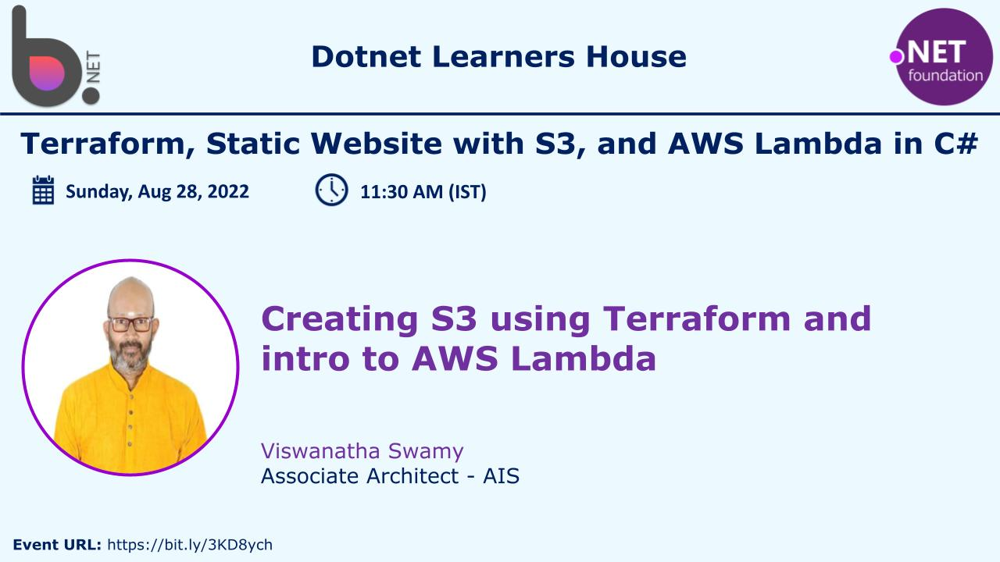

# Terraform, Static Website with S3, and AWS Lambda in C# (.NET 6)

## Date Time: 28-Aug-2022 at 10:00 AM IST

## Event URL: [https://www.meetup.com/dot-net-learners-house-hyderabad/events/286822813](https://www.meetup.com/dot-net-learners-house-hyderabad/events/286822813)

## Youtube URL: [https://www.youtube.com/watch?v=Y2j0u6oQEMo](https://www.youtube.com/watch?v=Y2j0u6oQEMo)

---

## Information

## What are we doing today?

> 1. Creating S3 Bucket & Object using Terraform
> 1. Creating S3 Bucket & Static Website inside S3 using Terraform
> 1. Updating the Static Website with Angular 14 App
> 1. Updating the Static Website with Blazor WASM
> 1. Introduction to AWS Lambda
> 1. Mini Project in AWS Lambda using .NET 6
> 1. SUMMARY / RECAP / Q&A

---

## 1. Creating S3 Bucket & Object using Terraform

> 1. Demo and Discussion

## 2. Creating S3 Bucket & Static Website inside S3 using Terraform

> 1. Demo and Discussion

## 3. Updating the Static Website with Angular 14 App

> 1. Demo and Discussion

## 4. Updating the Static Website with Blazor WASM

> 1. Demo and Discussion

## 5. Introduction to AWS Lambda

> 1. Demo and Discussion

## 6. Mini Project in AWS Lambda using .NET 6

> 1. Demo and Discussion

---

## 7. SUMMARY / RECAP / Q&A

---

> 1. SUMMARY / RECAP / Q&A
> 2. Any open queries, I will get back through meetup chat/twitter.

---

## What is Next?

**URL:** [https://www.meetup.com/dot-net-learners-house-hyderabad/events/ToBeDone](https://www.meetup.com/dot-net-learners-house-hyderabad/events/ToBeDone)

**Date:** `24-Jul-2022` at `10:00 AM IST`

> 1. To be done
