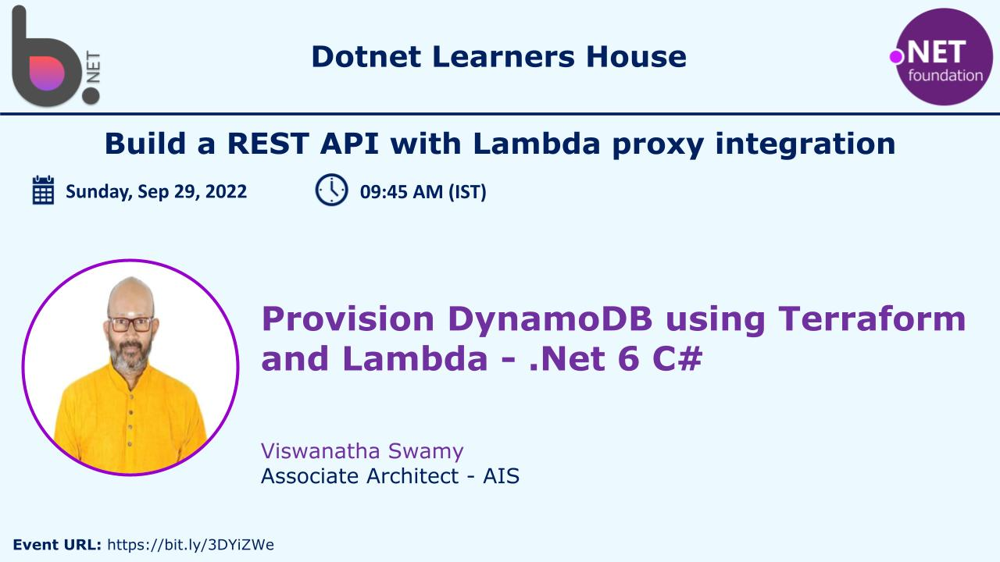
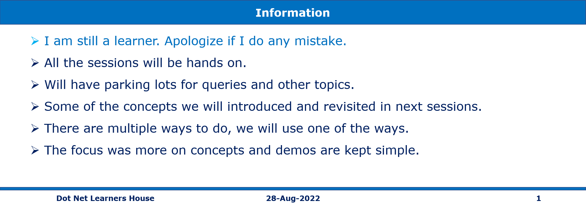
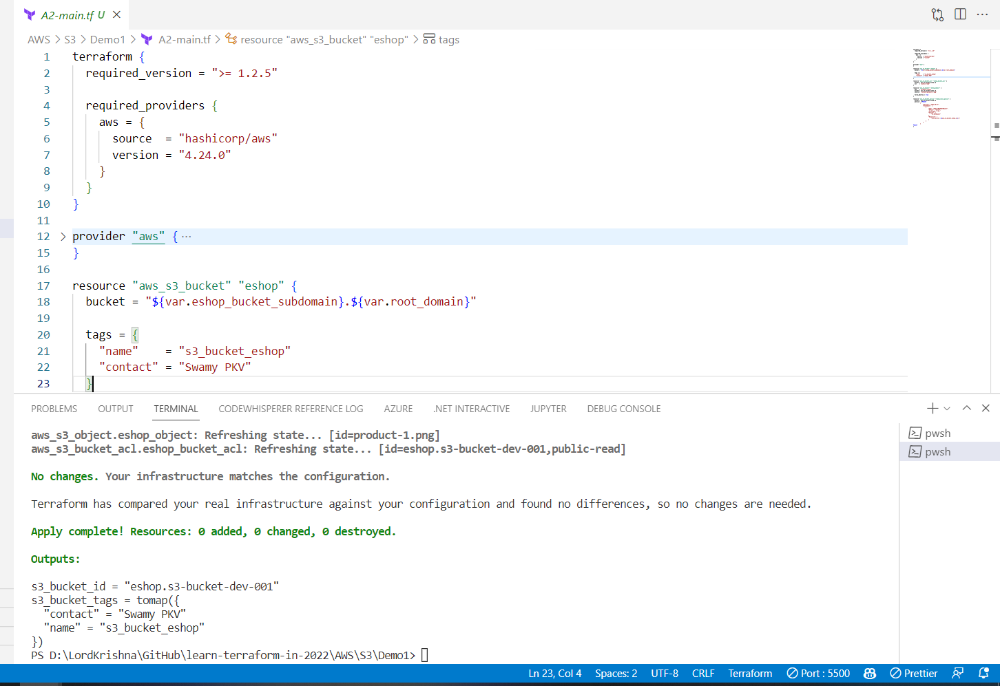
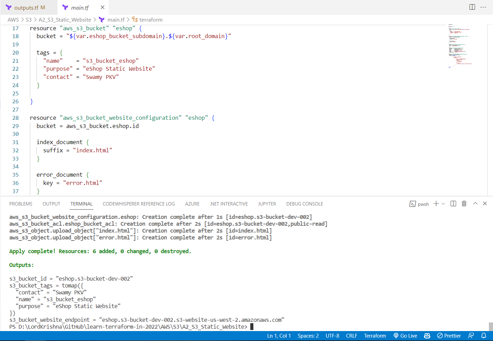
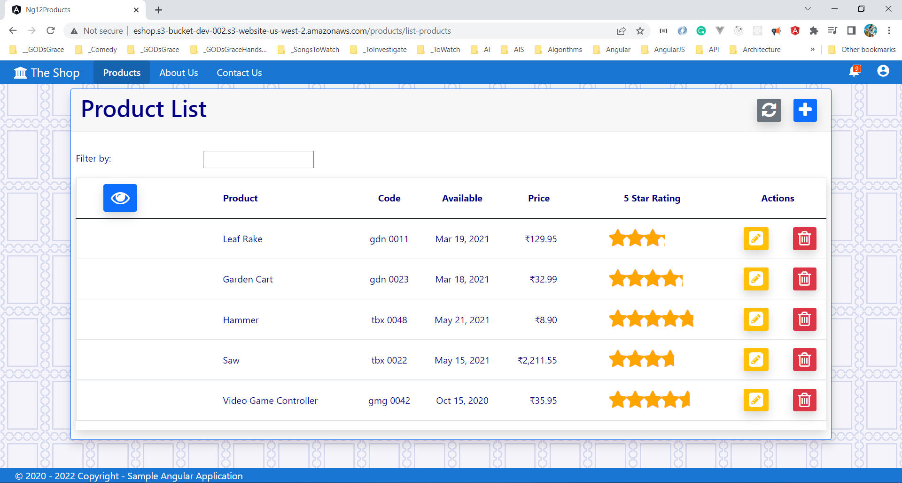
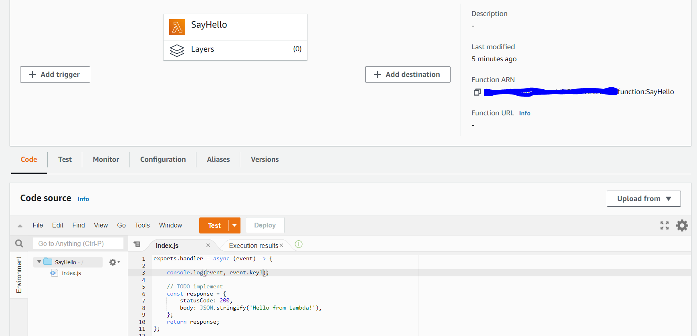
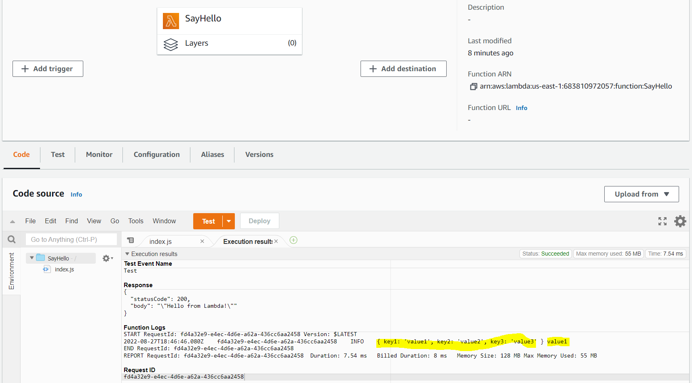
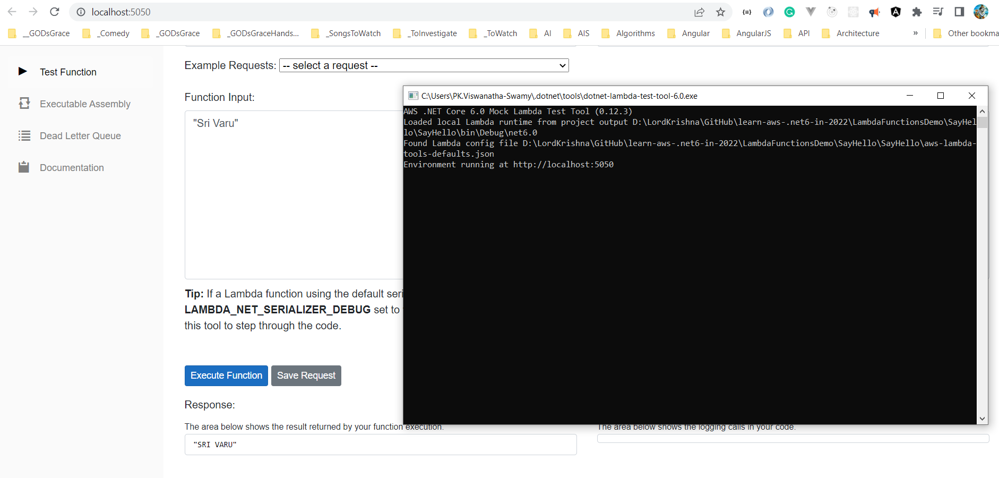
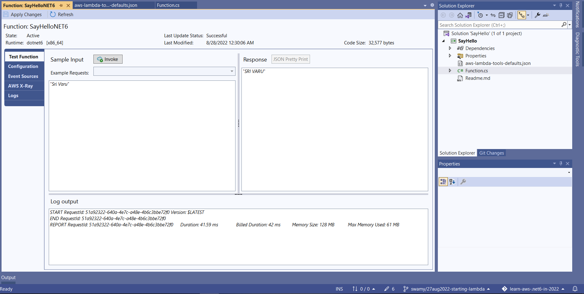

# Terraform, DynamoDB, API Gateway, Cloud Watch, AWS Lambda in C# (.NET 6)

## Date Time: 29-Sep-2022 at 09:00 AM IST

## Event URL: [https://www.meetup.com/dot-net-learners-house-hyderabad/events/287732502](https://www.meetup.com/dot-net-learners-house-hyderabad/events/287732502)

## Youtube URL: [https://www.youtube.com/watch?v=5rBhiI9e2B0](https://www.youtube.com/watch?v=5rBhiI9e2B0)

---

## Information

## What are we doing today?

> 1. Provisioning DynamoDB, and Table(s) in AWS using Terraform
> 1. Creating AWS Lambda to read data from DynamoDB, and Publishing it
> 1. Watching Logs in Cloud Watch
> 1. REST API with Lambda proxy integration (API Gateway)
> 1. SUMMARY / RECAP / Q&A

---

## Creating S3 Bucket & Object using Terraform

> 1. Demo and Discussion

## Creating S3 Bucket & Static Website inside S3 using Terraform

> 1. Demo and Discussion

## Updating the Static Website with Angular 14 App

> 1. Demo and Discussion

## Introduction to AWS Lambda

> 1. Demo and Discussion

## AWS Lambda Function using AWS Console (Mini Project)

> 1. Demo and Discussion

### Lambda Function in Console

### Testing Lambda Function in Console

## AWS Lambda using .NET 6 in VS 2022 (Mini Project)

> 1. Demo and Discussion

### Testing Lambda Function in VS 2022

### Testing Deployed Lambda Function in VS 2022

---

## SUMMARY / RECAP / Q&A

---

> 1. SUMMARY / RECAP / Q&A
> 2. Any open queries, I will get back through meetup chat/twitter.

---

## What is Next?

**URL:** [https://www.meetup.com/dot-net-learners-house-hyderabad/events/ToBeDone](https://www.meetup.com/dot-net-learners-house-hyderabad/events/ToBeDone)

**Date:** `XX-Sep-2022` at `10:00 AM IST`

> 1. To be done
