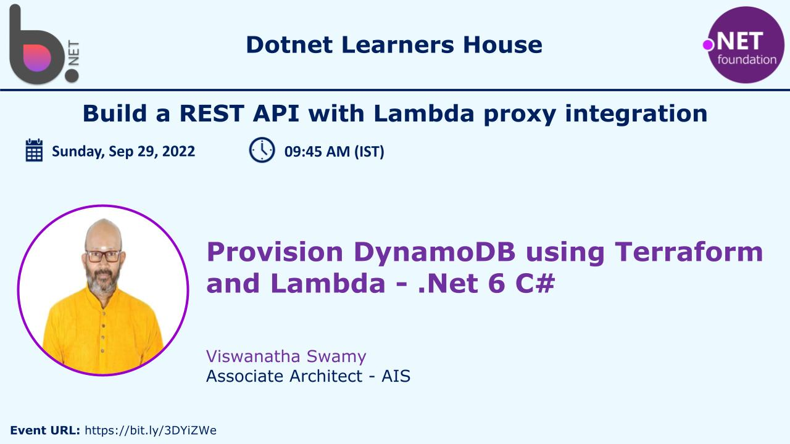
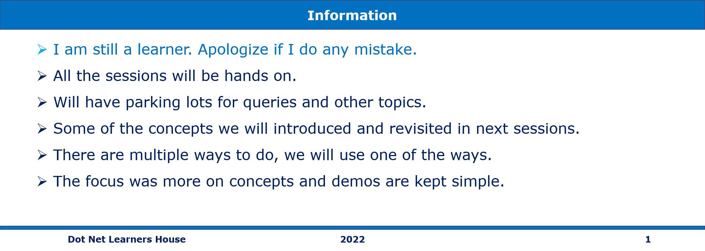
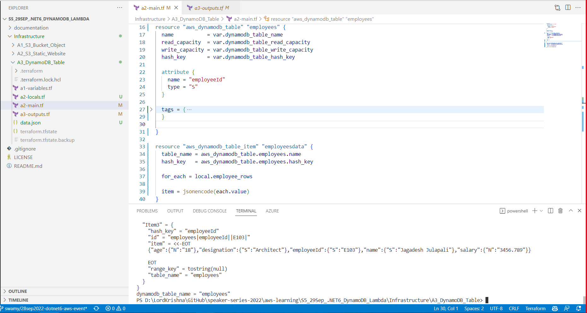
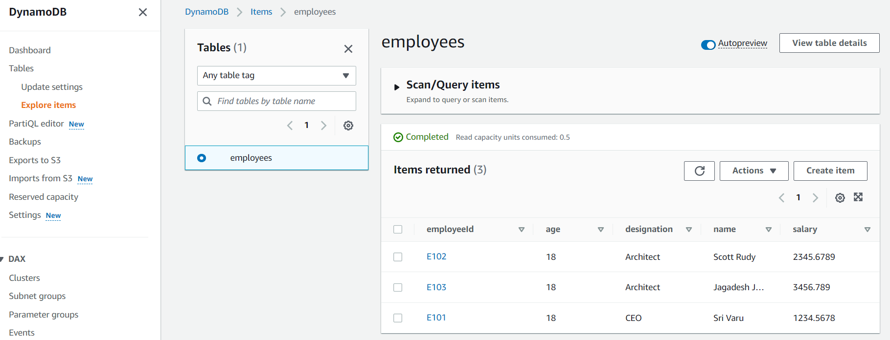
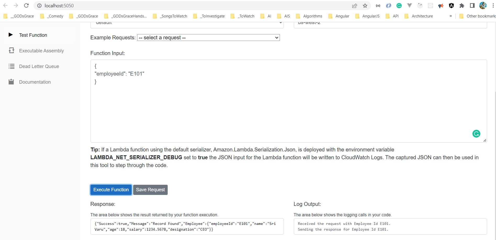
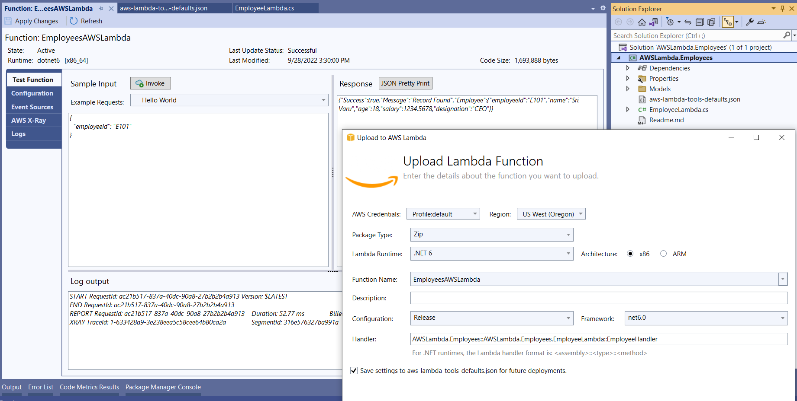
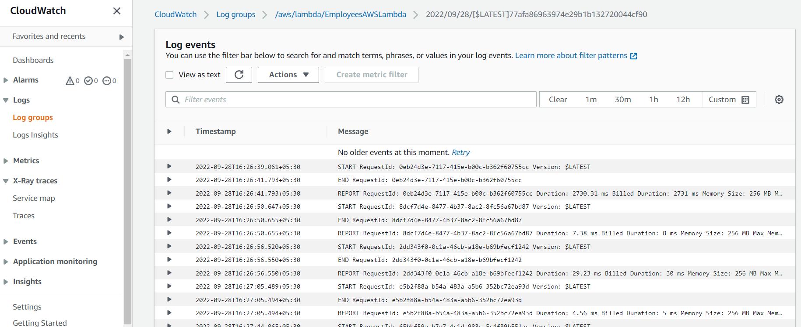
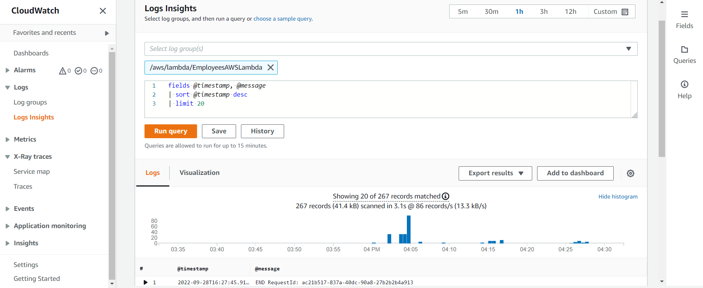

# Terraform, DynamoDB, API Gateway, Cloud Watch, AWS Lambda in C# (.NET 6)

## Date Time: 15-Oct-2022 at 10:00 AM IST

## Event URL: [https://www.meetup.com/dot-net-learners-house-hyderabad/events/288853992](https://www.meetup.com/dot-net-learners-house-hyderabad/events/288853992)

## Youtube URL: [https://www.youtube.com/watch?v=jtFv--BcKfA](https://www.youtube.com/watch?v=jtFv--BcKfA)

---

## Information

## What are we doing today?

> 1. Provisioning DynamoDB, and Table(s) in AWS using Terraform
> 1. Creating AWS Lambda to read data from DynamoDB, and verifying it locally
> 1. Publishing AWS Lambda using VS 2022, and verifying it
> 1. Watching Logs in Cloud Watch
> 1. REST API with Lambda proxy integration (API Gateway)
> 1. SUMMARY / RECAP / Q&A

---

## Provisioning DynamoDB, and Table(s) in AWS using Terraform

> 1. Demo and Discussion

## Creating AWS Lambda to read data from DynamoDB, and verifying it locally

> 1. Demo and Discussion

## Publishing AWS Lambda using VS 2022, and verifying it

> 1. Demo and Discussion

## Watching Logs in Cloud Watch

> 1. Demo and Discussion

## REST API with Lambda proxy integration (API Gateway)

> 1. Demo and Discussion

---

## SUMMARY / RECAP / Q&A

---

> 1. SUMMARY / RECAP / Q&A
> 2. Any open queries, I will get back through meetup chat/twitter.

---

## What is Next?

**URL:** [https://www.meetup.com/dot-net-learners-house-hyderabad/events/ToBeDone](https://www.meetup.com/dot-net-learners-house-hyderabad/events/ToBeDone)

**Date:** `16-Oct-2022` at `10:00 AM IST`

> 1. To be done
