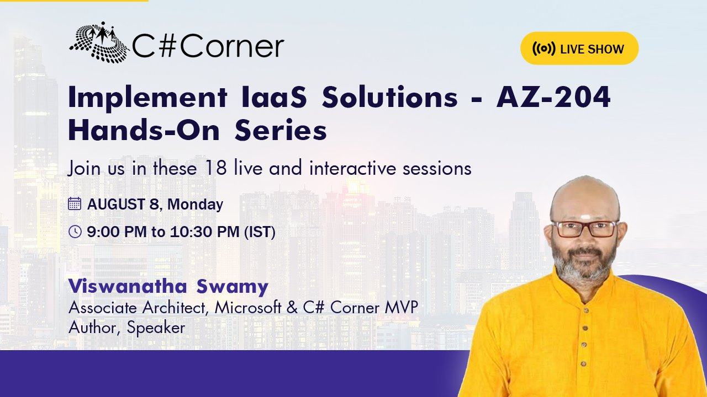
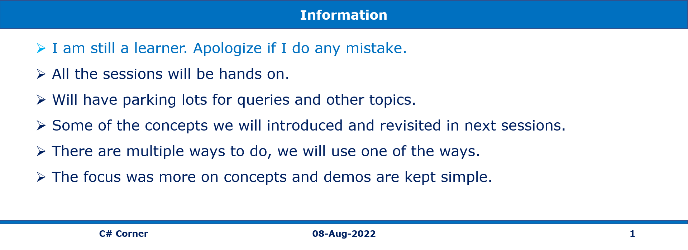
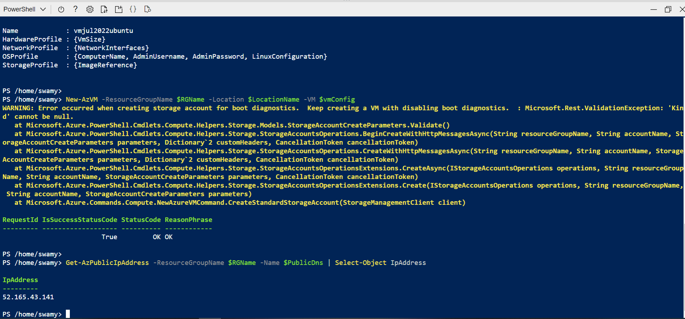
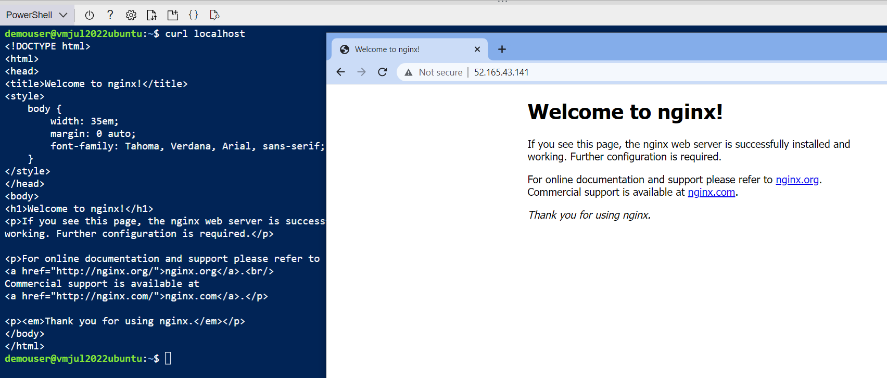

# AZ-204 | Implement infrastructure as a service solutions

## Date Time: 08-Aug-2022 at 09:00 PM IST

## Event URL: [https://www.c-sharpcorner.com/events/implement-iaas-solutions-az204-handson-series](https://www.c-sharpcorner.com/events/implement-iaas-solutions-az204-handson-series)

---

## Pre-Requisites

> 1. .NET 3.1/6 SDK
> 1. Azure CLI

### Software/Tools

> 1. OS: win32 x64
> 1. Node: **v14.17.5**
> 1. Visual Studio Code
> 1. Visual Studio 2019/2022

### Prior Knowledge

> 1. C#, Node JS
> 1. Application Insights
> 1. Azure Key Vault
> 1. .NET Razor/Blazor WASM

### Assumptions

> 1. NIL

## Technology Stack

> 1. Azure

## Information

## 

## What are we doing today?

> 1. Introduction to PowerShell and Az Module (3 Minutes)
> 1. Introduction to Azure CLI (3 Minutes)
> 1. Introduction to Azure Cloud Shell (4 Minutes)
> 1. Creating Ubuntu VM and installing Nginx using PowerShell. (6 Minutes)
> 1. Creating Windows VM and installing IIS using PowerShell. (6 Minutes)
> 1. Creating Ubuntu VM and installing LAMP Server using Azure CLI. (6 Minutes)
> 1. Creating Windows VM and installing IIS using Azure CLI. (6 Minutes)
> 1. What is Infrastructure as a Code? (5 Minutes)
> 1. Introduction to ARM (5 Minutes)
> 1. Creating a Storage Account using an ARM template and Azure CLI. (5 Minutes)
> 1. Deploy SQL Server, Database using ARM + Azure CLI (5 Minutes)
> 1. Deplopy App Service, Web App using ARM + AZ CLI (5 Minutes)
> 1. Creating Azure Key Vault using an ARM template and Azure CLI. (5 Minutes)
> 1. Creating Ubuntu VM using an ARM template and Azure CLI. (6 Minutes)
> 1. Review/Q & A/Panel Discussion (5 Minutes)
> 1. Q & A
> 1. What is next in `Session 2`? (5 Minutes)

### Please refer [MS Learn Module](https://docs.microsoft.com/en-gb/learn/paths/az-204-implement-iaas-solutions) for more details.

### [Source code for today's session](https://github.com/vishipayyallore/speaker-series-2022/tree/main/microsoft-reactor/S17_2022Jun22_AzureCosmosDB)

---

---

## Introduction to PowerShell and Az Module (3 Minutes)

> 1. Discussion and Demo

**Reference:**

> https://docs.microsoft.com/en-us/powershell/azure/new-azureps-module-az?view=azps-8.2.0

## Introduction to Azure CLI (3 Minutes)

> 1. Discussion and Demo

**Reference(s):**

> 1. https://docs.microsoft.com/en-us/cli/azure/

## Introduction to Azure Cloud Shell (4 Minutes)

> 1. Discussion and Demo

**Reference(s):**

> 1. https://docs.microsoft.com/en-us/azure/cloud-shell/overview

## Creating Ubuntu VM and installing Nginx using PowerShell. (6 Minutes)

> 1. Discussion and Demo

## Creating Windows VM and installing IIS using PowerShell. (6 Minutes)

> 1. Discussion and Demo

## Creating Ubuntu VM and installing LAMP Server using Azure CLI. (6 Minutes)

> 1. Discussion and Demo

## Creating Windows VM and installing IIS using Azure CLI. (6 Minutes)

> 1. Discussion and Demo

## What is Infrastructure as a Code? (5 Minutes)

> 1. Discussion and Demo

**Reference(s):**

> 1. https://docs.microsoft.com/en-us/dotnet/architecture/cloud-native/infrastructure-as-code
> 1. https://docs.microsoft.com/en-us/devops/deliver/what-is-infrastructure-as-code

## Introduction to ARM (5 Minutes)

> 1. Discussion and Demo

**Reference(s):**

> 1. https://docs.microsoft.com/en-us/azure/azure-resource-manager/management/overview

## Creating a Storage Account using an ARM template and Azure CLI. (5 Minutes)

> 1. Discussion and Demo

## Deploy SQL Server, Database using ARM + Azure CLI (5 Minutes)

> 1. Discussion and Demo

## Deplopy App Service, Web App using ARM + AZ CLI (5 Minutes)

> 1. Discussion and Demo

## Creating Azure Key Vault using an ARM template and Azure CLI. (5 Minutes)

> 1. Discussion and Demo

## Creating Ubuntu VM using an ARM template and Azure CLI. (6 Minutes)

> 1. Discussion and Demo

## SUMMARY / RECAP / Q&A

---

> 1. SUMMARY / RECAP / Q&A
> 2. Any open queries, I will get back through meetup chat/twitter.

---

## What is next in `Session 2`? (5 Minutes)

> 1. Discussion
