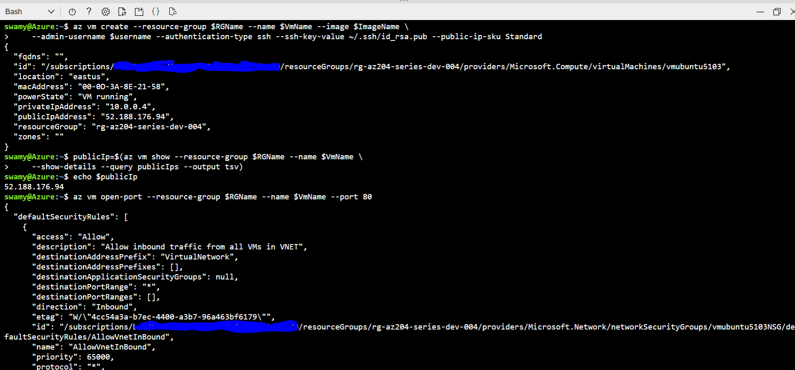

# AZ-204 | Implement infrastructure as a service solutions

## Date Time: 08-Aug-2022 at 09:00 PM IST

## Event URL: [https://www.c-sharpcorner.com/events/implement-iaas-solutions-az204-handson-series](https://www.c-sharpcorner.com/events/implement-iaas-solutions-az204-handson-series)

## Current Session's YouTube URL: [https://www.youtube.com/watch?v=33KvxeuG_U4](https://www.youtube.com/watch?v=33KvxeuG_U4)


---

## Pre-Requisites

> 1. .NET 3.1/6 SDK
> 1. Azure CLI

### Software/Tools

> 1. OS: win32 x64
> 1. Node: **v14.17.5**
> 1. Visual Studio Code
> 1. Visual Studio 2019/2022

### Prior Knowledge

> 1. C#, Node JS
> 1. Application Insights
> 1. Azure Key Vault
> 1. .NET Razor/Blazor WASM

### Assumptions

> 1. NIL

## Technology Stack

> 1. Azure

## Information

## 

## What are we doing today?

> 1. Introduction to PowerShell and Az Module (3 Minutes)
> 1. Introduction to Azure CLI (3 Minutes)
> 1. Introduction to Azure Cloud Shell (4 Minutes)
> 1. Creating Windows VM and installing IIS using PowerShell (6 Minutes)
> 1. Creating Ubuntu VM and installing Nginx using PowerShell (6 Minutes)
> 1. Creating Windows VM and installing IIS using Azure CLI (6 Minutes)
> 1. Creating Ubuntu VM and installing LAMP Server using Azure CLI (6 Minutes)
> 1. What is Infrastructure as a Code? (5 Minutes)
> 1. Introduction to ARM (5 Minutes)
> 1. Deploy a Storage Account using an ARM template, and Azure CLI (5 Minutes)
> 1. Deploy a SQL Server, Database using an ARM template, and Azure CLI (5 Minutes)
> 1. Deploy an App Service, Web App using an ARM template, and Azure CLI (5 Minutes)
> 1. Deploy an Azure Key Vault using an ARM template, and Azure CLI (5 Minutes)
> 1. Deploy an Ubuntu VM using an ARM template, and Azure CLI (6 Minutes)
> 1. Review/Q & A/Panel Discussion (5 Minutes)
> 1. Q & A
> 1. What is next in `Session 2`? (5 Minutes)

### Please refer MS Learn Module(s) for more details

> 1. [Provision virtual machines in Azure](https://docs.microsoft.com/en-gb/learn/modules/provision-virtual-machines-azure/)
> 1. [Create and deploy Azure Resource Manager templates](https://docs.microsoft.com/en-gb/learn/modules/create-deploy-azure-resource-manager-templates/)

### Please refer the [**Source code**](https://github.com/vishipayyallore/speaker-series-2022/tree/main/csharp-corner) for today's session

---


---

## Introduction to PowerShell and Az Module (3 Minutes)

> 1. Discussion and Demo

**Reference:**

> <https://docs.microsoft.com/en-us/powershell/azure/new-azureps-module-az?view=azps-8.2.0>

## Introduction to Azure CLI (3 Minutes)

> 1. Discussion and Demo

**Reference(s):**

> 1. <https://docs.microsoft.com/en-us/cli/azure/>

## Introduction to Azure Cloud Shell (4 Minutes)

> 1. Discussion and Demo

**Reference(s):**

> 1. <https://docs.microsoft.com/en-us/azure/cloud-shell/overview>

## Creating Windows VM and installing IIS using PowerShell. (6 Minutes)

> 1. Discussion and Demo


## Creating Ubuntu VM and installing Nginx using PowerShell. (6 Minutes)

> 1. Discussion and Demo


## Creating Windows VM and installing IIS using Azure CLI. (6 Minutes)

> 1. Discussion and Demo


## Creating Ubuntu VM and installing LAMP Server using Azure CLI. (6 Minutes)

> 1. Discussion and Demo




## What is Infrastructure as a Code? (5 Minutes)

> 1. Discussion and Demo

**Reference(s):**

> 1. <https://docs.microsoft.com/en-us/dotnet/architecture/cloud-native/infrastructure-as-code>
> 1. <https://docs.microsoft.com/en-us/devops/deliver/what-is-infrastructure-as-code>

## Introduction to ARM (5 Minutes)

> 1. Discussion and Demo

**Reference(s):**

> 1. <https://docs.microsoft.com/en-us/azure/azure-resource-manager/management/overview>

## Deploy a Storage Account using an ARM template, and Azure CLI (5 Minutes)

> 1. Discussion and Demo

```Azure CLI
az deployment group validate --resource-group rg-womd-robbie-001 --template-file storage-deploy.json --parameters storage-parameters.json

az deployment group create --resource-group rg-womd-robbie-001 --template-file storage-deploy.json --parameters storage-parameters.json --mode Incremental
```


## Deploy a SQL Server, Database using ARM template, and Azure CLI (5 Minutes)

> 1. Discussion and Demo

```Azure CLI
az deployment group validate --resource-group rg-womd-robbie-001 --template-file sql-server.deploy.json --parameters sql-server.parameters.json

az deployment group create --resource-group rg-womd-robbie-001 --template-file sql-server.deploy.json --parameters sql-server.parameters.json --mode Incremental
```


## Deploy an App Service, Web App using ARM template, and Azure CLI (5 Minutes)

> 1. Discussion and Demo

```Azure CLI
az deployment group validate --resource-group rg-womd-robbie-001 --template-file webapp.deploy.json --parameters webapp.parameters.json

az deployment group create --resource-group rg-womd-robbie-001 --template-file webapp.deploy.json --parameters webapp.parameters.json --mode Incremental
```


## Deploy an Azure Key Vault using an ARM template, and Azure CLI (5 Minutes)

> 1. Discussion and Demo

**Note:** Modify the `ObjectId` in the parameter file to match the ObjectId of the User.

```Azure CLI
az deployment group validate --resource-group rg-womd-robbie-001 --template-file keyvault.deploy.json --parameters keyvault.parameters.json

az deployment group create --resource-group rg-womd-robbie-001 --template-file keyvault.deploy.json --parameters keyvault.parameters.json --mode Incremental
```


## Deploy an Ubuntu VM using an ARM template, and Azure CLI (6 Minutes)

> 1. Discussion and Demo

**Note:** Modify the `<UserName>` in the parameter file to match the logged in User.

```Azure CLI
az deployment group validate --resource-group rg-womd-robbie-001 --template-file ubuntuvm.deploy.json --parameters ubuntuvm.parameters.json

sshKey=$(cat '/mnt/c/Users/<UserName>/.ssh/id_rsa.pub')
az deployment group create --resource-group rg-womd-robbie-001 --template-file ubuntuvm.deploy.json --parameters ubuntuvm.parameters.json --parameters adminPublicKey="$sshKey" --mode Incremental
```


```Bash
ssh -i /mnt/c/Users/<UserName>/.ssh/id_rsa demouser@<IpAddressOfNewlyCreatedVM>
```


## SUMMARY / RECAP / Q&A

---

> 1. SUMMARY / RECAP / Q&A
> 2. Any open queries, I will get back through meetup chat/twitter.

---

## What is next in `Session 2`? (5 Minutes)

> 1. Introduction to `SQL Server, and Database`, and programming in .NET 6
> 1. Introduction to `Cosmos Database`, and programming in .NET 6
> 1. `Web API`, and programming in .NET 6
> 1. `Web App Razor`, and programming in .NET 6
> 1. Web App `Blazor WebAssembly`, and programming in .NET 6
> 1. Deploy SQL Project Dacpac .sqlproj to Azure SQL Database
