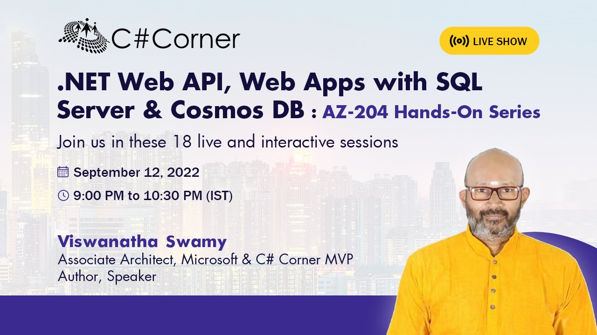
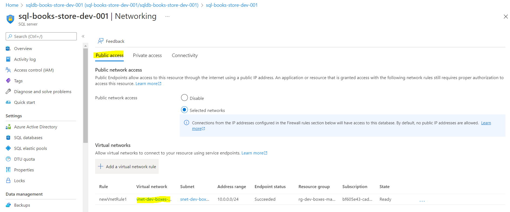
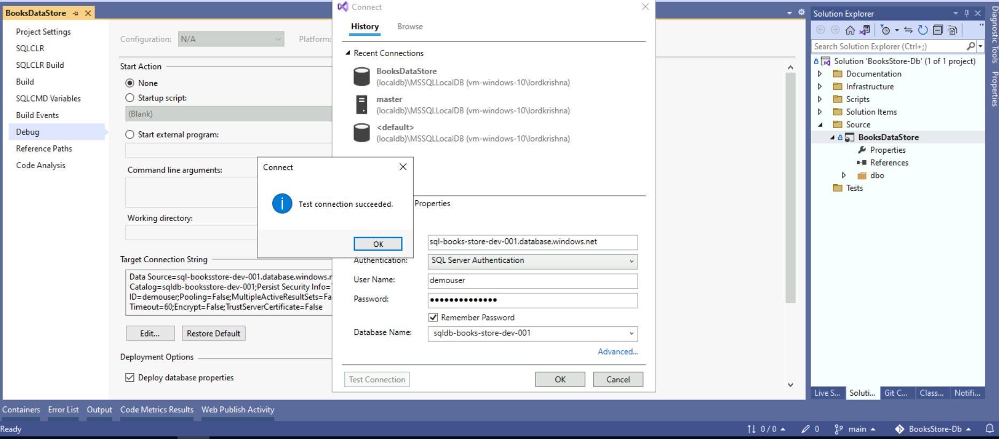
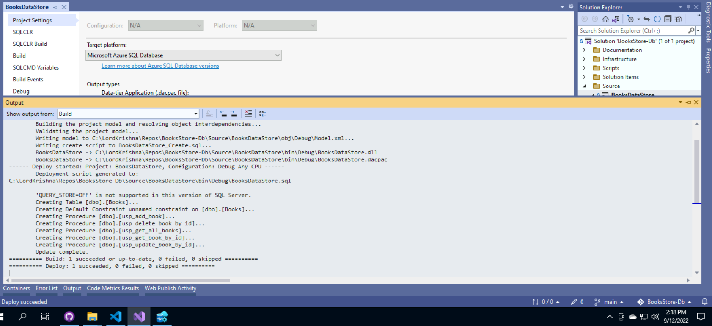
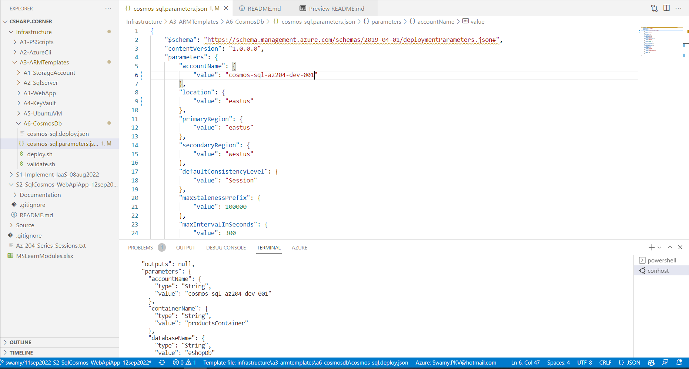
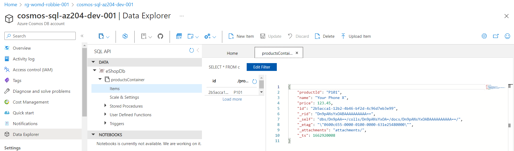
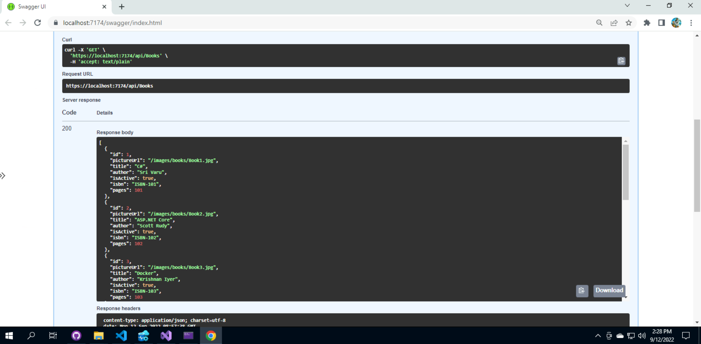
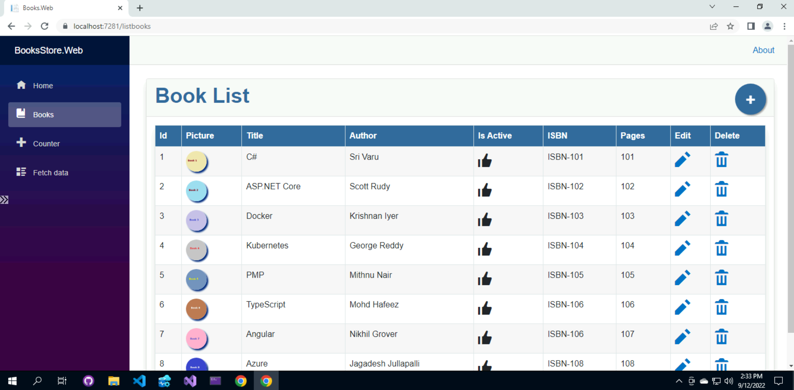

# AZ-204 | .NET Web API, Web Apps with SQL Server & CosmosDB - Session 2

## Date Time: 03-Oct-2022 at 09:00 PM IST

## Event URL: [https://www.c-sharpcorner.com/events/net-web-api-web-apps-with-sql-server-cosmosdb-az204-handson](https://www.c-sharpcorner.com/events/net-web-api-web-apps-with-sql-server-cosmosdb-az204-handson)

## Please watch the `previous sessions` on YouTube

>1. ### [Session 1](https://www.youtube.com/watch?v=33KvxeuG_U4)

>1. ### [Session 2](https://www.youtube.com/watch?v=1-y8KKurkBw)

## Current Session's YouTube URL: [https://www.youtube.com/watch?v=1-y8KKurkBw](https://www.youtube.com/watch?v=1-y8KKurkBw)

---



---

## Pre-Requisites

> 1. .NET 3.1/6 SDK
> 1. Azure CLI

### Software/Tools

> 1. OS: win32 x64
> 1. Node: **v14.17.5**
> 1. Visual Studio Code
> 1. Visual Studio 2019/2022

### Prior Knowledge

> 1. C#, Node JS
> 1. Application Insights
> 1. Azure Key Vault
> 1. .NET Razor/Blazor WASM

### Assumptions

> 1. NIL

## Technology Stack

> 1. Azure

## Information

## 

## What are we doing today?

> 1. Introduction to SQL Server from 30,000 feet (5 Minutes)
> 1. Provision SQL Server, and Database using ARM Template (5 Minutes)
> 1. Deploy SQL Server Project (.sqlproj) to SQL Azure using VS 2022 (5 Minutes)
> 1. Introduction to Cosmos Db from 30,000 feet (5 Minutes)
> 1. Provision Cosmos Db using ARM Template (5 Minutes)
> 1. Create Web API in .NET 6, interacting with SQL Server Database. Only List Functionality. (15 Minutes)
> 1. Create Web API in .NET 6, interacting with Cosmos Database. Only List Functionality. (15 Minutes)
> 1. Web APIs using Dependency Injection, AppSettings.json, Secrets.json, and Layered Architecture. (Part of items 6, and 7)
> 1. Create Asp.NET 6 Web App with Razor pages. Integrate with Local Web API. (15 Minutes)
> 1. Create Asp.NET 6 Blazor WASM App. Integrate with Local Web API. (15 Minutes)
> 1. Summary/Review/Q & A/Panel Discussion (5 Minutes)
> 1. What is next in Session 3? (5 Minutes)

### Please refer MS Learn Module(s) for more details

> 1. [Provision virtual machines in Azure](https://docs.microsoft.com/en-gb/learn/modules/provision-virtual-machines-azure/)
> 1. [Create and deploy Azure Resource Manager templates](https://docs.microsoft.com/en-gb/learn/modules/create-deploy-azure-resource-manager-templates/)

### Please refer the [**Source code**](https://github.com/vishipayyallore/speaker-series-2022/tree/main/csharp-corner) for today's session

---


---

## 1. Introduction to SQL Server from 30,000 feet (5 Minutes)

> 1. Discussion and Demo

**Reference(s):**

> 1. [https://docs.microsoft.com/en-in/azure/azure-sql/azure-sql-iaas-vs-paas-what-is-overview?view=azuresql](https://docs.microsoft.com/en-in/azure/azure-sql/azure-sql-iaas-vs-paas-what-is-overview?view=azuresql)

## 2. Provision SQL Server, and Database using ARM Template (5 Minutes)

> 1. Discussion and Demo

```azurecli
az deployment group validate --resource-group rg-womd-robbie-001 --template-file sql-server.deploy.json --parameters sql-server.parameters.json

az deployment group create --resource-group rg-womd-robbie-001 --template-file sql-server.deploy.json --parameters sql-server.parameters.json --mode Incremental
```


## 3. Deploy SQL Server Project (.sqlproj) to SQL Azure using VS 2022 (5 Minutes)

> 1. Discussion and Demo







## 4. Introduction to Cosmos Db from 30,000 feet (5 Minutes)

> 1. Discussion and Demo

**Reference(s):**

> 1. <https://docs.microsoft.com/en-us/azure/cosmos-db/introduction>

## 5. Provision Cosmos Db using ARM Template (5 Minutes)

> 1. Discussion and Demo

```azurecli
az deployment group validate --resource-group rg-womd-robbie-001 --template-file cosmos-sql.deploy.json --parameters cosmos-sql.parameters.json

az deployment group create --resource-group rg-womd-robbie-001 --template-file cosmos-sql.deploy.json --parameters cosmos-sql.parameters.json --mode Incremental
```





## 6. Create Web API in .NET 6, interacting with SQL Server Database. Only List Functionality. (15 Minutes)

> 1. Discussion and Demo



## 7. Create Web API in .NET 6, interacting with Cosmos Database. Only List Functionality. (15 Minutes)

> 1. Discussion and Demo

## 8. Web APIs using Dependency Injection, AppSettings.json, Secrets.json, and Layered Architecture. (Part of items 6, and 7)

> 1. Discussion and Demo

## 9. Create Asp.NET 6 Web App with Razor pages. Integrate with Local Web API. (15 Minutes)

> 1. Discussion and Demo

## 10. Create Asp.NET 6 Blazor WASM App. Integrate with Local Web API. (15 Minutes)

> 1. Discussion and Demo



---

## Summary/Review/Q & A/Panel Discussion (5 Minutes)

> 1. SUMMARY / RECAP / Q&A
> 2. Any open queries, I will get back through meetup chat/twitter.

---

## What is next in `Session 3`? (5 Minutes)

> 1. To be done
