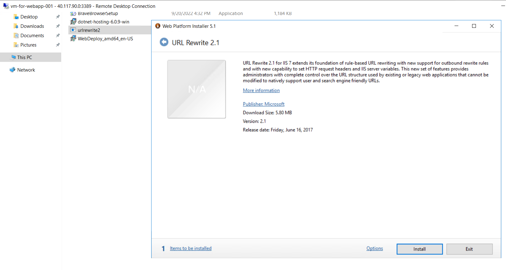

# AZ-204 | .NET Web API, Web Apps inside VM (IaaS), and App Service (PaaS) - Session 3

## Date Time: 03-Oct-2022 at 09:00 PM IST

## Event URL: [https://www.c-sharpcorner.com/events/deploying-net-web-api-web-apps-inside-vm-and-app-service-ep-3](https://www.c-sharpcorner.com/events/deploying-net-web-api-web-apps-inside-vm-and-app-service-ep-3)

## Please watch the previous `2 sessions` on YouTube

>1. [Session 1](https://www.youtube.com/watch?v=33KvxeuG_U4)
>1. [Session 2](https://www.youtube.com/watch?v=1-y8KKurkBw)

## Current Session's YouTube URL: [https://www.youtube.com/watch?v=1-y8KKurkBw](https://www.youtube.com/watch?v=1-y8KKurkBw)

---

---

## Pre-Requisites

> 1. .NET 3.1/6 SDK
> 1. Azure CLI

### Software/Tools

> 1. OS: win32 x64
> 1. Node: **v14.17.5**
> 1. Visual Studio Code
> 1. Visual Studio 2019/2022

### Prior Knowledge

> 1. C#, Node JS
> 1. Application Insights
> 1. Azure Key Vault
> 1. .NET Razor/Blazor WASM

### Assumptions

> 1. NIL

## Technology Stack

> 1. Azure

## Information

## 

## What are we doing today?

> 1. Creating Windows VM using an ARM template and Azure CLI (5 Minutes)
> 1. Configure Windows VM with IIS, and other required software (5 Minutes)
> 1. Create a Website inside IIS, and deploy Web API using VS 2022 (5 Minutes)
> 1. Create a Website inside IIS, and deploy a Web App (Razor Pages) using VS 2022 (5 Minutes)
> 1. Create a Website inside IIS, and deploy a Web App (Blazor WASM) using VS 2022 (5 Minutes)
> 1. Create a static HTML web app by using Azure Cloud Shell (5 Minutes)
> 1. Deploy App Service, Web App using ARM + AZ CLI (5 Minutes)
> 1. Deploy Web API to App Service using VS 2022 (5 Minutes)
> 1. Deploy Web App (Razor Pages) to App Service using VS 2022 (5 Minutes)
> 1. Deploy Web App (Blazor WASM) to App Service using VS 2022 (5 Minutes)
> 1. Review/Q & A/Panel Discussion (5 Minutes)
> 1. What is next in Session 4? (5 Minutes)

### Please refer MS Learn Module(s) for more details

> 1. [Provision virtual machines in Azure](https://docs.microsoft.com/en-gb/learn/modules/provision-virtual-machines-azure/)
> 1. [Create and deploy Azure Resource Manager templates](https://docs.microsoft.com/en-gb/learn/modules/create-deploy-azure-resource-manager-templates/)

### Please refer the [**Source code**](https://github.com/vishipayyallore/speaker-series-2022/tree/main/csharp-corner) for today's session

---

---

## 1. Creating Windows VM using an ARM template and Azure CLI (5 Minutes)

> 1. Discussion and Demo

## 2. Configure Windows VM with IIS, and other required software (5 Minutes)

> 1. Discussion and Demo

### Install IIS on Azure VM

### Install Brave Browser on Azure VM

### Enable Remote Connections and Start Management Service inside IIS

### Install .NET 6 Hosting Bundle on Azure VM

### Install Web Deploy on Azure VM

### Install URL Rewrite on Azure VM

### Update the VM DNS Name on Azure VM

### Without 8172 Port Enabled on Azure VM

### Enable 8172 Port on Azure VM

### Security Certificate Error/Validation

## 3. Create a Website inside IIS, and deploy Web API using VS 2022 (5 Minutes)

> 1. Discussion and Demo

## 4. Create a Website inside IIS, and deploy a Web App (Razor Pages) using VS 2022 (5 Minutes)

> 1. Discussion and Demo

## 5. Create a Website inside IIS, and deploy a Web App (Blazor WASM) using VS 2022 (5 Minutes)

> 1. Discussion and Demo

## 6. Create a static HTML web app by using Azure Cloud Shell (5 Minutes)

> 1. Discussion and Demo

## 7. Deploy App Service, Web App using ARM + AZ CLI (5 Minutes)

> 1. Discussion and Demo

## 8. Deploy Web API to App Service using VS 2022 (5 Minutes)

> 1. Discussion and Demo

## 9. Deploy Web App (Razor Pages) to App Service using VS 2022 (5 Minutes)

> 1. Discussion and Demo

## 10. Deploy Web App (Blazor WASM) to App Service using VS 2022 (5 Minutes)

> 1. Discussion and Demo

## 11. Summary/Review/Q & A/Panel Discussion (5 Minutes)

> 1. SUMMARY / RECAP / Q&A
> 2. Any open queries, I will get back through meetup chat/twitter.

---

## What is next in `Session 4`? (5 Minutes)

> 1. To be done
