# Building and Deploying Cloud Native Apps in Azure

## Date Time: 12-Feb-2022 at 10:00 AM IST

## Event URL: [https://www.meetup.com/dot-net-learners-house-hyderabad/events/282038867](https://www.meetup.com/dot-net-learners-house-hyderabad/events/282038867)


---

## Pre-Requisites

> 1. .NET 6
> 1. Azure CLI

### Software/Tools

> 1. OS: win32 x64
> 1. Node: **v14.17.5**
> 1. Visual Studio Code
> 1. Visual Studio 2022

### Prior Knowledge

> 1. C#, Node JS
> 1. Azure Storage
> 1. Azure Functions
> 1. .NET Razor/Blazor WASM

### Assumptions

> 1. NIL

## Technology Stack

> 1. Azure Functions

## Information

## 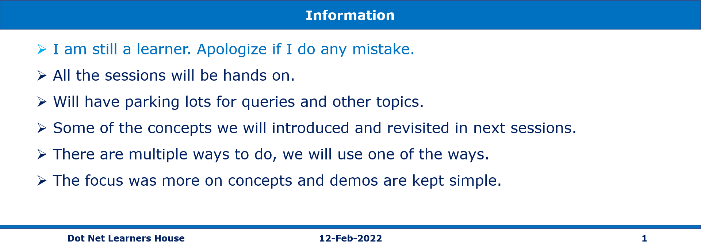

## What are we doing today?

> 1. Some security practices
> 1. Deploy .sqlproj Azure SQL Server
> 1. Redis cache to store data in memory
> 1. Cache Aside Pattern
> 1. Azure Key Vault to store secrets of Azure SQL Server and Redis Cache
> 1. Deploy .NET 6 Web API on Azure App Service
> 1. Modify the Web API's Configuration to use secrets from Azure Key Vault
> 1. Verify the Web API using Postman
> 1. Adding APIs to API Management
> 1. Integrate .NET 6 Blazor WASM based Single Page Application with Web API
> 1. Deploy .NET 6 Blazor WASM based Single Page Application on Azure App Service
> 1. Containerzing the Blazor WASM based Single Page Application
> 1. SUMMARY / RECAP / Q&A

---


---

**Note:** [Click here for Source Code on GitHub](https://github.com/vishipayyallore/cloudnative-dot-net6-azure)

## 1. Some security practices

> 1. Discussion on security practices. This is will be as part of all sections

## 2. Deploy .sqlproj Azure SQL Server

> 1. Discussion
> 1. Adding Virtual Network to Azure SQL Server Firewall Rule
> 1. Deploy .sqlproj Azure SQL Server using VS 2022

## 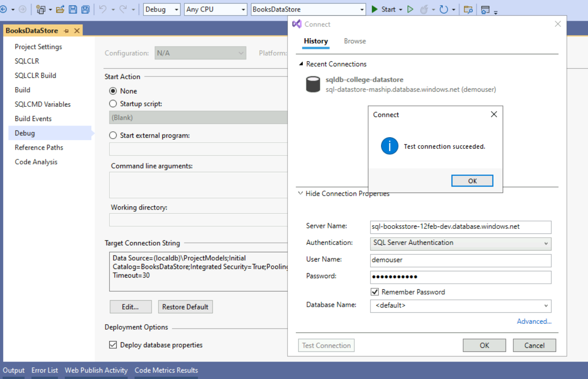

## 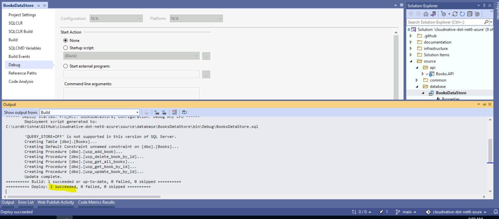

## 3. Redis cache to store data in memory

> 1. Discussion

## 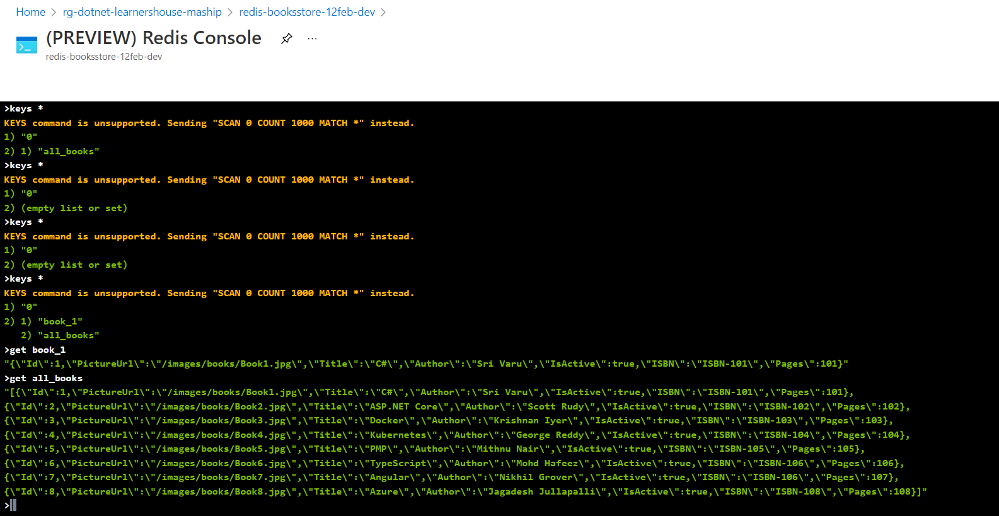

## 4. Cache Aside Pattern

> 1. Discussion and Demo

## 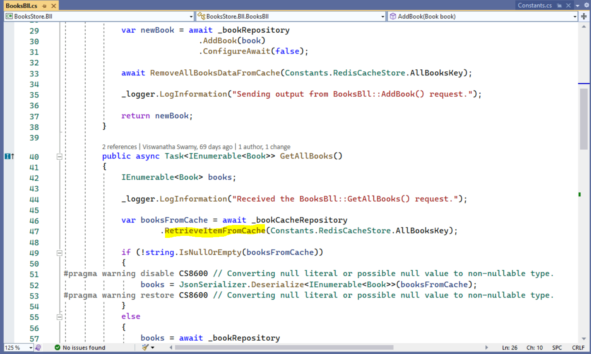

## 5. Azure Key Vault to store secrets of Azure SQL Server and Redis Cache

> 1. Discussion
> 1. Show casing the Purge protection of Redis Cache
> 1. We will store the Azure SQL Server and Redis Cache secrets in Azure Key Vault.

**SqlServerConnectionString**

```
Server=tcp:YourServer.database.windows.net,1433;Initial Catalog=sqldb-booksstore;Persist Security Info=False;User ID=demouser;Password=YourPassword;MultipleActiveResultSets=False;Encrypt=True;TrustServerCertificate=False;Connection Timeout=30;
```

**RedisConnectionString**

```
YourRedis.redis.cache.windows.net:6380,password=YourPassword=,ssl=True,abortConnect=False
```

## 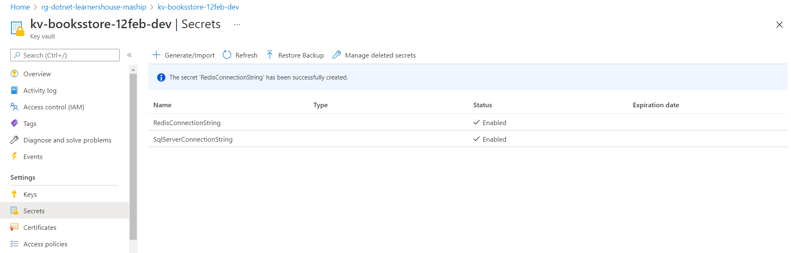

## 6. Deploy .NET 6 Web API on Azure App Service

> 1. Discussion
> 1. Secrets.json
> 1. Dependency Injection
> 1. Deploy .NET 6 Web API on Azure App Service using Visual Studio 2022

## 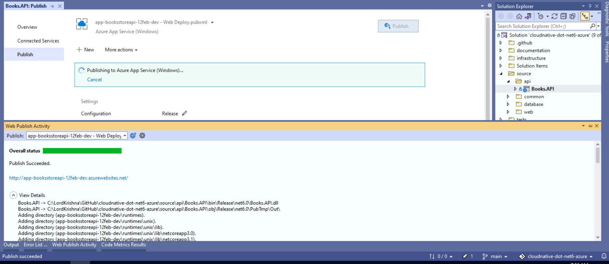

## 7. Modify the Web API's Configuration to use secrets from Azure Key Vault

> 1. Discussion
> 1. Modify the Web API's Configuration to use secrets from Azure Key Vault
> 1. Verify the Web API endpoint using Chrome. It will NOT work.
> 1. Enable the IP address of the Web API inside the SQL Server Fire Wall Rule.
> 1. Verify the Web API endpoint using Chrome. It will work.

```
https://YourKeyVault.vault.azure.net/secrets/SqlServerConnectionString/5038a0ac6f2c4dc6adb0098517c09253
DataStoreSettings__SqlServerConnectionString
@Microsoft.KeyVault(SecretUri=https://YourKeyVault.vault.azure.net/secrets/SqlServerConnectionString/5038a0ac6f2c4dc6adb0098517c09253)
```

```
https://YourKeyVault.vault.azure.net/secrets/RedisConnectionString/80a3cc12fb74470ca7812951bebadb6c
DataStoreSettings__RedisConnectionString
@Microsoft.KeyVault(SecretUri=https://YourKeyVault.vault.azure.net/secrets/RedisConnectionString/80a3cc12fb74470ca7812951bebadb6c)

```

## 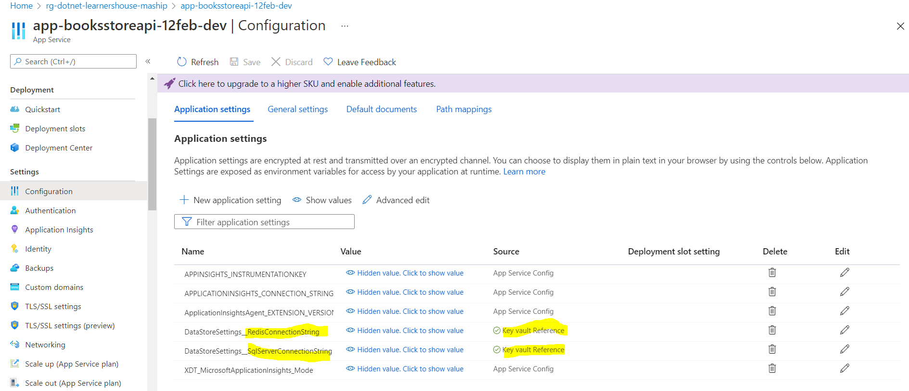

## 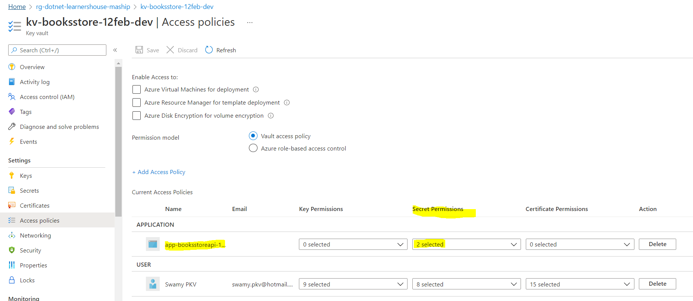

## 8. Verify the Web API using Postman

> 1. Discussion
> 1. Verify the Web API using Postman

## 9. Adding APIs to API Management

> 1. Discussion and Demo

```
<cors>
    <allowed-origins>
        <origin>https://localhost:7223/</origin>
        <origin>https://app-booksstoreweb-12feb-dev.azurewebsites.net/</origin>
    </allowed-origins>
    <allowed-methods preflight-result-max-age="300">
        <method>*</method>
    </allowed-methods>
    <allowed-headers>
        <header>*</header>
    </allowed-headers>
</cors>

```

## 10. Integrate .NET 6 Blazor WASM based Single Page Application with Web API

> 1. Discussion
> 1. Integrate .NET 6 Blazor WASM based Single Page Application with Web API

**appsettings.json**

```
"WebApis": {
    "Books_API": "https://app-booksstoreapi-12feb-dev.azurewebsites.net",
    "Books": "https://apimdnlh12febprod.azure-api.net/devapim/",
    "ApimSubscriptionKey": "YourSubscriptionKey"
  },
```

## 11. Deploy .NET 6 Blazor WASM based Single Page Application on Azure App Service

> 1. Discussion
> 1. Deploy .NET 6 Blazor WASM based Single Page Application on Azure App Service

## 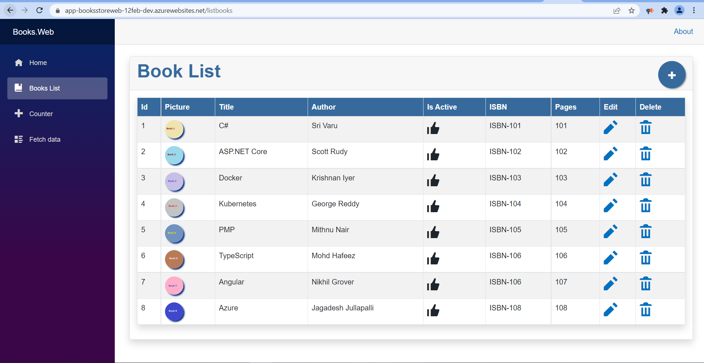

## 12. Containerzing the Blazor WASM based Single Page Application

> 1. Dockerfile Discussion
> 1. Change the directory to D:\LordKrishna\GitHub\cloudnative-dot-net6-azure\source\web
> 1. Execute below mentioned command to build the container
> 1. Execute the below mentioned command to run the container

```
docker build -f "D:\LordKrishna\GitHub\cloudnative-dot-net6-azure\source\web\Books.Web\Dockerfile" --force-rm -t booksdemo-image "D:\LordKrishna\GitHub\cloudnative-dot-net6-azure"
```

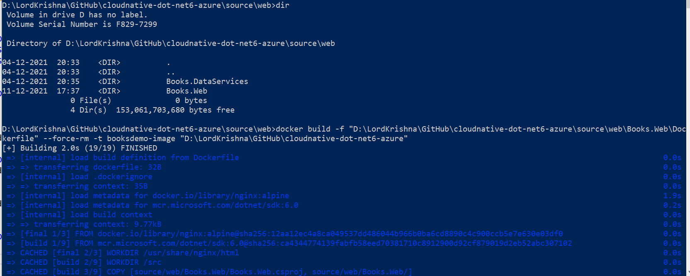

```
docker run -d -p 8091:80 --name demo-container1 booksdemo-image
```

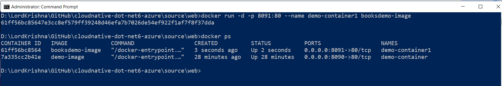

---

## 12. SUMMARY / RECAP / Q&A

---

> 1. SUMMARY / RECAP / Q&A
> 2. Any open queries, I will get back through meetup chat/twitter.

---
