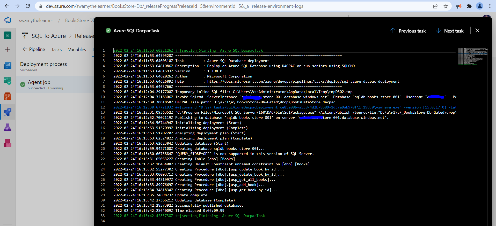

# DevOps, CI/CD with Azure DevOps

## Date Time: 12-Mar-2022 at 10:00 AM IST

## Event URL: [https://www.meetup.com/dot-net-learners-house-hyderabad/events/282179394](https://www.meetup.com/dot-net-learners-house-hyderabad/events/282179394)

---

## Pre-Requisites

> 1. .NET 6
> 1. Azure CLI

### Software/Tools

> 1. OS: win32 x64
> 1. Node: **v14.17.5**
> 1. Visual Studio Code
> 1. Visual Studio 2022

### Prior Knowledge

> 1. C#, Node JS
> 1. Azure Storage
> 1. Azure Functions
> 1. .NET Razor/Blazor WASM

### Assumptions

> 1. NIL

## Technology Stack

> 1. Azure Functions

## Information

## 

## What are we doing today?

> 1. Azure DevOps Boards
> 1. Infrastructure as a Code
> 1. Build Pipeline
> 1. Release Pipeline
> 1. SUMMARY / RECAP / Q&A

---

---

## 1. Azure DevOps Boards

> 1. Discussion and Demo

## 2. Infrastructure as a Code

> 1. Discussion and Demo

## 3. Build Pipeline

> 1. Discussion

## 

## 4. Release Pipeline

> 1. Discussion and Demo

## 

---

## 12. SUMMARY / RECAP / Q&A

---

> 1. SUMMARY / RECAP / Q&A
> 2. Any open queries, I will get back through meetup chat/twitter.

---
