# Az-204 Labs - Web Apps, Azure Functions, and Blob Storage | Workshop

## Date Time: 24-Sep-2022 at 10:00 AM IST

## Event URL: [https://www.meetup.com/microsoft-reactor-bengaluru/events/287635867](https://www.meetup.com/microsoft-reactor-bengaluru/events/287635867)

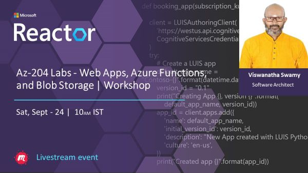

---

## Pre-Requisites

> 1. .NET 3.1/6 SDK
> 1. Azure CLI

### Software/Tools

> 1. OS: win32 x64
> 1. Node: **v14.17.5**
> 1. Visual Studio Code
> 1. Visual Studio 2019/2022

### Prior Knowledge

> 1. C#, Node JS
> 1. Application Insights
> 1. Azure Key Vault
> 1. .NET Razor/Blazor WASM

### Assumptions

> 1. NIL

## Technology Stack

> 1. Azure

## Information

## What are we doing today?

> 1. Explore the Azure Active Directory
> 1. Explore the Microsoft identity platform
> 1. Explore Microsoft Graph API
> 1. Mini Project(s)
> 1. Q & A
> 1. Implement authentication by using the Microsoft Authentication Library - **`Stretch Goal`**
> 1. Implement shared access signatures - **`Stretch Goal`**

### Please refer AZ-204 [**MS Learn Module**](https://aka.ms/AZ-204-Authentication) for more details.

### Please refer to the [**Source Code**](https://github.com/vishipayyallore/learn-azure-in-2022) of today's session for more details.

---

---

## Explore the Azure Active Directory

### Introduction to Azure AD - (`5 minutes`)

> 1. Discussion and Demo

#### Reference(s):

> 1. [https://docs.microsoft.com/en-us/azure/active-directory/fundamentals/active-directory-whatis](https://docs.microsoft.com/en-us/azure/active-directory/fundamentals/active-directory-whatis)

### Creating Azure AD Tenant - (`5 minutes`)

> 1. Discussion and Demo

#### Reference(s):

> 1. [https://docs.microsoft.com/en-us/azure/active-directory/fundamentals/active-directory-access-create-new-tenant](https://docs.microsoft.com/en-us/azure/active-directory/fundamentals/active-directory-access-create-new-tenant)

#### Create New Tenant in Azure AD

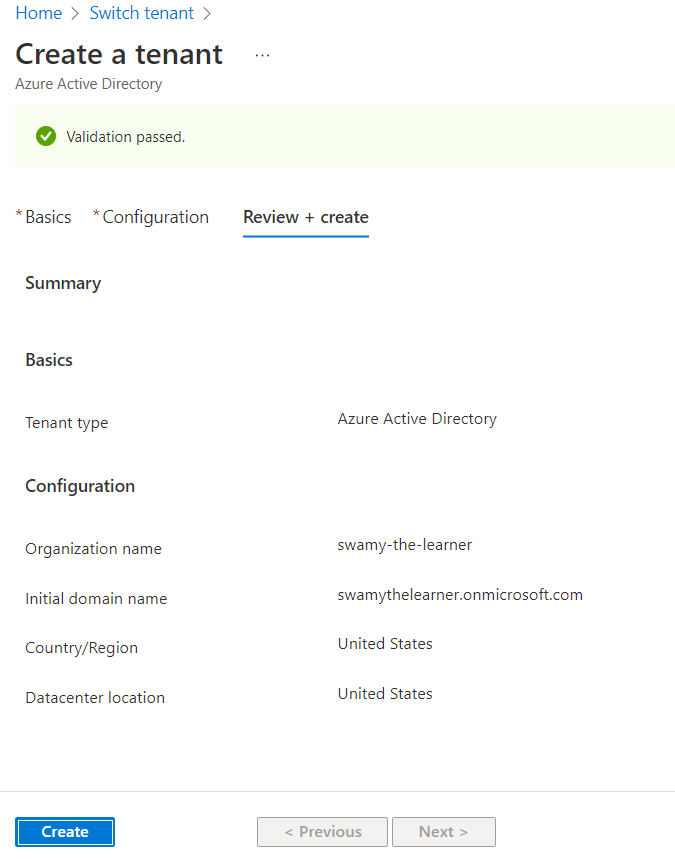

### Creating User inside Azure AD Tenant - (`5 minutes`)

> 1. Discussion and Demo
> 1. Create a new user in Azure AD
> 1. Login to Azure Portal
> 1. Change the password of the user

#### Create New User in Azure AD

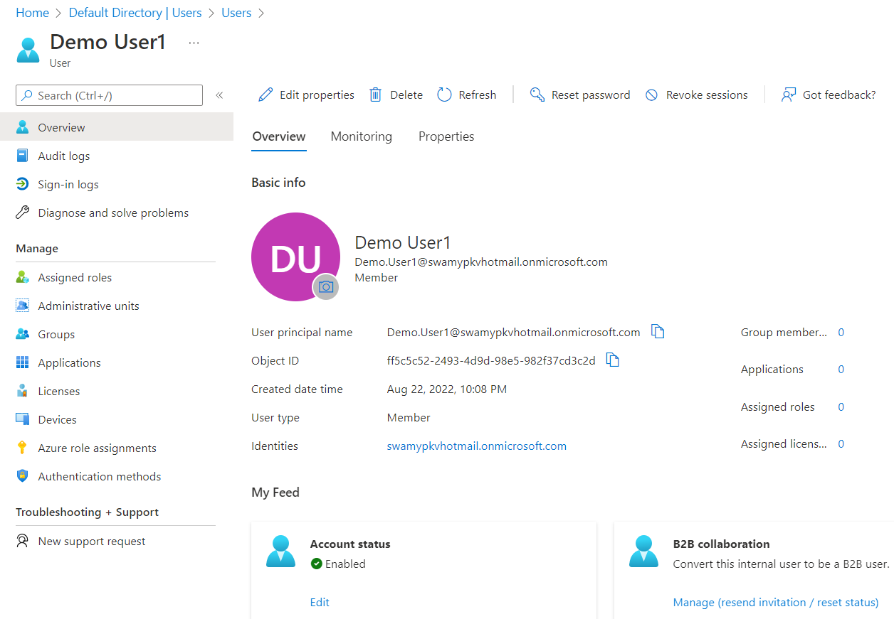

#### Create New User in Azure AD using Invitation

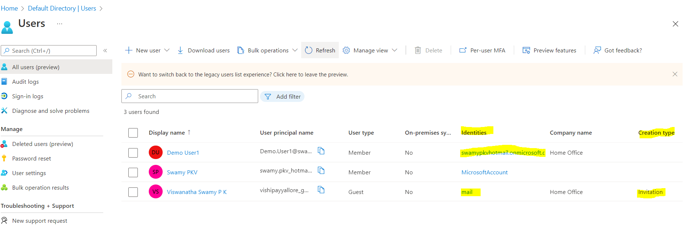

#### New User Invitation Email

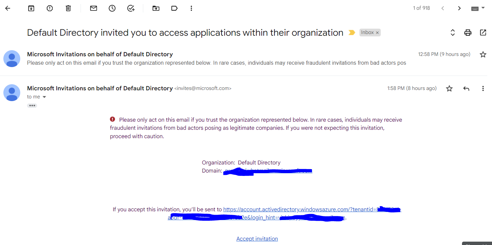

#### New User Without Subscription

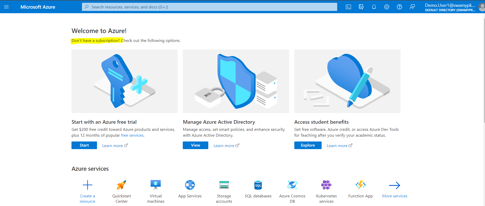

### RBAC to newly created User to Resource Group Azure AD Tenant - (`5 minutes`)

> 1. Discussion and Demo

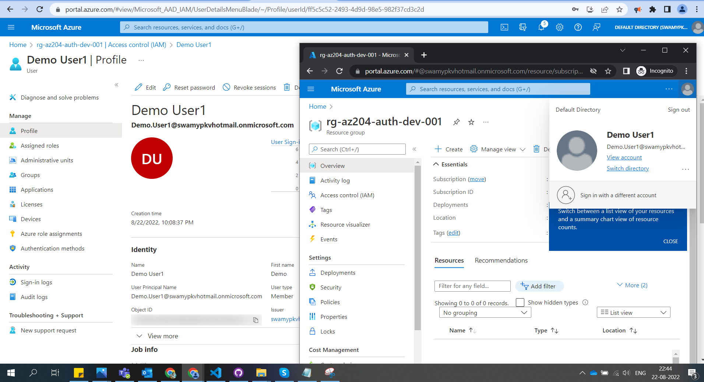

## Explore the Microsoft identity platform

### Introduction to Microsoft identity platform - (`5 minutes`)

> 1. Discussion and Demo

#### Reference(s):

> 1. [https://docs.microsoft.com/en-us/azure/active-directory/fundamentals/active-directory-whatis](https://docs.microsoft.com/en-us/azure/active-directory/fundamentals/active-directory-whatis)
> 1. [https://docs.microsoft.com/en-gb/azure/active-directory/develop/v2-overview](https://docs.microsoft.com/en-gb/azure/active-directory/develop/v2-overview)

### Console Application with RBAC to Storage - (`10 minutes`)

> 1. Discussion and Demo

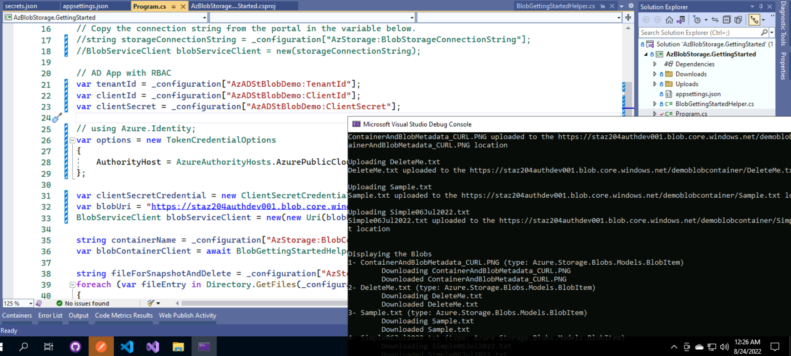

### Web Application - (`10 minutes`)

> 1. Discussion and Demo

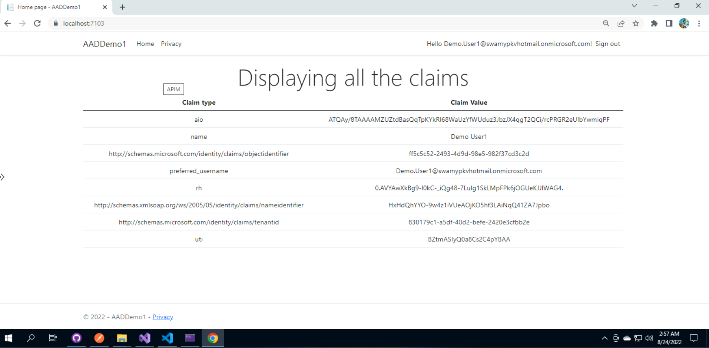

### Web API - (`10 minutes`)

> 1. Discussion and Demo

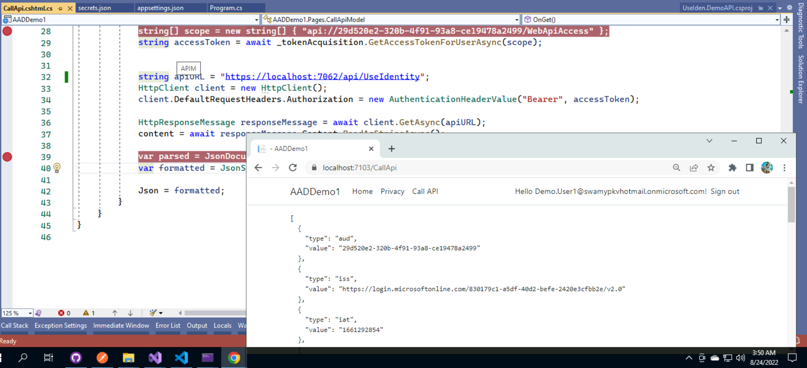

## Explore Microsoft Graph API

> 1. Discussion and Demo

### Graph Explorer - (`5 minutes`)

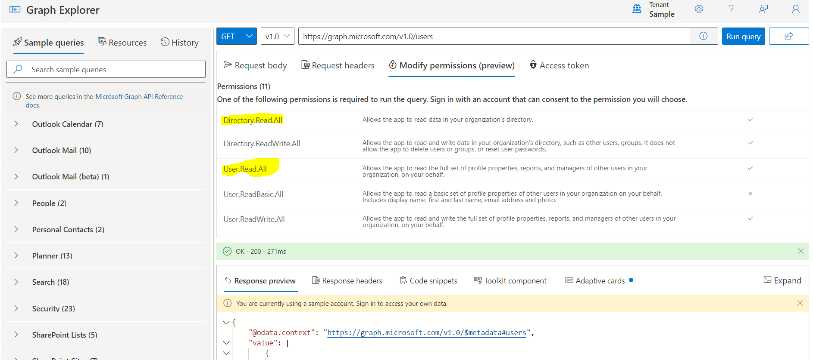

### Console Application - (`10 minutes`)

#### Reference(s):

> 1. [https://docs.microsoft.com/en-us/graph/sdks/choose-authentication-providers?tabs=CS](https://docs.microsoft.com/en-us/graph/sdks/choose-authentication-providers?tabs=CS)

#### App Resigration and Permissions

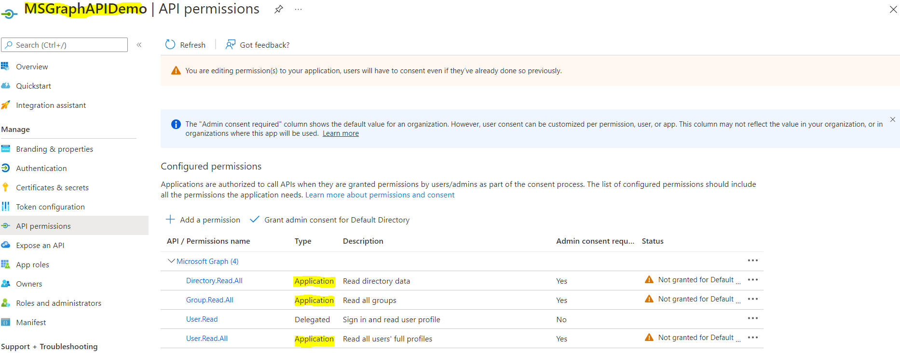

#### Graph API Console Application

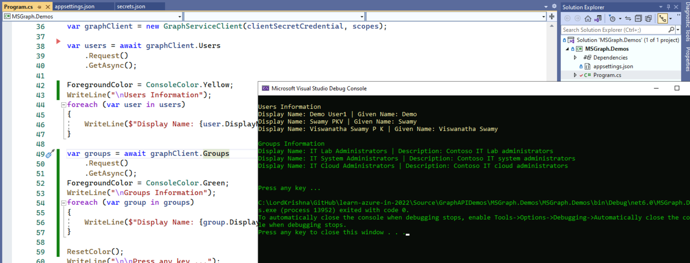

### Graph API using Postman - (`10 minutes`)

#### Reference(s):

> 1. [https://docs.microsoft.com/en-us/graph/auth-v2-service](https://docs.microsoft.com/en-us/graph/auth-v2-service)

#### Graph API using Postman

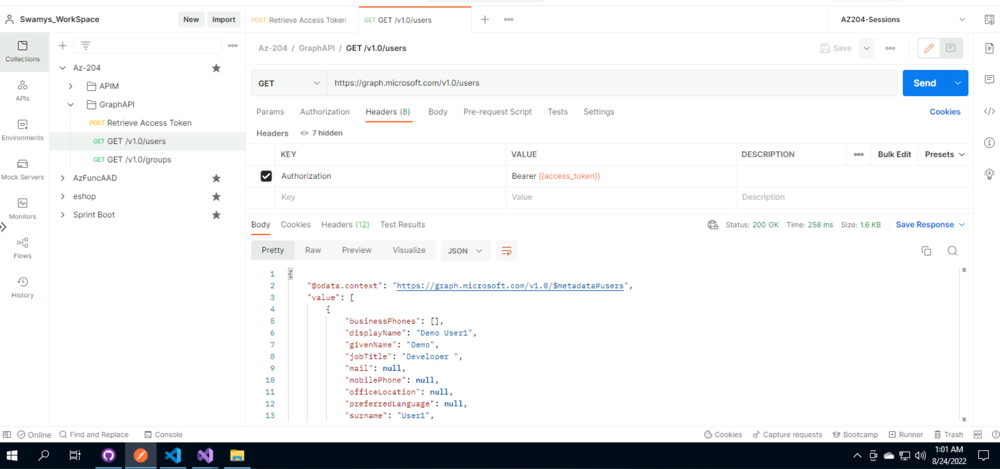

## SUMMARY / RECAP / Q&A

---

> 1. SUMMARY / RECAP / Q&A
> 2. Any open queries, I will get back through meetup chat/twitter.

---

## What is Next? Session `22` of `23` Sessions on Oct, 2022 (Along with our 3 hours AZ-204 Labs)

> 1. Event Hubs
> 1. Mini Project(s)
> 1. Q & A

## What is Next? Session `23` of `23` Sessions on Nov, 2022 (Along with our 3 hours AZ-204 Labs)

> 1. Implement authentication by using the Microsoft Authentication Library - **`Session 23`**
> 1. Implement shared access signatures - **`Session 23`**
> 1. Azure Function - (`10 minutes`)
> 1. Q & A
