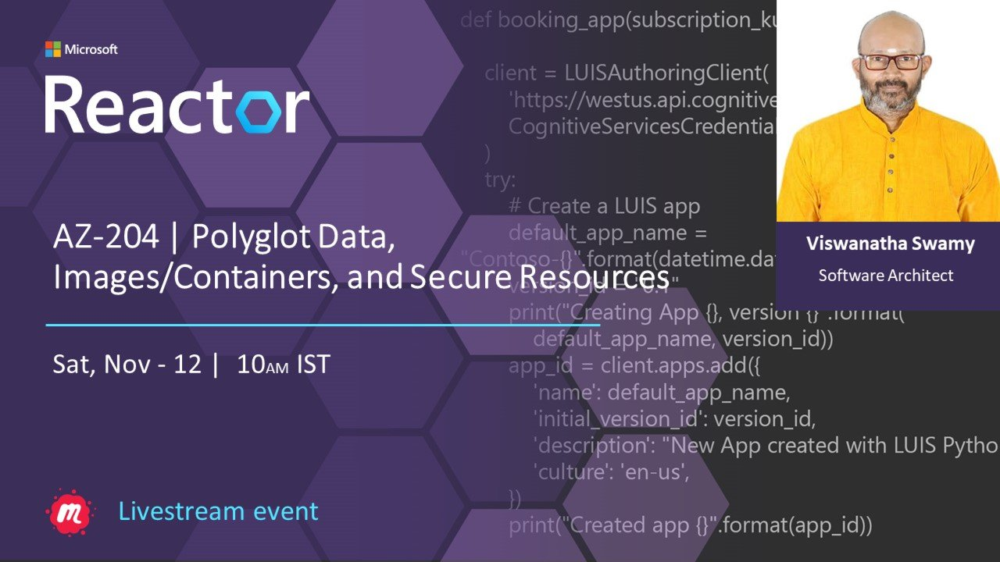

# Az-204 Labs - Web Apps, Azure Functions, and Blob Storage | Workshop

## Date Time: 24-Sep-2022 at 10:00 AM IST

## Event URL: [https://www.meetup.com/microsoft-reactor-bengaluru/events/287635867](https://www.meetup.com/microsoft-reactor-bengaluru/events/287635867)

---

## Pre-Requisites

> 1. .NET 3.1/6 SDK
> 1. Azure CLI

### Software/Tools

> 1. OS: win32 x64
> 1. Node: **v14.17.5**
> 1. Visual Studio Code
> 1. Visual Studio 2019/2022

### Prior Knowledge

> 1. C#, Node JS
> 1. Application Insights
> 1. Azure Key Vault
> 1. .NET Razor/Blazor WASM

### Assumptions

> 1. NIL

## Technology Stack

> 1. Azure

## Information

## What are we doing today?

> 1. Deploy Web App(s) inside IIS on Azure VM (IaaS)
> 1. Deploy Web App(s) on App Service on Azure (PaaS)
> 1. Implement task processing logic by using Azure Functions
> 1. Retrieve Azure Storage resources and metadata by using the Azure Storage
> 1. Q & A

### Please refer AZ-204 MS Learn Module(s) for more details

> 1. [https://aka.ms/AZ-204-AzureApp](https://aka.ms/AZ-204-AzureApp)
> 1. [https://aka.ms/AZ-204-AzureFunctions](https://aka.ms/AZ-204-AzureFunctions)
> 1. [https://aka.ms/AZ-204-Blobstorage-24/9](https://aka.ms/AZ-204-Blobstorage-24/9)

### Please refer to the [**Source Code**](https://github.com/vishipayyallore/learn-azure-in-2022) of today's session for more details

---

---

## 1. Deploy Web App(s) inside IIS on Azure VM (IaaS)

> 1. Discussion and Demo

### Install IIS on Azure VM

### Install Brave Browser on Azure VM

### Enable Remote Connections and Start Management Service inside IIS

### Install .NET 6 Hosting Bundle on Azure VM

### Install Web Deploy on Azure VM

### Install URL Rewrite on Azure VM

### Update the VM DNS Name on Azure VM

### Without 8172 Port Enabled on Azure VM

### Enable 8172 Port on Azure VM

### Security Certificate Error/Validation

### VM Connection Validated

## 2. Deploy Web App(s) on App Service on Azure (PaaS)

> 1. Discussion and Demo

## 3. Implement task processing logic by using Azure Functions

> 1. Discussion and Demo

## 4. Retrieve Azure Storage resources and metadata by using the Azure Storage

> 1. Discussion and Demo

## SUMMARY / RECAP / Q&A

> 1. SUMMARY / RECAP / Q&A
> 2. Any open queries, I will get back through meetup chat/twitter.

---

## What is Next? Workshop `2` of `4` Sessions on Oct, 2022

> 1. To be done
> 1. To be done
> 1. To be done
