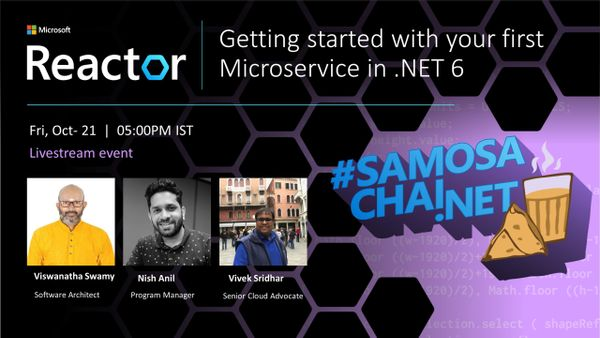
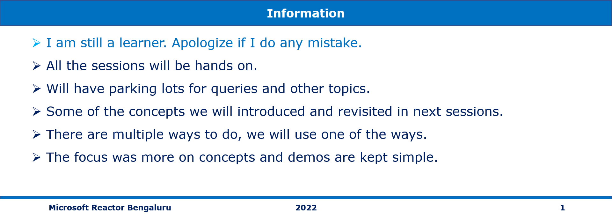
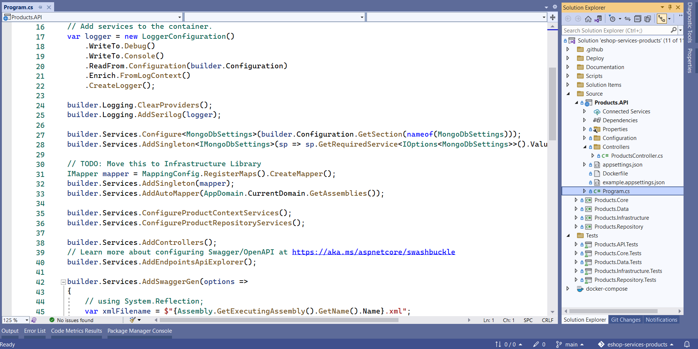

# Getting started with your first Microservice in .NET 6 | #SamosaChai.NET

## Date Time: 21-Oct-2022 at 06:00 PM IST

## Event URLs

> 1. [https://www.meetup.com/microsoft-reactor-bengaluru/events/288768482](https://www.meetup.com/microsoft-reactor-bengaluru/events/288768482/)

---

---

## Pre-Requisites

> 1. .NET 3.1/6 SDK
> 1. Azure CLI

### Software/Tools

> 1. OS: win32 x64
> 1. Node: **v14.17.5**
> 1. Visual Studio Code
> 1. Visual Studio 2022

### Prior Knowledge

> 1. C#, Node JS
> 1. Docker
> 1. Azure
> 1. Kubernetes
> 1. .NET Razor/Blazor WASM

### Assumptions

> 1. NIL

## Technology Stack

> 1. Azure

## Information

## 

## Duration: `90 minutes`

## Mode: `Demo Style` Workshop/Hands-On

## Event Description

In this session, we will work on .NET 6 microservice. Learn how to Design, Architect, and deploy to AKS. In this session, we will speak about Code, Unit Testing, DevOps, Static Code Analysis, and GitHub Actions. It will be hands-on, and a summary of my 9 sessions on Products Microservice.

## What are we doing today?

> 1. Introduction to `Products` .NET 6 Web API (`5 Minutes`)
> 1. Dependency Injection, AppSettings.json, Secrets.json, and Layered Architecture (`5 Minutes`)
> 1. DTO, Auto-Mapper, Strongly typed Configuration, Repository Pattern, and Serilog (`5 Minutes`)
> 1. Executing it locally on IIS Express, Kestrel, Docker, and Docker Compose (`5 Minutes`)
> 1. Terraform to deploy resources into AWS, and Azure (Cloud Agnostic) (`10 Minutes`)
> 1. DevOps from 30,000 feet, Pull Request Process, Gated Build, and Continuous Integration Build (`5 Minutes`)
> 1. Unit Testing, Static Code Analysis, Software Composition Analysis (`5 Minutes`)
> 1. Deploy AKS Infrastructure using GitHub Actions (`10 Minutes`)
> 1. Create Products.API's docker image and push it to Docker Hub using GitHub Actions (`5 Minutes`)
> 1. Deploy Products Microservice docker image from Docker Hub into AKS using GitHub Actions (`10 Minutes`)
> 1. CRUD Operations on the Deployed Products microservice into AKS using Postman (`5 Minutes`)
> 1. Hands of Azure Kubernetes Service using Portal / VS Code Extension (`10 Minutes`)
> 1. Hands of Azure Kubernetes Service using Imperative way in Azure Cloud Shell (`10 Minutes`)
> 1. Summary/Review/Q & A/Panel Discussion (`5 Minutes`)

### Please refer the [**Products Microservice**](https://github.com/vishipayyallore/eshop-services-products) Source code for today's session

---

---

## 1. Introduction to `Products` .NET 6 Web API (`5 Minutes`)

> 1. Discussion and Demo

## 2. Dependency Injection, AppSettings.json, Secrets.json, and Layered Architecture (`5 Minutes`)

> 1. Discussion and Demo

## 3. DTO, Auto-Mapper, Strongly typed Configuration, Repository Pattern, and Serilog (`5 Minutes`)

> 1. Discussion and Demo

## 4. Executing it locally on IIS Express, Kestrel, Docker, and Docker Compose (`5 Minutes`)

> 1. Discussion and Demo

## 5. Terraform to deploy resources into AWS, and Azure (Cloud Agnostic) (`10 Minutes`)

> 1. Discussion and Demo

## 6. DevOps from 30,000 feet, Pull Request Process, Gated Build, and Continuous Integration Build (`5 Minutes`)

> 1. Discussion and Demo

## 7. Unit Testing, Static Code Analysis, Software Composition Analysis (`5 Minutes`)

> 1. Discussion and Demo

## 8. Deploy AKS Infrastructure using GitHub Actions (`10 Minutes`)

> 1. Discussion and Demo

## 9. Create Products.API's docker image and push it to Docker Hub using GitHub Actions (`5 Minutes`)

> 1. Discussion and Demo

## 10. Deploy Products Microservice docker image from Docker Hub into AKS using GitHub Actions (`10 Minutes`)

> 1. Discussion and Demo

## 11. CRUD Operations on the Deployed Products microservice into AKS using Postman (`5 Minutes`)

> 1. Discussion and Demo

## 12. Hands of Azure Kubernetes Service using Portal / VS Code Extension (`10 Minutes`)

> 1. Discussion and Demo

## 13. Hands of Azure Kubernetes Service using Imperative way in Azure Cloud Shell (`10 Minutes`)

> 1. Discussion and Demo

## 14. Summary/Review/Q & A/Panel Discussion (5 Minutes)

> 1. Summary/Review/Q & A/Panel Discussion
> 2. Any open queries, I will get back through meetup chat/twitter.
