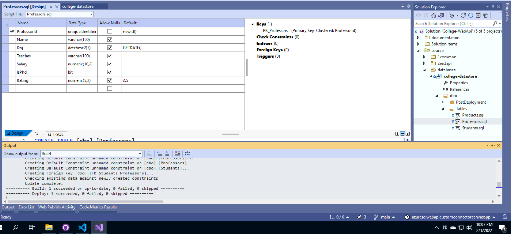
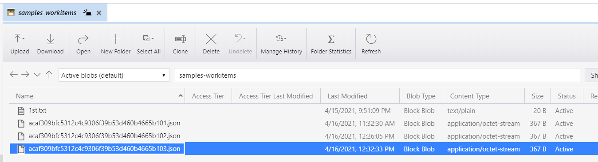

# AZ-204 | Azure Web Apps Scaling

## Date Time: 02-Feb-2022 at 09:00 AM IST

## Event URL: [https://www.meetup.com/microsoft-reactor-bengaluru/events/282135512](https://www.meetup.com/microsoft-reactor-bengaluru/events/282135512)


---

## Pre-Requisites

> 1. .NET 3.1/6 SDK
> 1. Azure CLI

### Software/Tools

> 1. OS: win32 x64
> 1. Node: **v14.17.5**
> 1. Visual Studio Code
> 1. Visual Studio 2019/2022

### Prior Knowledge

> 1. C#, Node JS
> 1. Azure Storage
> 1. Azure Functions
> 1. .NET Razor/Blazor WASM

### Assumptions

> 1. NIL

## Technology Stack

> 1. Azure Functions

## Information

## 

## What are we doing today?

> 1. Scaling Web App [Up and Out]
> 1. Scaling out Web App
> 1. Scaling In/Out manually
> 1. Scaling In/Out automatically based on Schedule
> 1. Scaling In/Out automatically based on Specific Dates
> 1. Scaling In/Out automatically based on Metrics

---


---



## 1. Scaling Web App [Up and Out]

> 1. Discussion and Demo

## 2. Scaling out Web App

> 1. Discussion and Demo

## 3. Scaling In/Out manually

> 1. Discussion and Demo


## 4. Scaling In/Out automatically based on Schedule

> 1. Discussion and Demo

## 5. Scaling In/Out automatically based on Specific Dates

> 1. Discussion and Demo

## 6. Scaling In/Out automatically based on Metrics

> 1. Discussion and Demo

## 7. GitCodeChangeTracker - Http Trigger - (**Stretch Goal** if time permits)

When code is commited to the repository, GitHub Webhook will invoke **GitCodeChangeTracker** function. This function has two (Table, and Blob) Output  bindings. We will store information into the Table, and Blob. It will trigger the `textfile-creation` function when the blob is created (`Function Chaining`).

### textfile-creation - Blob Trigger
On Blob creation this function we be invoked. It has `Table` output binding and will log the blob creation. It will also store the content of the blob inside `FileContents` column of the Table.

### Steps:

1. Verify the Azure Functions Core Tools on local Laptop.
1. Create the Azure Function project using **func init**
1. Create two (`GitCodeChangeTracker`, and `textfile-creation`) new functions with **func new**
1. Modify the code of both (`GitCodeChangeTracker`, and `textfile-creation`) azure functions. Please refer **StarterFiles** folder.
1. Verify functions locally **func start**. We use **Postman** for testing it locally.
1. **Debug** using Visual Studio Code.
1. Function App is already create using **az functionapp create** command
1. Publish the Function app to Azure using **func azure functionapp publish func-azcoretools-demo-dev-001**
1. Ensure to update the Function App with Table Storage Connection String

```
func version
func
func init
func new
func start
func azure functionapp publish func-azcoretools-demo-dev-001
```

### Images for Reference

### Publishing Azure Functions using _func azure functionapp publish_ command


### GitHub Webhook invoking Http Trigger Azure Function


### Http Trigger Function Storing the record in Table using Output binding


### Http Trigger Function Storing the JSON file in blob using Output binding



### Blob Trigger Function Storing the record in Table using Output binding


---

## 8. SUMMARY / RECAP / Q&A

---

> 1. SUMMARY / RECAP / Q&A
> 2. Any open queries, I will get back through meetup chat/twitter.

---

## What is Next? (`Session 11` of `20 Sessions` on 09-Feb-2022)

### Azure Web Apps Scaling

> 1. Deploying Node JS Web API
> 1. Deploying .NET Web API
> 1. Deploying Angular 13 Web App
> 1. Deploying ReactJS 17.x
> 1. Deploying Blazor WASM to Web App and integrating with existing Web API
> 1. Deploying ASP.NET Razor to Web App and integrating with existing Web API

