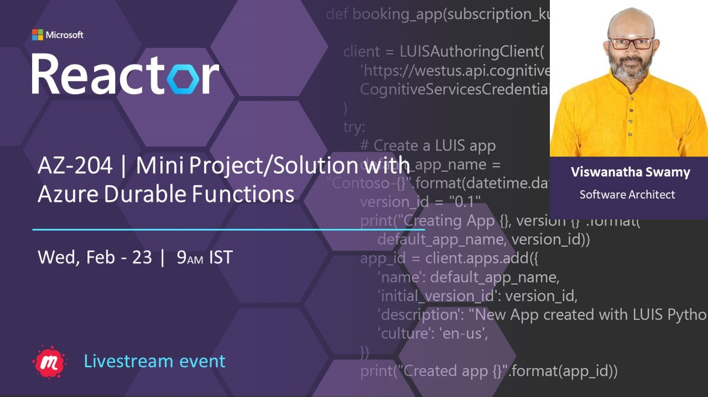
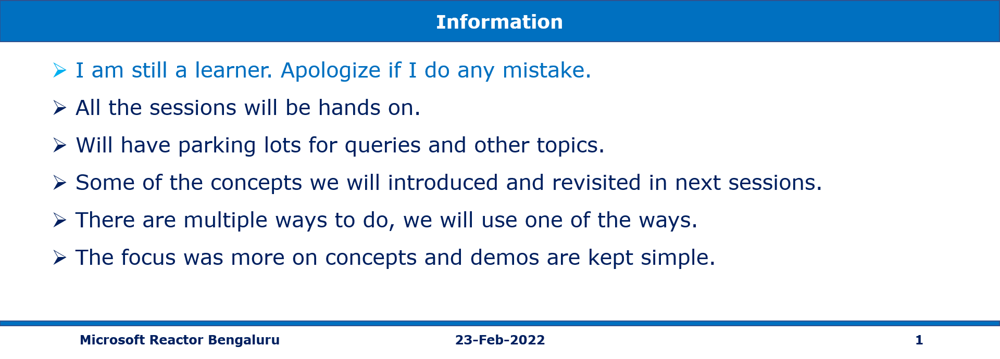

# AZ-204 | Mini Project/Solution with Azure Durable Functions

## Date Time: 23-Feb-2022 at 09:00 AM IST

## Event URL: [https://www.meetup.com/microsoft-reactor-bengaluru/events/283315802](https://www.meetup.com/microsoft-reactor-bengaluru/events/283315802)

---

## Pre-Requisites

> 1. .NET 3.1/6 SDK
> 1. Azure CLI

### Software/Tools

> 1. OS: win32 x64
> 1. Node: **v14.17.5**
> 1. Visual Studio Code
> 1. Visual Studio 2019/2022

### Prior Knowledge

> 1. C#, Node JS
> 1. Azure Storage
> 1. Azure Functions
> 1. .NET Razor/Blazor WASM

### Assumptions

> 1. NIL

## Technology Stack

> 1. Azure Functions

## Information

## 

## What are we doing today?

> 1. Deploy Node JS Web API to Azure. It connects to Mongo Atlas.
> 1. **MERN Stack** - Deploy ReactJS Web App to Azure. It retrieves the data from Node JS Web API
> 1. **MEAN Stack** - Deploy Angular 13 App to Azure. It retrieves the data from Node JS Web API
> 1. Deploy .NET 6 Razor Web App to Azure Container Registry, and Azure Container Instances
> 1. Deploy .NET 6 Razor Web App to Docker Registry, and Azure App Server (Docker Container)
> 1. Deploy .sqlproj to SQL Azure
> 1. Deploy .NET 6 Web API to Azure
> 1. Deploy .NET 6 Blazor Web App to Azure. It retrieves the data from .NET 6 Web API

---

---

## 1. Deploy Node JS Web API to Azure. It connects to Mongo Atlas.

> 1. Discussion and Demo

---

## X. SUMMARY / RECAP / Q&A

---

> 1. SUMMARY / RECAP / Q&A
> 2. Any open queries, I will get back through meetup chat/twitter.

---

## What is Next? (`Session 13` of `20 Sessions` on 16-Mar-2022)

### AZ-204 | Manage images in ACR, and Run Container images in ACI

> 1. Describe how to use ACR Tasks to automate builds and deployments.
> 1. Explain the elements in a Dockerfile.
> 1. Build and run an image in the ACR by using Azure CLI.
> 1. Deploy a container instance in Azure by using the Azure CLI.
> 1. Start and stop containers using policies. Set environment variables in your container instances.
> 1. Mount file shares in your container instances.
