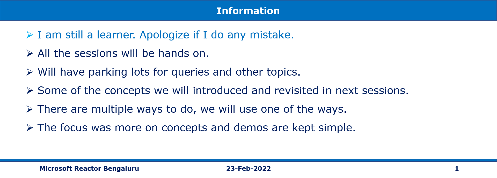
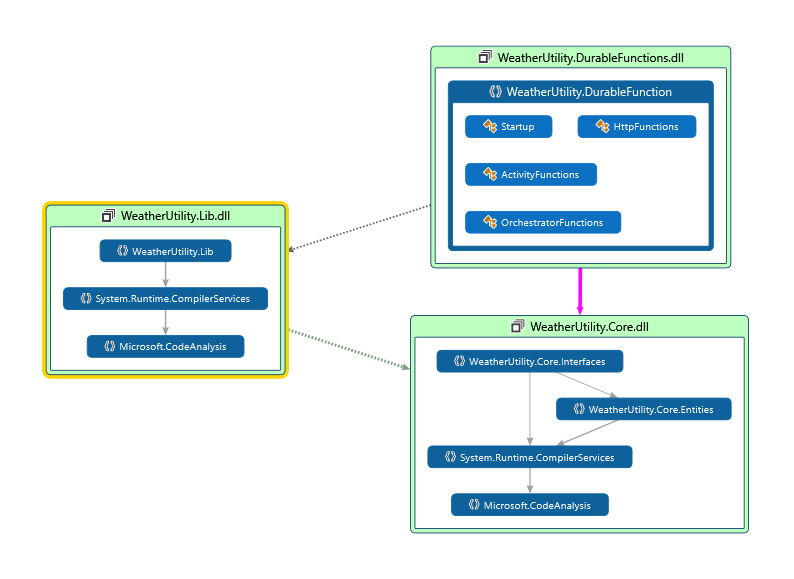

# Mini Project/Solution with Azure Durable Functions

## Date Time: 20-Mar-2022 at 12:00 PM IST

## Event URL: [https://techdaypakistan.com/Schedule.html](https://techdaypakistan.com/Schedule.html)

---

## Pre-Requisites

> 1. .NET 3.1/6 SDK
> 1. Azure CLI

### Software/Tools

> 1. OS: win32 x64
> 1. Node: **v14.17.5**
> 1. Visual Studio Code
> 1. Visual Studio 2019/2022

### Prior Knowledge

> 1. C#, Node JS
> 1. Azure Storage
> 1. Azure Functions
> 1. .NET Razor/Blazor WASM

### Assumptions

> 1. NIL

## Technology Stack

> 1. Azure Functions

## Information

## 

## What are we doing today?

> 1. What are Durable Functions?
> 1. Few Application patterns in Durable Functions
> 1. Solution Map `Function chaining` Durable Functions
> 1. Hands-on with `Function chaining` Durable Functions
> 1. SUMMARY / RECAP / Q&A

---

---

## 1. What are Durable Functions?

**Reference**: https://docs.microsoft.com/en-us/azure/azure-functions/durable/durable-functions-types-features-overview

> 1. Durable Functions
> 1. Orchestrator functions
> 1. Activity functions
> 1. Client functions
> 1. Entity functions
> 1. Task Hubs / Storage Account (Queues, Tables, and Blobs)
> 1. DurableClient Bindings

**State in Task Hubs inside Storage**

## 2. Few Application patterns in Durable Functions

> 1. Function chaining
> 1. Fan-out/fan-in
> 1. Async HTTP APIs
> 1. Monitoring
> 1. Human interaction
> 1. Aggregator (stateful entities)

**Reference**: https://docs.microsoft.com/en-us/azure/azure-functions/durable/durable-functions-overview?tabs=csharp

## 3. Solution Map `Function chaining` Durable Functions

## 

## 4. Hands-on with `Function chaining` Durable Functions

> 1. Discussion and Demo

---

## X. SUMMARY / RECAP / Q&A

---

> 1. SUMMARY / RECAP / Q&A
> 2. Any open queries, I will get back through meetup chat/twitter.

---
