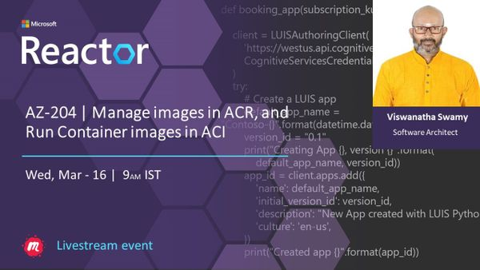
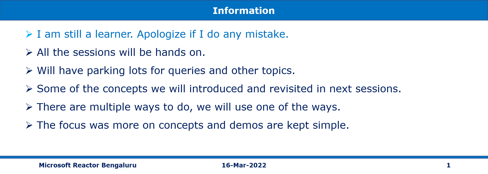

# AZ-204 | Manage images in ACR, and Run Container images in ACI

## Date Time: 16-Mar-2022 at 09:00 AM IST

## Event URL: [https://www.meetup.com/microsoft-reactor-bengaluru/events/284040465](https://www.meetup.com/microsoft-reactor-bengaluru/events/284040465)

---

## Pre-Requisites

> 1. .NET 3.1/6 SDK
> 1. Azure CLI

### Software/Tools

> 1. OS: win32 x64
> 1. Node: **v14.17.5**
> 1. Visual Studio Code
> 1. Visual Studio 2019/2022

### Prior Knowledge

> 1. C#, Node JS
> 1. Azure Storage
> 1. Azure Functions
> 1. .NET Razor/Blazor WASM

### Assumptions

> 1. NIL

## Technology Stack

> 1. Azure Functions

## Information

## 

## What are we doing today?

> 1. Deploy Node JS Web API to Azure. It connects to Mongo Atlas.
> 1. **MERN Stack** - Deploy ReactJS Web App to Azure. It retrieves the data from Node JS Web API
> 1. **MEAN Stack** - Deploy Angular 13 App to Azure. It retrieves the data from Node JS Web API
> 1. Deploy .NET 6 Razor Web App to Azure Container Registry, and Azure Container Instances
> 1. Deploy .NET 6 Razor Web App to Docker Registry, and Azure App Server (Docker Container)
> 1. Deploy .sqlproj to SQL Azure
> 1. Deploy .NET 6 Web API to Azure
> 1. Deploy .NET 6 Blazor Web App to Azure. It retrieves the data from .NET 6 Web API

---

---

## 1. What are Durable Functions?

**Reference**: https://docs.microsoft.com/en-us/azure/azure-functions/durable/durable-functions-types-features-overview

> 1. Durable Functions
> 1. Orchestrator functions
> 1. Activity functions
> 1. Client functions
> 1. Entity functions
> 1. Task Hubs / Storage Account (Queues, Tables, and Blobs)
> 1. DurableClient Bindings

**State in Task Hubs inside Storage**

## 2. Few Application patterns in Durable Functions

> 1. Function chaining
> 1. Fan-out/fan-in
> 1. Async HTTP APIs
> 1. Monitoring
> 1. Human interaction
> 1. Aggregator (stateful entities)

**Reference**: https://docs.microsoft.com/en-us/azure/azure-functions/durable/durable-functions-overview?tabs=csharp

## 3. Hands-on with `Function chaining` Durable Functions

> 1. Discussion and Demo

## 

---

## X. SUMMARY / RECAP / Q&A

---

> 1. SUMMARY / RECAP / Q&A
> 2. Any open queries, I will get back through meetup chat/twitter.

---

## What is Next? (`Session 14` of `20 Sessions` on 30-Mar-2022)

### AZ-204 | Implement secure cloud solutions, support monitoring, and logging

> 1. Azure Key Vault can help you keep your apps more secure, and how to set and retrieve secrets by using the Azure CLI.
> 1. Managed identities can help you deploy secure solutions on Azure without the need to manage credentials.
> 1. Azure App Configuration service to centrally manage and secure your configuration settings, and to manage app features.
> 1. Application Insights to enhance the performance and stability of your applications..
