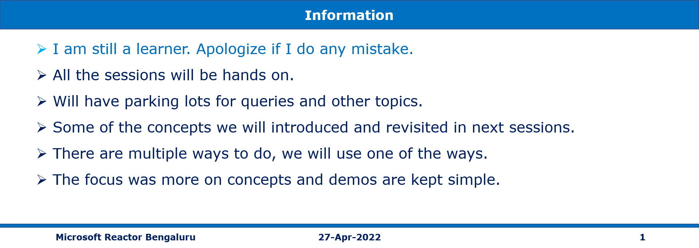

# AZ-204 | Implement Secure Cloud Solutions, Support Monitoring, and Logging

## Date Time: 24-Apr-2022 at 09:00 AM IST

## Event URL: [https://www.meetup.com/microsoft-reactor-bengaluru/events/284040465](https://www.meetup.com/microsoft-reactor-bengaluru/events/284040465)

---

## Pre-Requisites

> 1. .NET 3.1/6 SDK
> 1. Azure CLI

### Software/Tools

> 1. OS: win32 x64
> 1. Node: **v14.17.5**
> 1. Visual Studio Code
> 1. Visual Studio 2019/2022

### Prior Knowledge

> 1. C#, Node JS
> 1. Application Insights
> 1. Azure Key Vault
> 1. .NET Razor/Blazor WASM

### Assumptions

> 1. NIL

## Technology Stack

> 1. Azure

## Information

## 

## What are we doing today?

> 1. Azure Key Vault. How to set and retrieve secrets by using the Azure CLI
> 1. Managed identities to deploy secure solutions on Azure
> 1. Azure App Configuration service to centrally manage and secure your configuration settings, and to manage app features
> 1. Application Insights to enhance the performance and stability of your applications

---

---

## 1. Azure Key Vault. How to set and retrieve secrets by using the Azure CLI

> 1. Discussion and Demo.

## 1. Managed identities to deploy secure solutions on Azure

> 1. Discussion and Demo.

## 1. Azure App Configuration service to centrally manage and secure your configuration settings, and to manage app features

> 1. Discussion and Demo.

## 1. Application Insights to enhance the performance and stability of your applications

> 1. Discussion and Demo.

**az acr build**

---

## X. SUMMARY / RECAP / Q&A

---

> 1. SUMMARY / RECAP / Q&A
> 2. Any open queries, I will get back through meetup chat/twitter.

---

## What is Next? (`Session 14` of `20 Sessions` on 30-Mar-2022)

### AZ-204 | Implement secure cloud solutions, support monitoring, and logging

> 1. Azure Key Vault can help you keep your apps more secure, and how to set and retrieve secrets by using the Azure CLI.
> 1. Managed identities can help you deploy secure solutions on Azure without the need to manage credentials.
> 1. Azure App Configuration service to centrally manage and secure your configuration settings, and to manage app features.
> 1. Application Insights to enhance the performance and stability of your applications..
