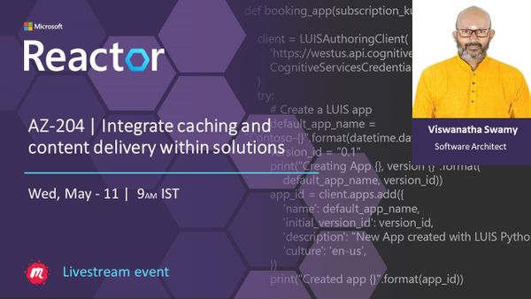
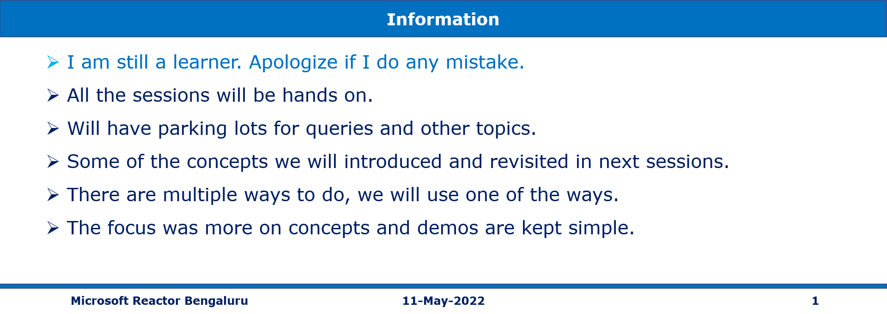
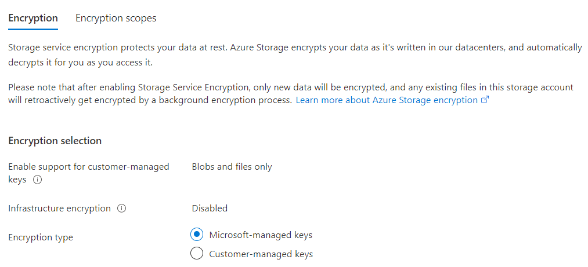
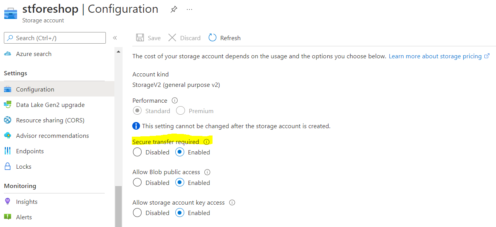
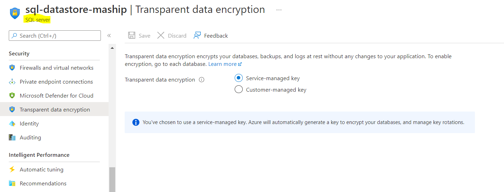
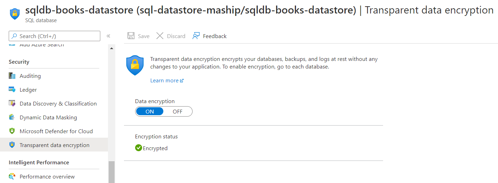

# AZ-204 | Integrate caching and content delivery within solutions

## Date Time: 11-May-2022 at 09:00 AM IST

## Event URL: [https://www.meetup.com/microsoft-reactor-bengaluru/events/284040465](https://www.meetup.com/microsoft-reactor-bengaluru/events/284040465)



---

## Pre-Requisites

> 1. .NET 3.1/6 SDK
> 1. Azure CLI

### Software/Tools

> 1. OS: win32 x64
> 1. Node: **v14.17.5**
> 1. Visual Studio Code
> 1. Visual Studio 2019/2022

### Prior Knowledge

> 1. C#, Node JS
> 1. Application Insights
> 1. Azure Key Vault
> 1. .NET Razor/Blazor WASM

### Assumptions

> 1. NIL

## Technology Stack

> 1. Azure

## Information

## 

## What are we doing today?

> 1. Azure Key Vault. How to set and retrieve secrets by using the Azure CLI
> 1. Managed identities to deploy secure solutions on Azure
> 1. Azure App Configuration service to centrally manage and secure your configuration settings, and to manage app features
> 1. Application Insights to enhance the performance and stability of your applications

---


---

## Implement secure cloud solutions

### 1. Azure Key Vault

> 1. Discussion and Demo
> 1. Show casing the `Soft Delete` and `Purge protection` of Key Vault
> 1. How to set and retrieve secrets by using the Azure CLI

```
az group create --name rg-name --location eastus
az keyvault create --name kv-name --resource-group rg-name --location eastus
az keyvault secret set --vault-name kv-name --name "ExamplePassword" --value "NoPassword@123$"
az keyvault secret show --name "ExamplePassword" --vault-name kv-name
```

### 2. Storage Encryption

> 1. Discussion & Demo

**SSE**



**Secure Transfer**


### 3. SQL Server and Database Encryption

> 1. Discussion & Demo

**SQL Server**


**SQL Database**


Reference: [Transport Layer Security (Encryption-in-transit)](https://docs.microsoft.com/en-us/azure/azure-sql/database/security-overview?view=azuresql#:~:text=SQL%20Database%2C%20SQL%20Managed%20Instance%2C%20and%20Azure%20Synapse%20Analytics%20enforce,TrustServerCertificate%20in%20the%20connection%20string.)

### 4. Azure Key Vault to store secrets of Azure SQL Server

> 1. Demo & Discussion
> 1. We will store the Azure SQL Server secrets in Azure Key Vault

**SqlServerConnectionString**

```
Server=tcp:YourServer.database.windows.net,1433;Initial Catalog=sqldb-booksstore;Persist Security Info=False;User ID=demouser;Password=YourPassword;MultipleActiveResultSets=False;Encrypt=True;TrustServerCertificate=False;Connection Timeout=30;
```

### 5. Managed identities to deploy secure solutions on Azure

> 1. Demo & Discussion

### 6. Modify the Web API's Configuration to use secrets from Azure Key Vault

> 1. Discussion and Demo.
> 1. Modify the Web API's Configuration to use secrets from Azure Key Vault
> 1. Verify the Web API endpoint using Chrome. It will NOT work.
> 1. Enable the IP address of the Web API inside the SQL Server Fire Wall Rule.
> 1. Verify the Web API endpoint using Chrome. It will work.

```
https://YourKeyVault.vault.azure.net/secrets/SqlServerConnectionString/5038a0ac6f2c4dc6adb0098517c09253
DataStoreSettings__SqlServerConnectionString
@Microsoft.KeyVault(SecretUri=https://YourKeyVault.vault.azure.net/secrets/SqlServerConnectionString/5038a0ac6f2c4dc6adb0098517c09253)
```

## Instrument solutions to support monitoring and logging

### 1. Azure Monitor

> 1. Discussion and Demo

### 1. Application Insights to enhance the performance and stability of your applications

> 1. Discussion and Demo.

---

## Stretch Goal

### 1. Azure App Configuration service to centrally manage and secure your configuration settings, and to manage app features

> 1. Discussion and Demo.

---

## X. SUMMARY / RECAP / Q&A

---

> 1. SUMMARY / RECAP / Q&A
> 2. Any open queries, I will get back through meetup chat/twitter.

---

## What is Next? (`Session 15` of `20 Sessions` on May 11, 2022)

### AZ-204 | Integrate caching and content delivery within solutions

> 1. Explore Azure Cache for Redis
> 1. Configure Azure Cache for Redis
> 1. Interact with Azure Cache for Redis by using .NET
> 1. Cache Aside Pattern using Azure Cache for Redis by using .NET Core
> 1. Explore Azure Content Delivery Networks
> 1. Control cache behavior on Azure Content Delivery Networks
> 1. Interact with Azure Content Delivery Networks by using .NET
> 1. Q & A
