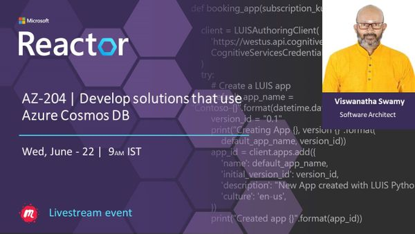
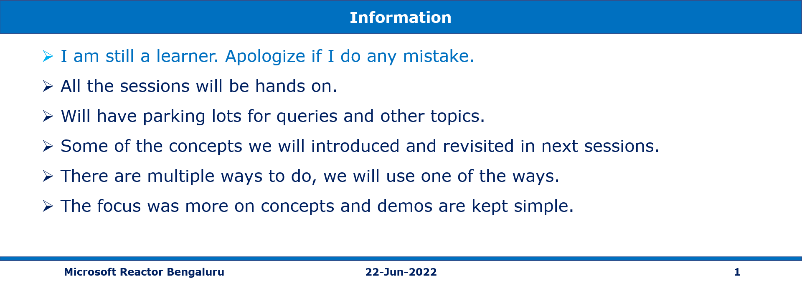
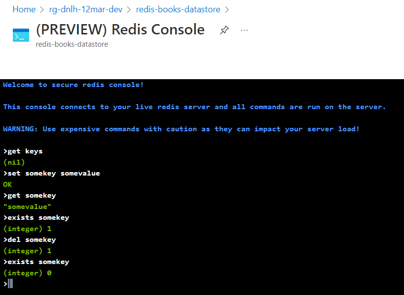
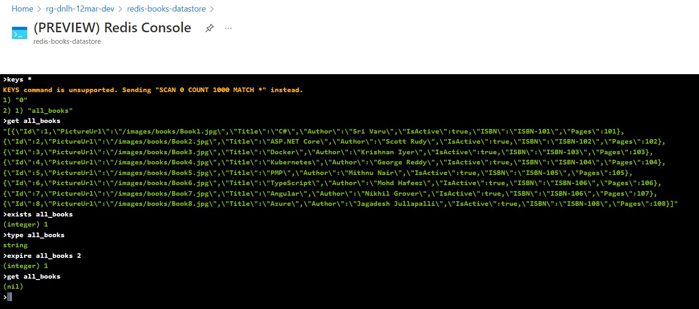

# AZ-204 | Develop solutions that use Azure Cosmos DB

## Date Time: 22-Jun-2022 at 09:00 AM IST

## Event URL: [https://www.meetup.com/microsoft-reactor-bengaluru/events/285815732/](https://www.meetup.com/microsoft-reactor-bengaluru/events/285815732/)



---

## Pre-Requisites

> 1. .NET 3.1/6 SDK
> 1. Azure CLI

### Software/Tools

> 1. OS: win32 x64
> 1. Node: **v14.17.5**
> 1. Visual Studio Code
> 1. Visual Studio 2019/2022

### Prior Knowledge

> 1. C#, Node JS
> 1. Application Insights
> 1. Azure Key Vault
> 1. .NET Razor/Blazor WASM

### Assumptions

> 1. NIL

## Technology Stack

> 1. Azure

## Information

## 

## What are we doing today?

> 1. Explore Azure Cosmos DB
> 1. Implement partitioning in Azure Cosmos DB
> 1. Work with Azure Cosmos DB
> 1. Mini Project
> 1. Q & A

### [MS Learn Module](https://docs.microsoft.com/en-us/learn/paths/az-204-develop-solutions-that-use-azure-cosmos-db/)

### [Source code for today's session](https://github.com/vishipayyallore/blazorwasm-dot-net6-containerized)

---


---

## Explore Azure Cache for Redis

> 1. Discussion and Demo
> 1. Few scenarios
> 1. Service tiers
> 1. Security Considerations

Reference: [Azure Cache for Redis/](https://docs.microsoft.com/en-us/learn/modules/develop-for-azure-cache-for-redis/)

## Configure Azure Cache for Redis

> 1. Discussion and Demo



## Interact with Azure Cache for Redis by using .NET

> 1. Discussion and Demo



## Cache Aside Pattern using Azure Cache for Redis by using .NET Core

> 1. Discussion and Demo

## Explore Azure Content Delivery Networks

> 1. Discussion and Demo

## Control cache behavior on Azure Content Delivery Networks

> 1. Discussion and Demo

## Interact with Azure Content Delivery Networks by using .NET

> 1. Discussion and Demo

## Q & A

> 1. Demo & Discussion
> 1. We will store the Azure SQL Server secrets in Azure Key Vault

**SqlServerConnectionString**

```
Server=tcp:YourServer.database.windows.net,1433;Initial Catalog=sqldb-booksstore;Persist Security Info=False;User ID=demouser;Password=YourPassword;MultipleActiveResultSets=False;Encrypt=True;TrustServerCertificate=False;Connection Timeout=30;
```

```
https://YourKeyVault.vault.azure.net/secrets/SqlServerConnectionString/5038a0ac6f2c4dc6adb0098517c09253
DataStoreSettings__SqlServerConnectionString
@Microsoft.KeyVault(SecretUri=https://YourKeyVault.vault.azure.net/secrets/SqlServerConnectionString/5038a0ac6f2c4dc6adb0098517c09253)
```

---

## X. SUMMARY / RECAP / Q&A

---

> 1. SUMMARY / RECAP / Q&A
> 2. Any open queries, I will get back through meetup chat/twitter.

---

## What is Next? (`Session 16` of `20 Sessions` on May 11, 2022)

### AZ-204 | Implement API Management

> 1. Discover the API Management service
> 1. Explore API gateways
> 1. Explore API Management policies
> 1. Create advanced policies
> 1. Secure APIs by using subscriptions
> 1. Secure APIs by using certificates
> 1. Create a backend API for .NET 6 Web APIs
> 1. Create a backend API for Azure Functions
> 1. Q & A
