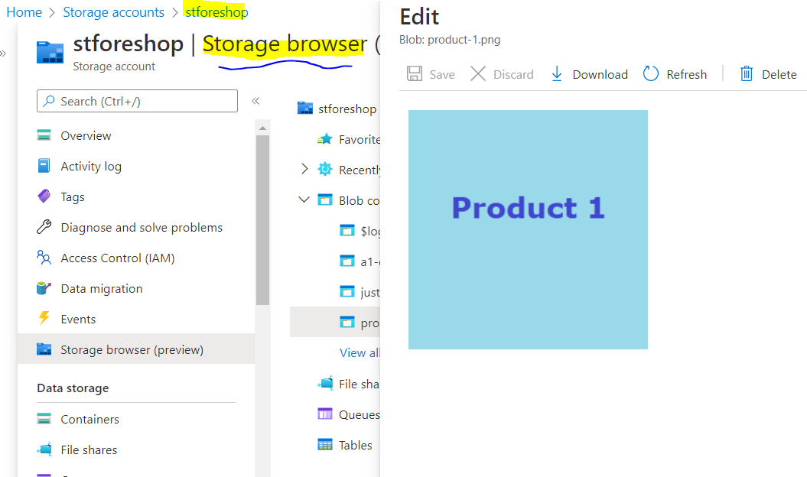
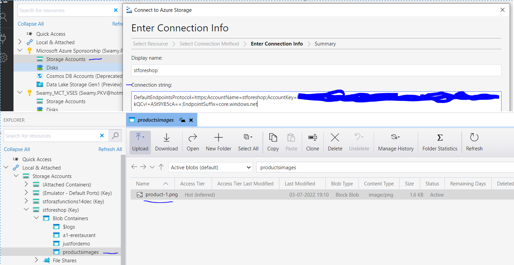
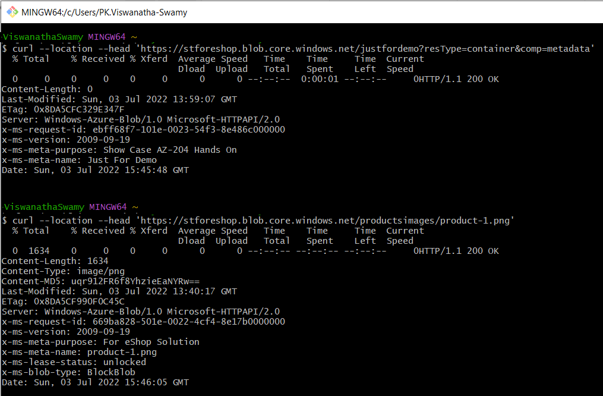
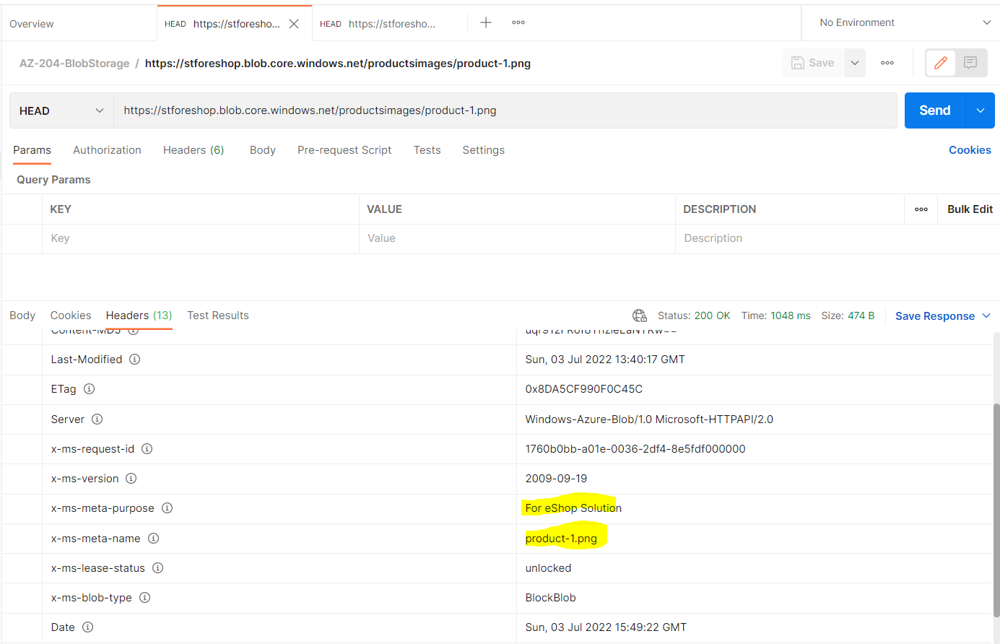

# AZ-204 | Develop solutions that use Blob storage

## Date Time: 06-Jul-2022 at 09:00 AM IST

## Event URL: [https://www.meetup.com/microsoft-reactor-bengaluru/events/285815349](https://www.meetup.com/microsoft-reactor-bengaluru/events/285815349)


---

## Pre-Requisites

> 1. .NET 3.1/6 SDK
> 1. Azure CLI

### Software/Tools

> 1. OS: win32 x64
> 1. Node: **v14.17.5**
> 1. Visual Studio Code
> 1. Visual Studio 2019/2022

### Prior Knowledge

> 1. C#, Node JS
> 1. Application Insights
> 1. Azure Key Vault
> 1. .NET Razor/Blazor WASM

### Assumptions

> 1. NIL

## Technology Stack

> 1. Azure

## Information

## 

## What are we doing today?

> 1. Explore Azure Blob storage
> 1. Manage the Azure Blob storage lifecycle
> 1. Work with Azure Blob storage
> 1. Deploy Static Web Apps to Azure Blob storage
> 1. Mini Project(s)
> 1. Q & A

### [AZ-204 MS Learn Module](https://docs.microsoft.com/en-us/learn/paths/develop-solutions-that-use-blob-storage/?source=learn)

### [Source code for today's session](https://github.com/vishipayyallore/speaker-series-2022/tree/main/microsoft-reactor/S18_2022Jul06_AzureBlobStorage)

---


---

## Explore Azure Blob storage

> 1. Discussion and Demo
> 1. Microsoft's object storage solution for the cloud
> 1. Types of storage: Standard general-purpose v2, Premium block blobs, Premium page blobs, and Premium file shares)
> 1. Access tiers for block blob data (Hot, Cold, and Archive)
> 1. Storage accounts -> Containers -> Blobs (Block, Append, and Page blobs)
> 1. Azure Storage encryption for data at rest
> 1. Azure Storage encryption for data in transit
> 1. Azure Storage redundancy options

## Create a block blob storage account using `Azure Portal`

> 1. Discussion and Demo

## Create account by using Azure CLI inside `Cloud Shell`

> 1. Discussion and Demo

## Working with `Storage Explorer` and `Storage Browser`

> 1. Discussion and Demo





## Working with `AzCopy`

> 1. Discussion and Demo

## Manage the Azure Blob storage lifecycle

> 1. Discussion and Demo

## Metadata for blob resources by using REST

> 1. Discussion and Demo

```
HEAD https://stforeshop.blob.core.windows.net/justfordemo?resType=container&comp=metadata

HEAD https://stforeshop.blob.core.windows.net/productsimages/product-1.png
```





## Mini Project(s)

> 1. Discussion and Demo

## Work with Azure Blob storage using `.NET 6`

> 1. Discussion and Demo

## Container properties and metadata by using `.NET 6`

> 1. Discussion and Demo

## Deploy Static Web Apps to Azure Blob storage

> 1. Discussion and Demo

---

## X. SUMMARY / RECAP / Q&A

---

> 1. SUMMARY / RECAP / Q&A
> 2. Any open queries, I will get back through meetup chat/twitter.

---

## What is Next? Session `19` of `21` Sessions on July 20, 2022

### AZ-204 | Develop message-based solutions

> 1. Choose a message queue solution
> 1. Explore Azure Service Bus
> 1. Discover Service Bus queues, topics, and subscriptions
> 1. Explore Service Bus message payloads and serialization
> 1. Exercise: Send and receive messages from a Service Bus queue by using .NET
> 1. Explore Azure Queue Storage
> 1. Create and manage Azure Queue Storage queues and messages by using .NET
> 1. Mini Project(s)
> 1. Q & A
