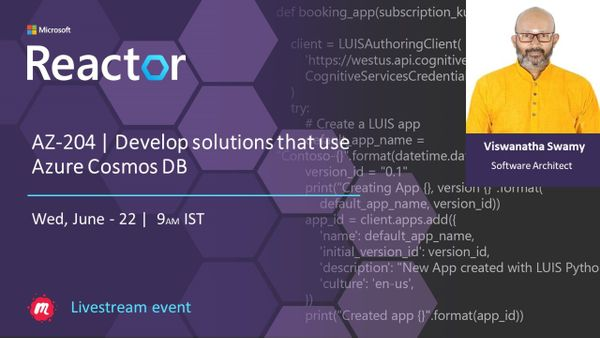
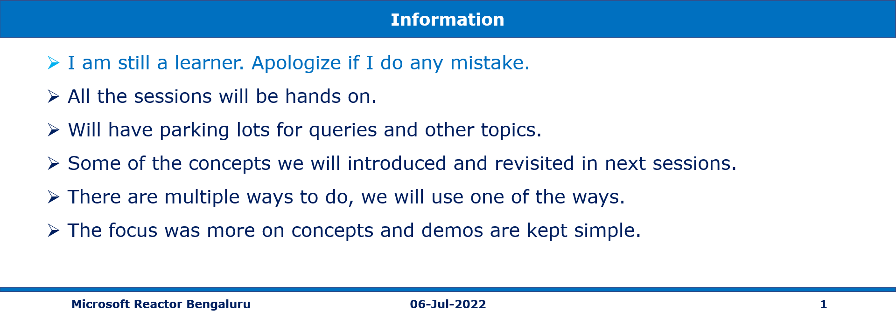

# AZ-204 | Develop solutions that use Blob storage

## Date Time: 06-Jul-2022 at 09:00 AM IST

## Event URL: [https://www.meetup.com/microsoft-reactor-bengaluru/events/285815349](https://www.meetup.com/microsoft-reactor-bengaluru/events/285815349)

---

## Pre-Requisites

> 1. .NET 3.1/6 SDK
> 1. Azure CLI

### Software/Tools

> 1. OS: win32 x64
> 1. Node: **v14.17.5**
> 1. Visual Studio Code
> 1. Visual Studio 2019/2022

### Prior Knowledge

> 1. C#, Node JS
> 1. Application Insights
> 1. Azure Key Vault
> 1. .NET Razor/Blazor WASM

### Assumptions

> 1. NIL

## Technology Stack

> 1. Azure

## Information

## 

## What are we doing today?

> 1. Explore Azure Blob storage
> 1. Manage the Azure Blob storage lifecycle
> 1. Work with Azure Blob storage
> 1. Deploy Static Web Apps to Azure Blob storage
> 1. Mini Project(s)
> 1. Q & A

### [MS Learn Module](https://docs.microsoft.com/en-us/learn/paths/az-204-develop-solutions-that-use-azure-cosmos-db/)

### [Source code for today's session](https://github.com/vishipayyallore/speaker-series-2022/tree/main/microsoft-reactor/S17_2022Jun22_AzureCosmosDB)

---

---

## Explore Azure Cosmos DB

> 1. Discussion and Demo
> 1. Key Benefits of Azure Cosmos DB
> 1. Resource Hierarchy
> 1. Consistency Levels
> 1. APIs supported in Azure Cosmos DB
> 1. Request Units (RUs)

**Reference(s):**

[https://docs.microsoft.com/en-us/azure/cosmos-db/consistency-levels](https://docs.microsoft.com/en-us/azure/cosmos-db/consistency-levels)

## Implement partitioning in Azure Cosmos DB

> 1. Discussion and Demo
> 1. Explore partitions

## Work with Azure Cosmos DB

> 1. Discussion and Demo

## Mini Project(s)

> 1. Discussion and Demo

---

## X. SUMMARY / RECAP / Q&A

---

> 1. SUMMARY / RECAP / Q&A
> 2. Any open queries, I will get back through meetup chat/twitter.

---

## What is Next? Session `19` of `21` Sessions on July 20, 2022

### AZ-204 | Develop message-based solutions

> 1. Choose a message queue solution
> 1. Explore Azure Service Bus
> 1. Discover Service Bus queues, topics, and subscriptions
> 1. Explore Service Bus message payloads and serialization
> 1. Exercise: Send and receive messages from a Service Bus queue by using .NET
> 1. Explore Azure Queue Storage
> 1. Create and manage Azure Queue Storage queues and messages by using .NET
> 1. Mini Project(s)
> 1. Q & A
