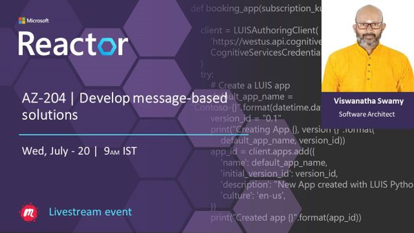
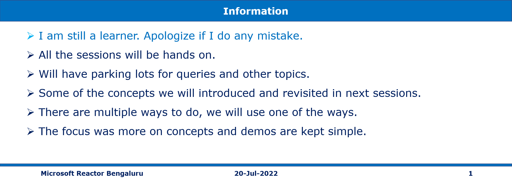
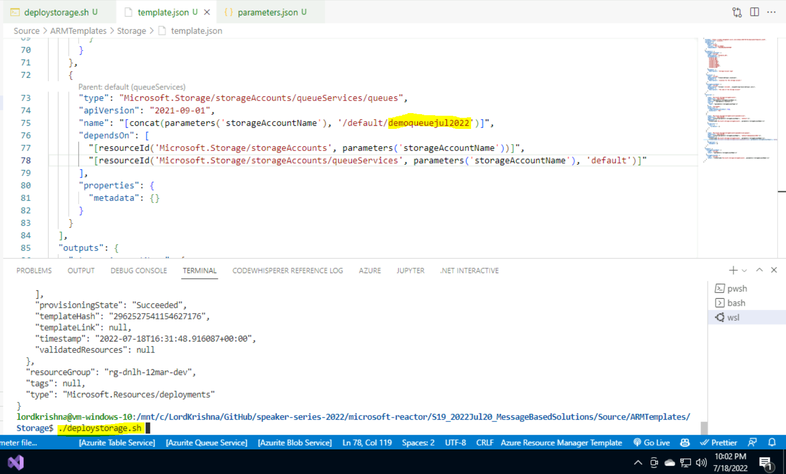
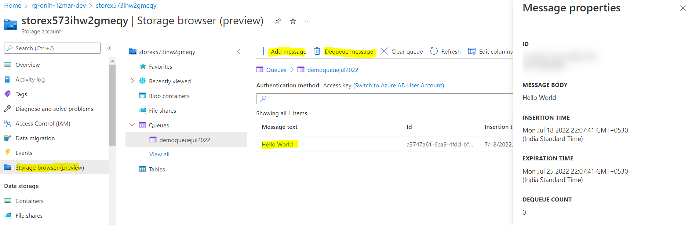
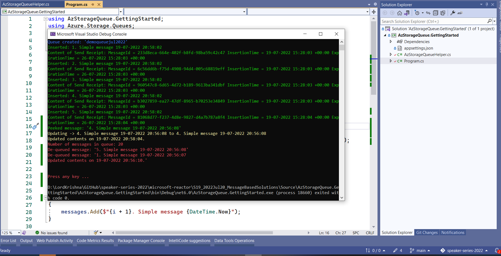
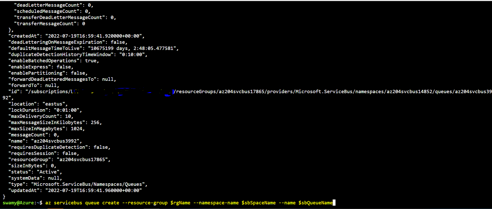
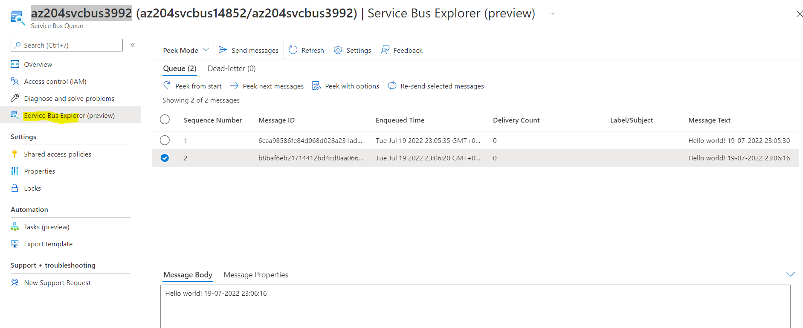

# AZ-204 | Develop message-based solutions

## Date Time: 20-Jul-2022 at 09:00 AM IST

## Event URL: [https://www.meetup.com/microsoft-reactor-bengaluru/events/286538834](https://www.meetup.com/microsoft-reactor-bengaluru/events/286538834)



---

## Pre-Requisites

> 1. .NET 3.1/6 SDK
> 1. Azure CLI

### Software/Tools

> 1. OS: win32 x64
> 1. Node: **v14.17.5**
> 1. Visual Studio Code
> 1. Visual Studio 2019/2022

### Prior Knowledge

> 1. C#, Node JS
> 1. Application Insights
> 1. Azure Key Vault
> 1. .NET Razor/Blazor WASM

### Assumptions

> 1. NIL

## Technology Stack

> 1. Azure

## Information



## What are we doing today?

> 1. Choose a message queue solution
> 1. Explore Azure Queue Storage
> 1. Create and manage Azure Queue Storage queues and messages by using .NET (`Mini Project`)
> 1. Explore Azure Service Bus
> 1. Discover Service Bus queues, topics, and subscriptions
> 1. Explore Service Bus message payloads and serialization
> 1. Exercise: Send and receive messages from a Service Bus queue by using .NET (`Mini Project`)
> 1. Q & A

### [AZ-204 MS Learn Module](https://aka.ms/AZ-204-Message-basedsolutions)

### [Source code for today's session](https://github.com/vishipayyallore/speaker-series-2022/tree/main/microsoft-reactor/S19_2022Jul20_MessageBasedSolutions)

---


---

## Choose a message queue solution

> 1. Discussion and Demo

## Explore Azure Queue Storage

> 1. Discussion and Demo
> 1. Create `Storage Queue` using `ARM Template`





## Create and manage Azure Queue Storage queues and messages by using .NET (`Mini Project`)

> 1. Discussion and Demo

**References:**

> 1. [https://docs.microsoft.com/en-us/azure/storage/queues/storage-dotnet-how-to-use-queues?tabs=dotnet](https://docs.microsoft.com/en-us/azure/storage/queues/storage-dotnet-how-to-use-queues?tabs=dotnet)
> 1. [https://github.com/MicrosoftDocs/azure-docs/blob/main/articles/storage/queues/storage-quickstart-queues-dotnet.md](https://github.com/MicrosoftDocs/azure-docs/blob/main/articles/storage/queues/storage-quickstart-queues-dotnet.md)



## Explore Azure Service Bus

> 1. Discussion and Demo
> 1. Create `Service Bus` and `Service Bus Queue` using `Az CLI`

```
rgName=az204svcbus$RANDOM
location=eastus
sbSpaceName=az204svcbus$RANDOM
sbQueueName=az204svcbus$RANDOM

az group create --name $rgName --location $location

az servicebus namespace create --resource-group $rgName --name $sbSpaceName --location $location

az servicebus queue create --resource-group $rgName --namespace-name $sbSpaceName --name $sbQueueName
```



## Discover Service Bus queues, topics, and subscriptions

> 1. Discussion and Demo

## Explore Service Bus message payloads and serialization

> 1. Discussion and Demo



## Exercise: Send and receive messages from a Service Bus queue by using .NET (`Mini Project`)

> 1. Discussion and Demo

**References:**

> 1. [https://docs.microsoft.com/en-us/dotnet/api/overview/azure/messaging.servicebus-readme-pre](https://docs.microsoft.com/en-us/dotnet/api/overview/azure/messaging.servicebus-readme-pre)

---

## X. SUMMARY / RECAP / Q&A

---

> 1. SUMMARY / RECAP / Q&A
> 2. Any open queries, I will get back through meetup chat/twitter.

---

## What is Next? Session `20` of `21` Sessions on July 10, 2022

### AZ-204 | Develop event-based solutions

> 1. Explore Azure Event Grid
> 1. Discover event schemas
> 1. Explore event delivery durability
> 1. Control access to events
> 1. Receive events by using webhooks
> 1. Filter events
> 1. Exercise: Route custom events to web endpoint by using Azure CLI
> 1. Discover Azure Event Hubs
> 1. Explore Event Hubs Capture
> 1. Scale your processing application
> 1. Control access to events
> 1. Perform common operations with the Event Hubs client library
> 1. Mini Project(s)
> 1. Q & A

```

```
