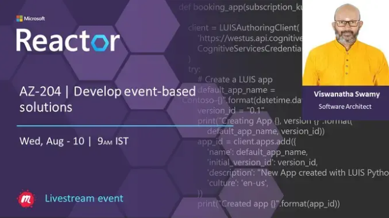
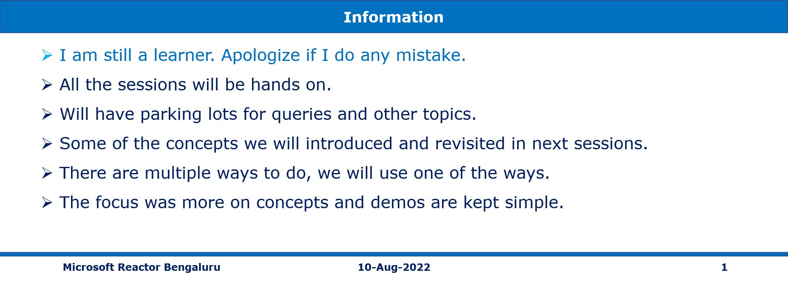
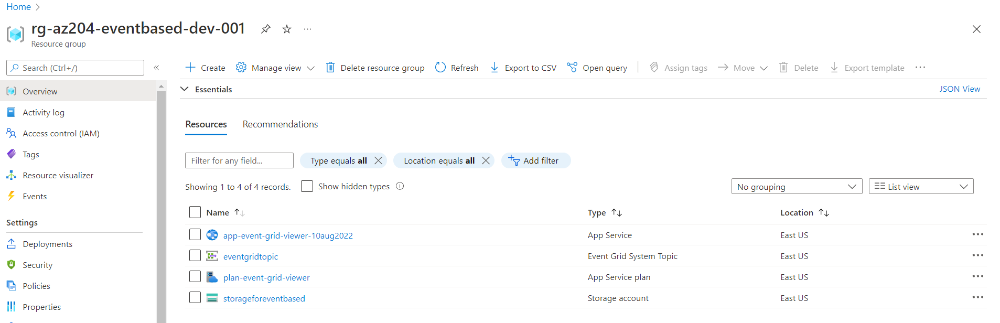
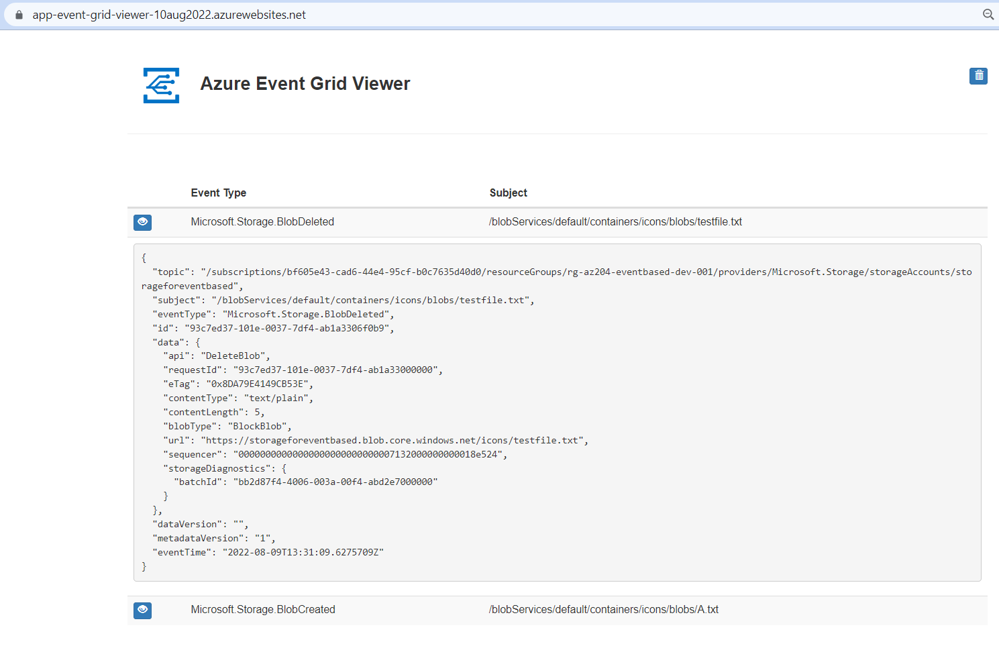
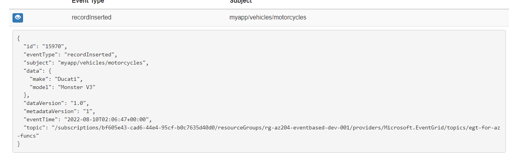
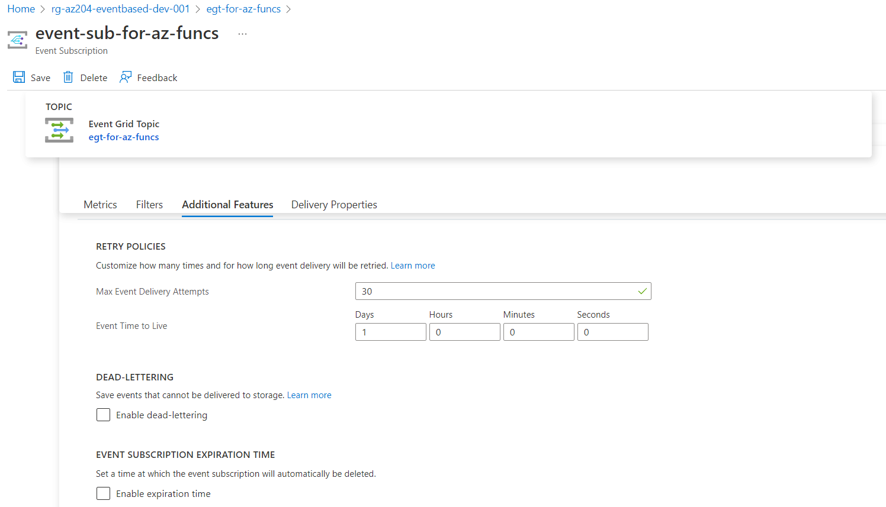
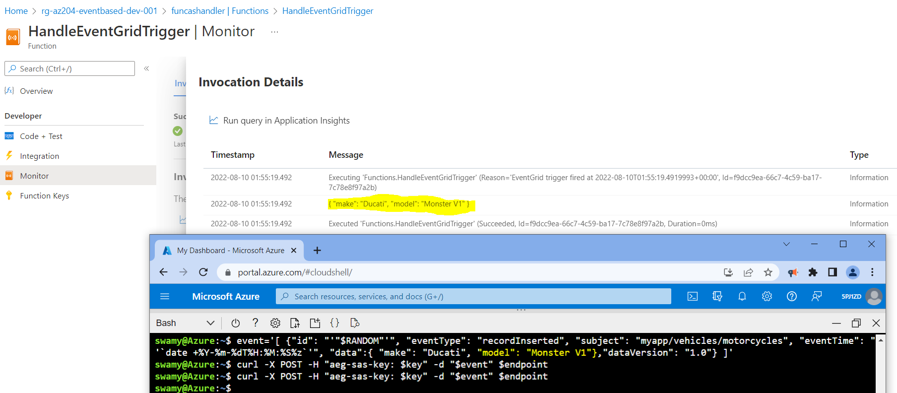
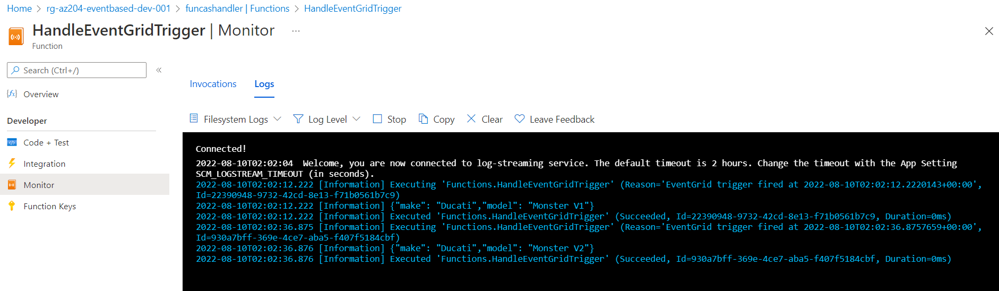
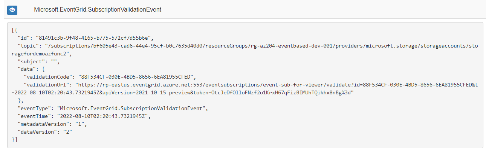
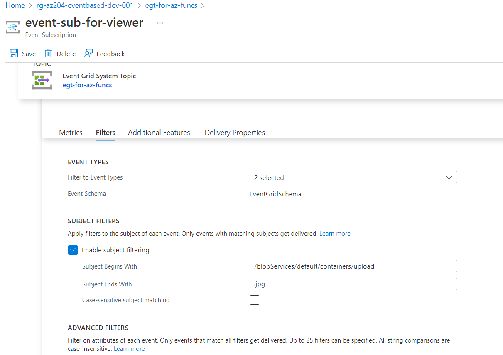

# AZ-204 | Develop event-based solutions

## Date Time: 10-Aug-2022 at 09:00 AM IST

## Event URL: [https://www.meetup.com/microsoft-reactor-bengaluru/events/287116794](https://www.meetup.com/microsoft-reactor-bengaluru/events/287116794)



---

## Pre-Requisites

> 1. .NET 3.1/6 SDK
> 1. Azure CLI

### Software/Tools

> 1. OS: win32 x64
> 1. Node: **v14.17.5**
> 1. Visual Studio Code
> 1. Visual Studio 2019/2022

### Prior Knowledge

> 1. C#, Node JS
> 1. Application Insights
> 1. Azure Key Vault
> 1. .NET Razor/Blazor WASM

### Assumptions

> 1. NIL

## Technology Stack

> 1. Azure

## Information



## What are we doing today?

> 1. Explore Azure Event Grid
> 1. Discover event schemas
> 1. Explore event delivery durability
> 1. Control access to events
> 1. Receive events by using webhooks
> 1. Filter events
> 1. Exercise: Route custom events to web endpoint by using Azure CLI
> 1. Discover Azure Event Hubs
> 1. Explore Event Hubs Capture
> 1. Scale your processing application
> 1. Control access to events
> 1. Perform common operations with the Event Hubs client library
> 1. Q & A

### Please refer AZ-204 [**MS Learn Module**](https://aka.ms/AZ-204-DevelopingSolutions) for more details.

### Please refer the [**Source code**](https://github.com/vishipayyallore/speaker-series-2022/tree/main/microsoft-reactor/S20_2022Jul20_EventBasedSolutions) for today's session code.

---


---

## Explore Azure Event Grid

> 1. Discussion and Demo

**Reference(s):**

> 1. [https://docs.microsoft.com/en-us/azure/event-grid/overview](https://docs.microsoft.com/en-us/azure/event-grid/overview)

## Hands on with Azure Event Grid using Portal

> 1. Discussion and Demo

**Azure Resources for Storage EventGrid WebHook**


**Storage Events passed to EventGrid which sends to WebHook**


## Discover event schemas

> 1. Discussion and Demo




## Explore event delivery durability

> 1. Discussion and Demo

```AzureCLI
eventgridname=egt-for-az-funcs
rgname=rg-az204-eventbased-dev-001
event='[ {"id": "'"$RANDOM"'", "eventType": "recordInserted", "subject": "myapp/vehicles/motorcycles", "eventTime": "'`date +%Y-%m-%dT%H:%M:%S%z`'", "data":{ "make": "Ducati", "model": "Monster V1"},"dataVersion": "1.0"} ]'

endpoint=$(az eventgrid topic show --name $eventgridname -g $rgname --query "endpoint" --output tsv)

key=$(az eventgrid topic key list --name $eventgridname -g $rgname --query "key1" --output tsv)

curl -X POST -H "aeg-sas-key: $key" -d "$event" $endpoint
```







## Control access to events

> 1. Discussion and Demo

## Receive events by using webhooks

> 1. Discussion and Demo



## Filter events

> 1. Discussion and Demo



## Exercise: Route custom events to web endpoint by using Azure CLI

> 1. Discussion and `LIVE Demo`

## Discover Azure Event Hubs

> 1. Discussion and Demo

## Explore Event Hubs Capture

> 1. Discussion and Demo

## Scale your processing application

> 1. Discussion and Demo

## Control access to events

> 1. Discussion and Demo

## Perform common operations with the Event Hubs client library

> 1. Discussion and Demo

---

## SUMMARY / RECAP / Q&A

---

> 1. SUMMARY / RECAP / Q&A
> 2. Any open queries, I will get back through meetup chat/twitter.

---

## What is Next? Session `21` of `21` Sessions on Aug 24, 2022

### AZ-204 |Implement user authentication and authorization

> 1. Explore the Microsoft identity platform
> 1. Implement authentication by using the Microsoft Authentication Library
> 1. Implement shared access signatures
> 1. Explore Microsoft Graph API
> 1. Mini Project(s)
> 1. Q & A
