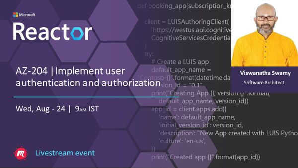
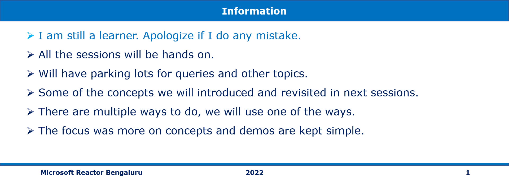
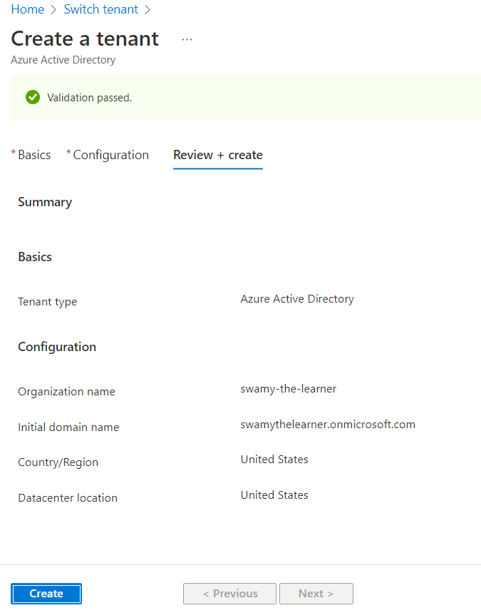

# AZ-204 |Implement user authentication and authorization

## Date Time: 24-Aug-2022 at 09:00 AM IST

## Event URL: [https://www.meetup.com/microsoft-reactor-bengaluru/events/287116842](https://www.meetup.com/microsoft-reactor-bengaluru/events/287116842)

---

## Pre-Requisites

> 1. .NET 3.1/6 SDK
> 1. Azure CLI

### Software/Tools

> 1. OS: win32 x64
> 1. Node: **v14.17.5**
> 1. Visual Studio Code
> 1. Visual Studio 2019/2022

### Prior Knowledge

> 1. C#, Node JS
> 1. Application Insights
> 1. Azure Key Vault
> 1. .NET Razor/Blazor WASM

### Assumptions

> 1. NIL

## Technology Stack

> 1. Azure

## Information

## What are we doing today?

> 1. Explore the Microsoft identity platform
> 1. Implement shared access signatures
> 1. Explore Microsoft Graph API
> 1. Mini Project(s)
> 1. Implement authentication by using the Microsoft Authentication Library - **`Stretch Goal`**
> 1. Q & A

### Please refer AZ-204 [**MS Learn Module**](https://aka.ms/AZ-204-Authentication) for more details.

---

---

## Explore the Microsoft identity platform

### Introduction to Azure AD, and Microsoft identity platform - (`5 minutes`)

> 1. Discussion and Demo

#### Reference(s):

> 1. [https://docs.microsoft.com/en-us/azure/active-directory/fundamentals/active-directory-whatis](https://docs.microsoft.com/en-us/azure/active-directory/fundamentals/active-directory-whatis)
> 1. [https://docs.microsoft.com/en-gb/azure/active-directory/develop/v2-overview](https://docs.microsoft.com/en-gb/azure/active-directory/develop/v2-overview)

### Creating Azure AD Tenant - (`5 minutes`)

> 1. Discussion and Demo

#### Reference(s):

> 1. [https://docs.microsoft.com/en-us/azure/active-directory/fundamentals/active-directory-access-create-new-tenant](https://docs.microsoft.com/en-us/azure/active-directory/fundamentals/active-directory-access-create-new-tenant)

### Creating User inside Azure AD Tenant

> 1. Discussion and Demo

### RBAC to newly created inside Azure AD Tenant

> 1. Discussion and Demo

### Web Application with Azure AD

> 1. Discussion and Demo

### Web API with Azure AD

> 1. Discussion and Demo

### Azure Function with Azure AD

> 1. Discussion and Demo

## Implement shared access signatures

> 1. Discussion and Demo

## Explore Microsoft Graph API

> 1. Discussion and Demo

## Mini Project(s)

> 1. Discussion and Demo

## Implement authentication by using the Microsoft Authentication Library - **`Stretch Goal`**

> 1. Discussion and Demo

---

## SUMMARY / RECAP / Q&A

---

> 1. SUMMARY / RECAP / Q&A
> 2. Any open queries, I will get back through meetup chat/twitter.

---

## What is Next? Session `22` of `22` Sessions on Sep 07, 2022

### AZ-204 | To be done

> 1. To be done
> 1. Mini Project(s)
> 1. Q & A
