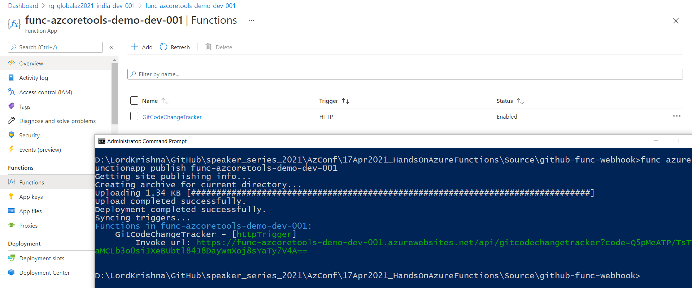
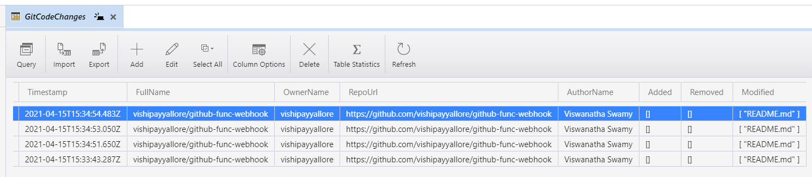

# AZ-204 | Web Apps Deployment slots, Web Jobs, and Application Insights

## Date Time: 12-Jan-2022 at 09:00 AM IST

## Event URL: [https://www.meetup.com/microsoft-reactor-bengaluru/events/282116856](https://www.meetup.com/microsoft-reactor-bengaluru/events/282116856)


---

## Pre-Requisites

> 1. .NET 3.1/6 SDK
> 1. Azure CLI

### Software/Tools

> 1. OS: win32 x64
> 1. Node: **v14.17.5**
> 1. Visual Studio Code
> 1. Visual Studio 2019/2022

### Prior Knowledge

> 1. C#, Node JS
> 1. Azure Storage
> 1. Azure Functions
> 1. .NET Razor/Blazor WASM

### Assumptions

> 1. NIL

## Technology Stack

> 1. Azure Functions

## Information

## 

## What are we doing today?

> 1. Deployment Slots
> 1. Creating Web Jobs
> 1. Web Application Backup
> 1. Working with Application Insights for Web Apps
> 1. Working with Application Insights for Azure Functions

---


---

## 1. Introduction to Azure Functions


## 2. Monitoring Azure Functions with Application Insights


## 3. Creating Azure Functions using multiple methods


## 4. Creating Azure Functions in C#, and Node JS


### 8.1. GitCodeChangeTracker - Http Trigger

When code is commited to the repository, GitHub Webhook will invoke **GitCodeChangeTracker** function. This function has two (Table, and Blob) Output  bindings. We will store information into the Table, and Blob. It will trigger the `textfile-creation` function when the blob is created (`Function Chaining`).

### 8.2. textfile-creation - Blob Trigger
On Blob creation this function we be invoked. It has `Table` output binding and will log the blob creation. It will also store the content of the blob inside `FileContents` column of the Table.

### Steps:

1. Verify the Azure Functions Core Tools on local Laptop.
1. Create the Azure Function project using **func init**
1. Create two (`GitCodeChangeTracker`, and `textfile-creation`) new functions with **func new**
1. Modify the code of both (`GitCodeChangeTracker`, and `textfile-creation`) azure functions. Please refer **StarterFiles** folder.
1. Verify functions locally **func start**. We use **Postman** for testing it locally.
1. **Debug** using Visual Studio Code.
1. Function App is already create using **az functionapp create** command
1. Publish the Function app to Azure using **func azure functionapp publish func-azcoretools-demo-dev-001**
1. Ensure to update the Function App with Table Storage Connection String

```
func version
func
func init
func new
func start
func azure functionapp publish func-azcoretools-demo-dev-001
```

#### Images for Reference

#### Publishing Azure Functions using _func azure functionapp publish_ command



#### GitHub Webhook invoking Http Trigger Azure Function


#### Http Trigger Function Storing the record in Table using Output binding



#### Http Trigger Function Storing the JSON file in blob using Output binding


#### Blob Trigger Function Storing the record in Table using Output binding


---

## 9. Mini Project 5 - Simple App with `Azure Functions` & `Blazor WASM`

> 1. APIs using Azure Functions in Visual Studio Code in C#
> 1. Retrieve GitHub Code Changes - HTTP Trigger
> 1. Blazor WASM Web App UI to display those changes.
> 1. Deploying the code to Azure

**Description:**

We will create a Azure function App **func-vscode-demo-dev-001** using **Visual Studio Code** with dotnet runtime. It will have a A. Http Trigger auzre function. We will retrieve the GitHub Code Changes from Azure Table Storage. We have a Blazor WASM SPA application, which will invoke the Azure Function and display the content.

**A. RetrieveGitHubCodeChanges - Http Trigger**

It will retrieve the GitHub Code Changes from Azure Table Storage.

**B. Blazor WASM Web App**
We have a Blazor WASM SAP application, which will invoke the Azure Function and display the content.

**Steps:**

1. Create the Azure Function project using **VS Code**
1. Create _RetrieveGitHubCodeChanges_ new function
1. Modify the code of _RetrieveGitHubCodeChanges_ azure function. Please refer **StarterFiles** folder.
1. Verify functions locally **func start**. We use **Postman** for testing it locally.
1. **Debug** using Visual Studio Code.
1. Function App is already create using **az functionapp create** command
1. Publish the Function app to Azure using **VS Code**
1. Ensure to update the Function App with Table Storage Connection String
1. Ensure to update the CORS in the deployed Function App.

##### **Images for Reference**

##### **Publishing Azure Functions using _VS Code_ .**


##### **Retrieving Content using Postman**


##### **Integrating the Blazor WASM and Http Triggered Azure Function**


---

## 10. SUMMARY / RECAP / Q&A

---

> 1. SUMMARY / RECAP / Q&A
> 2. Any open queries, I will get back through meetup chat/twitter.

---

## What is Next? (`Session 9` of `20 Sessions` on XX-Jan-2022)

### Topics

> 1. To Be Done
